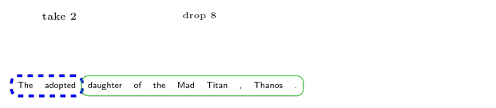
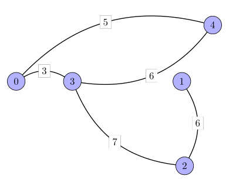

Many programming problems lend themselves easily to solutions based on Functional Programming languages. It is not hard to convince ourselves of this after coding a Language like OCaml or Haskell. 

This short article does not explain the basics of OCaml. Nor is it too advanced. The functions are
kept as simple as possible. This is the learner's perspective after all.

Dr Xavier Leroy was awarded the Milner Award in 2016 for achivements including OCaml.

### Development environment

[OPAM](https://opam.ocaml.org) does not seem to install easily in Windows. As is my wont in such cases I started with Cygwin and after two days switched to a Ubuntu VM. I didn’t think I was gaining much by reporting Cygwin permission issues to owners of OPAM Windows installers.  

The IDE is the venerable emacs. All diagrams are drawn using the Tex package, Tikz.

### _let_ keyword
**This section is Yet to be updated**


let min_index a =

let b = Array.copy a in a;

Array.sort compare a;

let n = 0 in a.(n);

let i := ref(-1) in

let () = Array.iteri( fun x elt -> if a.(n) = elt then I := x else ()) 0 in
!i
;;


### Mutation

The hardest concept to fathom is side-effect or mutation. OCaml is mostly a functional language but
It has imperative constructs too and mutable data structures which I have decided to gloss over as my intention is to highlight the functional programming paradigm. But an example of imperative code is given at the end.

The OCaml code shown below does not mutate any value or data structure. It creates a new _List_. That is hallmark of functional code. No side-effects unless we intend to create it using imperative constructs.


let rec appendtolist l a =
  match l with
  |[] -> [a]
  |h :: t -> (h :: appendtolist t a)
;;




let insert l a b = 
  if List.mem_assoc a l
  then 
    let n = List.assoc a l in (a, (appendtolist n b))::(List.remove_assoc a l)
  else (a, (appendtolist [] b))::l
;;


### Higher-order functions
Composable functions can be combined to create higher-order functions. Let us assume we
want part of a list and the rest to be dropped. We want to _take n_ elements and drop
the rest.

These two functions take ‘n’ elements from a list and  drop ‘n’ elements. This is not the Idiomatic OCaml style I have come across because the algorithmic complexity is off the scale as the length of the list is computed repeatedly.

But these two functions can be composed to form other higher-order functions that operate
on the lists obtained.


let take n words =
  let rec loop i l1 = 
    if i = n
    then l1
    else
    if( n <= List.length words ) then
      loop (i + 1)  ( appendtolist l1 (List.nth words i) ) 
    else []
  in loop 0  []
;;



let drop n words =
  let rec loop i l1 = 
    if i >= List.length words
    then l1
    else
      loop (i + 1) (appendtolist l1 (List.nth words i))
  in loop n  []
;;


Let us assume we are working on lists of words to find out which word follows an n-gram. In this case we want to find out which word follws all sets of 2 words in a sentence.
This is somethinkg like a _Markov Chain_.

{:class="img-responsive"}

We _take 2_ and drop the rest.

Now we slide the window to the right and drop the first element.


let slidewindow l x =
  match l with
  | h :: t -> t @ [x]
  | [] -> []
;;


{:class="img-responsive"}

We slide the window to the right and thereby get the following word. Our composable functions can be used to figure out a simple _Markov Chain_.

### The Option type

This obviates the need to litter code with checks for the presence or absence of an expected result. 


let store l =
 let rec loop count hash l1 = 
 match l1 with
 | h :: t -> Hashtbl.add hash h count; loop ( count + 1) hash t
 | [] -> hash 
 in loop 0 (Hashtbl.create 42) l
;;



_'Some value'_ means that the value is found and _'None'_ means it isn't.


let optional hash a =
 if Hashtbl.find hash a
   then Some a
 else
   None
;;


### Fold

Let us consider the _store_ function shown above. We fold the _Hashtbl_ and accumulate
the count before returning it at the end. _Fold_ is the functional style of operation on
data structures.

If the key matches a value we accumulate the count in _accum_.


let foldhashtbl  htbl   =
  Hashtbl.fold (fun k v accum -> (if (  k  = "a" ) 
                                  then
                                    ( accum + 1 )
                                  else 
                                    accum)) htbl 0
;;


_Fold_ has some semantics that originates in the deep bowels of the functional
paradigm but we print some values to understand that. Unlike a fold on _List_ which can be _left_ or _right_, a fold on _Hashtbl_ seems straightforward.


let foldhashtbl  htbl   =
  Hashtbl.fold (fun k v accum -> (if (  k  = "a" ) 
                                  then
                                    ( Printf.printf "%3s %3d\n" k v ;accum + 1 )
                                  else 
                                    (  Printf.printf "%3s %3d\n" k v ;accum) )) htbl 0
;;


A rather contrived example of _List.fold_left_ is


let issorted l  =
  match l with
  | [] -> true
  |  x::tl -> let (_,result) = List.fold_left
                  ( fun (accum,result) cur -> 
                      if (result = true && 
		      (String.compare accum cur = 0 || 
		       String.compare accum cur = -1)) 
 `                     then  (cur,true) 
                      else (cur,false) )(x,true ) tl in
                      result
;;


This is the result.

>     #  issorted ["b";"c";"d";"a";"b"];;
      - : bool = false
      #   issorted ["b";"c";"d";"a"];;
      - : bool = false
      #   issorted ["b";"c";"d";"b"];;
      - : bool = false
      #  issorted ["b";"c";"d"];;
      - : bool = true

### Imperative OCaml

The contrast here is between pure functional style of programming without mutating any state
and the imperative features that operate based on side-effects.

This code checks if a List is sorted or not. 


let is_list_sorted l =
let n – ref true in
  for I = 0 to List.length l -1 do
      if ( I + 1 <= List.length l -1 then
         If( (String.compare (List.nth l i) (List.nth l (I + 1)) == -1 ||
              String.compare (List.nth l i) (List.nth l ( I + 1 )) == 0 ) 
          then n := true
          else n := false )
  done;
!n
;;


Even though OCaml has such constructs an aspiring functional programmer should be cautioned. It is all too easy to forget that we are learning about functions and hark back to an earlier style we are used to.

Let use write a more idiomatic OCaml function that does the same thing.


let is_list_sorter1 l =
let rec loop l1 =
  match l1 with
  } a :: (b :: _ as t ) -> if ( String.compare a b = -1 || 
                                String.compare a b = 0 )
                           then loop t
                           else false;
  | _ :: [] -> true
  | [] => true
in loop l
;;


### Djikstra's shortest-path **(Yet to be updated)**

So based on some of the functions defined above we try to find the shortest-path. This is
from chapter 24. of Carmen et al.

{:class="img-responsive"}



let rec appendtolist l a =
  match l with
  |[] -> [a]
  |h :: t -> (h :: appendtolist t a)
;;

let estimates n = 
let rec loop n1 l = 
  match n1 with
  | n1 when n1 < n -> loop (n1 + 1) ( appendtolist l infinity)
  | n1 -> l
in loop 0 []
;;

let predecessor n = 
let rec loop n1 l = 
  match n1 with
  | n1 when n1 < n -> loop (n1 + 1) ( appendtolist l false )
  | n1 -> l
in loop 0 []
;;

let update l a b = 
  if List.mem_assoc a l
  then 
    let n = List.assoc a l in b::(List.remove_assoc a l)
  else l
;;

let creategraph =
[
[0;0;0;3;0;5;0;0;0;0;0];
[0;0;0;0;0;0;0;0;0;0;0];
[0;0;0;0;0;0;0;0;0;0;0];
[0;0;0;0;0;2;0;0;6;0;0];
[0;0;0;0;0;0;0;0;0;0;0];
[0;0;0;1;0;0;0;0;4;0;6];
[0;0;0;0;0;0;0;0;0;0;0];
[0;0;0;0;0;0;0;0;0;0;0];
[0;0;0;0;0;0;0;0;0;0;2];
[0;0;0;0;0;0;0;0;0;0;0];
[3;0;0;0;0;0;0;0;7;0;0]]
;;

