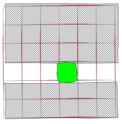
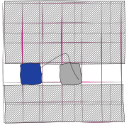

In the second part I will explain some more language features and code. All diagrams are drawn using the Tex package, Tikz.

### _let_ keyword
We start with this keyword again as this tripped me up. Moreover one does not
proceed much further without understanding the semantics of this keyword.


(let table = Hashtbl.create 10 in
  
  Hashtbl.add table "functional" ["practical";"utilitarian"];
  Hashtbl.add table "side-effect" ["outcome";"consequence"];
 table ) 
;;



let choose_randomly_hashtbl table (word : string) =
  let n0 = Hashtbl.find  table word in
  let n1 = Random.int (List.length n0) in
  let n2 = List.nth n0 n1 in
  n2
;;


*choose_randomly_hashtbl* returns randomly one of the values from the list corresponding to the key . And we see that _n0_, _n1_ and _n2_ are used after they are defined one by one. This should give a clearer idea about _let_'s semantics.

### User-defined types

### Record types

#### Nested pattern matching Record types

I plan to write about pattern matching concepts in another installment of this series as that is deeper than what would fit in one paragraph.

#### Partial updates of Record types

### Basic containers

Let us use the record types and UDF's to code a grid using the _zipper_ pattern which is a functional way of coding a grid. The code should serve as a foundation for a _game of life_ representation in the future.

It should be  pointed out that none of these functions mutate any data structure. So there is no side-effect. As you see it takes some effort to shed our memory of imperative mutable code. It is hard at the beginning but seems quite natural now.

Some of the following functions are my OCaml port of existing Haskell code. Given that I am not an OCaml expert, this code is far more verbose than the equivalent Haskell code My Haskell chops were not enough and I turned to the IRC for much needed advice. 

The code focuses on a _cell_ like this picture shows. There are areas above,below, to the left and to the right. We move over this grid.
The focus is the green square.

{:class="img-responsive"}


type cell = { alive : bool ; column : int ; row : int }
;;



type cell = { alive : bool ; column : int ; row : int }
;;



type grid = {gamegrid : cell list list}
;;



type gridzipper  =
             { above : grid
             ; below : grid
             ; left  : cell list
             ; right : cell list
             ; focus : cell }



let focuscell celllist n =
 let rec loop acc n l =
  match l,n with
    | hd :: tl,n when n > 0 -> loop (hd :: acc) (n - 1) tl
    | [],_  -> None
    | hd :: tl,0 -> Some (acc, hd, tl)
 in loop  [] n celllist
;;



let gridfocus x y g =
 let a = focuscell g x in
  match a with
    | Some(before, line , after) -> (
                                  let b = focuscell line y in
                                   match b with
                                   Some (left  , focus, right) -> 
                                                              ( 
                                                               
                                                               (let above =  { gamegrid = before } in
                                                               let below = { gamegrid = after} in
                                                                            Some(
                                                                            {  above
                                                                            ;  below
                                                                            ;  left
                                                                            ;  right
                                                                            ;  focus }
                                                                             )
                                                               )
                                                              )
                                     | None -> None
                                  )
    | None -> None
;;

### Move the focus inside the grid

{:class="img-responsive"}

The _left_ function moves the focus to the left. Similarly the other functions shift the focus
to other grids cells.


let left g =
match g.left with
 [] -> None 
| hd::tl ->  let newgridzipper = { g  with focus = hd; left = tl; right = g.right @ [g.focus] } in
             Some(newgridzipper)
;;



let right g =
match g.left with
 [] -> None 
| hd::tl ->  let newgridzipper = { g  with focus = hd; left = [g.focus]; right =  tl } in
             Some(newgridzipper)
;;



(*pattern-matches on the list (of lists) , which should be non-empty, and introduces two bindings,
 line for the head, and above for the tail.*)
let up g =
 match g.above,g.below with
   |  {gamegrid = line :: above},{gamegrid = below} -> (
                          let below' =  (List.rev g.left) :: ([g.focus] @ g.right) :: below in
                          let a = focuscell line (List.length g.left) in
                          match a with
                           Some (left, focus, right) ->
                                                               let above =  { gamegrid = above } in
                                                               let below = { gamegrid = below'} in
                            { above
                            ; below
                            ; left
                            ; right
                            ; focus }
                          |None -> 
                            { above = g.above
                            ; below = g.below
                            ; left = g.left
                            ; right = g.right
                            ; focus = g.focus }
                         )
   |({gamegrid=[]},_) ->  { above = g.above
                            ; below = g.below
                            ; left = g.left
                            ; right = g.right
                            ; focus = g.focus }
;;




let down g = 
   match g.below,g.above with
   |  {gamegrid = line :: below},{gamegrid = above} -> (
                          let above' =  (List.rev g.left) :: ([g.focus] @ g.right) :: above in
                          let a = focuscell line (List.length g.left) in
                          match a with
                           Some (left, focus, right) ->
                                                               let above =  { gamegrid = above } in
                                                               let below = { gamegrid = above'} in
                            { above
                            ; below
                            ; left
                            ; right
                            ; focus }
                          |None -> 
                            { above = g.above
                            ; below = g.below
                            ; left = g.left
                            ; right = g.right
                            ; focus = g.focus }
                         )
   | ({gamegrid=[]},_)->    { above = g.above
                            ; below = g.below
                            ; left = g.left
                            ; right = g.right
                            ; focus = g.focus }

;;



#require "containers";;
 let makegrid = CCList.init 2 ( fun i -> (CCList.init 2 (fun j -> { alive = true; column = j;row = i })) );;


Function that tests if the focus stays within the grid. _None_ signifies an exceptional movement outside. 


let grid = makegrid in
  let gf = gridfocus 0 1 grid in
   match gf with
   | Some(gf) ->
                Printf.printf "Focus is on [ %B %d %d ]" gf.focus.alive gf.focus.column gf.focus.row;left gf
   | None -> Printf.printf "No focus";gf
;;


Another Function that tests _focuscell_, a lower-order function.


let grid = makegrid in
  let fc = focuscell grid 2 in
   match fc with
    | Some(before, line , after) -> Printf.printf "Focus is on [ %B %d %d ]" (List.nth line 0).alive (List.nth line 0).column (List.nth line 0).row
    | None -> Printf.printf "No focus"
;;


References :

1. Huet, Gerard (September 1997). "Functional Pearl: The Zipper"
