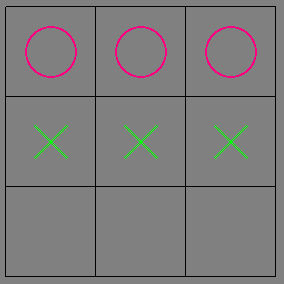

## Introduction


```haskell
module ReinforcementLearning where
import Control.Monad.State
import qualified Data.Map as Map
import Control.Applicative
import Graphics.Gloss
import Data.Array.IO
import Control.Monad.Reader
import System.Random
import Data.List
```


```haskell

fun :: Map.Map String Int
fun = Map.empty

store :: String -> Int-> State (Map.Map String Int) ()
store row value = do
  fun <- get
  put (Map.insert row value fun)

retrieve :: String -> State (Map.Map String Int) (Maybe (Int))
retrieve roworcolumn = do
  fun <- get
  return (Map.lookup roworcolumn fun) 

getrow = do {store "row" 1; retrieve "row"}  
getcolumn = do {store "column" 1; retrieve "column"}  
getboardsize = do   
           let x = (runState getrow fun) in
             let y = (runState getcolumn fun) in
                (Just (*) <*> (fst x)  <*>  (fst y) )
```

```haskell
magicsquare :: [Int]
magicsquare = [2,9,4,7,5,4,7,5,4] 

data BoardState = BoardState { xloc :: [Int],
                               oloc :: [Int],
                               index :: Int
                             }  deriving (Show)
```

### Haskell Gloss 

While porting the code I realized that a visual representation is helpful. I used Haskell Gloss UI toolkit to draw the board and the pieces based on the _BoardState_

```haskell
translationaccumulator ::   [Int] -> [Int] -> [(Float,Float)] -> [Picture] -> [Picture]
translationaccumulator  [] _ _ ys = reverse ys
translationaccumulator  _ []  _ ys = reverse ys
translationaccumulator  (head1:xs1) (head:xs) angle  ys = let (a,b) = (angle !!(head - 1)) in
                                                            let (c,d) = (angle  !!(head1 - 1)) in
                                                              translationaccumulator xs1 xs angle ( ((translate a b) $
                                                                                                 drawx ) : ((translate c d) $
                                                                                                 drawo ):ys)


```

{:class="img-responsive"}

```haskell

drawBoard :: BoardState -> Picture
drawBoard (BoardState xloc oloc index)=
  Pictures $ [ translate x y $ rectangleWire 90 90| x<-[0,90..180], y<-[0,90..180] ] ++ (translationaccumulator xloc oloc [(0,180),(90,180),(180,180),(0,90),(90,90),(180,90),(0,0),(90,0),(180,0)] [])

drawx :: Picture
drawx = color green $ rotate 45 $
        pictures [rectangleWire 1 45, rectangleWire  45 1] 

drawo :: Picture
drawo = color rose $ thickCircle 25 2

 

```
 
```haskell

powersof2  :: [Int]  
powersof2  =  [ 2 ^ i | i <- [0..9]]


createarray :: IO ( IOArray Int Double)
createarray =  do {
                       arr <- newArray (512,512) 0;
                       return arr
                  }

stateindex :: [Int] -> [Int] -> Int  
stateindex xloc oloc =  let powers = powersof2 in
                          ((foldl (+) 0 [  ( powers !!n) | n <- [0..(length xloc - 1)]]) +
                          ( 512 * foldl (+) 0 [  ( powers !!n) | n <- [0..(length oloc - 1)]]))
 
```

The ReaderT Monad transformer for reading and writing to arrays.


```haskell
type ArrayAccess = ReaderT  (IOArray Int Double)  IO 
type ArrayWriteAccess = ReaderT  (IOArray Int Double)  IO() 

readvalue ::  Int -> ArrayAccess  Double  
readvalue x    = do 
  a <- ask
  b <- liftIO( readArray a x);    
  return b

writevalue ::  Int -> Double -> ArrayWriteAccess   
writevalue x y   = do 
  a <- ask
  liftIO( writeArray a x y)    

-- Test array accesses
readfromarray = do { a <- createarray; liftIO (runReaderT (readvalue 1) a) }
writetoarray = do { a <- createarray; liftIO (runReaderT (writevalue 1 2) a) }
```
```

Haskell Enum to differentiate between players using X's and O's.

```haskell
data Player = X | O deriving Show
isX :: Player -> Bool
isX X = True
isX O = False 


```

### Calculate the next state in the board.


```haskell
append :: Int -> [Int] -> [Int]
append elem l = l ++ [elem]

readthevalue :: ( IOArray Int Int) -> Int -> IO Int
readthevalue a index =  liftIO (runReaderT (readvalue index ) a) 

writethevalue :: ( IOArray Int Int) -> Int -> Int -> IO ()
writethevalue a index value =  liftIO (runReaderT (writevalue index value) a) 
  
nextstate :: Player -> BoardState -> Int -> BoardState
nextstate  player (BoardState xloc oloc index) move= BoardState newx newo newindex where
  newx = if isX player then (append move xloc) else xloc
  newo = if isX player then (append move oloc) else oloc
  newindex = stateindex newx newo

magicnumber :: [Int]-> Int
magicnumber l = sum $ ([magicsquare !! (x-1) | x <- l])


newnextstate :: ( IOArray Int Int) -> BoardState-> IO ()
newnextstate  a ( BoardState xloc oloc index) =  do
  x <- readthevalue a index;
  if (x == 0)
  then if ((magicnumber xloc ) == 15)
       then (writethevalue a index 0)
       else if ((magicnumber oloc ) == 15)
            then (writethevalue a index 1)
            else pure ()
  else pure ()
```
Get a list of empty positions in the board.

```haskell
-- Returns a list of unplayed locations
possiblemoves :: BoardState -> [Int]
possiblemoves (BoardState xloc oloc index) =
  let xs =  [1,2,3,4,5,6,7,8,9] in
    (xs \\ xloc) \\ oloc

```

Select an empty position randomly

```haskell
--   "Returns one of the unplayed locations, selected at random"
randommove ::  BoardState -> IO Int
randommove state = 
  let possibles = possiblemoves state in
    case possibles of
      p ->   fmap (p !! ) $ randomRIO(0, length p - 1)
```
Greedy move
 
```haskell
greedymove :: ( IOArray Int Double) ->Player -> BoardState -> IO Int
greedymove a player state = 
  let possibles = possiblemoves state in
    case possibles of
      p  -> let bestvalue = -1.0 in
              let bestmove = 0 in
                choosebestmove p bestvalue bestmove
                where
                  choosebestmove (x:xs) bestvalue bestmove = do
                    xvalue <- (readthevalue a (ReinforcementLearning.index (nextstate player state x)));
                    case compare bestvalue xvalue of
                      LT -> choosebestmove  xs bestvalue bestmove;
                      GT -> return bestmove
```
### Abandoning the functional approach with this function

This is basically the original _Lisp_ converted line by line to Haskell. The Haskell programmers who I consulted dissuaded me from doing this but at this time my Haskell knowledge does not measure up to the task.

```haskell
randomgreedy :: Double -> Int -> Int -> Int
randomgreedy r1 rm gm = if (r1 < 0.01)
                  then rm
                  else gm

gameplan :: ( IOArray Int Double) -> BoardState -> BoardState -> IO Double 
gameplan a state newstate = do 
  r1 <- randombetween;
  result <- (terminalstatep a (ReinforcementLearning.index newstate));
    case result of
      True -> do
        update a state newstate
        valueofnewstate <- readthevalue a (ReinforcementLearning.index newstate)
        return valueofnewstate
      False -> do
        rm <- randommove newstate
        gm <- greedymove a O newstate
        let randomorgreedy = randomgreedy r1 rm gm in
          let newstate = (nextstate O newstate randomorgreedy) in
            if not (r1 < 0.01)
            then (update a state newstate)
            else (update a state state)
        result <- (terminalstatep a (ReinforcementLearning.index newstate));
        valueofnewstate <- readthevalue a (ReinforcementLearning.index newstate);
        if result
        then return valueofnewstate
        else gameplan a newstate newstate
  

--   "Plays 1 game against the random player. Also learns.
--    :X moves first and is random.  :O learns"
game :: IO ()
game = do
  a <- createarray
  r <- randommove (BoardState [0,0,0] [0,0,0] 0)
  let initialstate = BoardState [0,0,0] [0,0,0] 0 in
    gameplan a initialstate (nextstate X initialstate r)
  return ()

```


```haskell
main =  do print (runState getrow fun)
           let x = (runState getrow fun)
           let y = (runState getcolumn fun)

           let ms = (runState putmagicsquare fun)
           print (stateindex [1,2,3] [4,5,6])
           display (InWindow "Reinforcement Learning" (530,530) (220,220)) (greyN 0.5)  (drawBoard (BoardState [1,2,3] [4,5,6] 1))
           return ()

```
