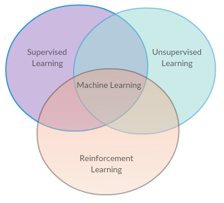

## Introduction

I am going through Reinforcement Learning: An Introduction by Richard S. Sutton and Andrew G. Barto and porting the lisp examples to Haskell in order to learn RL mainly but also to hone my functional programming skills. I chose the lisp examples over C examples obviously because I am coding Haskell. Not that lisp and Haskell are similar. Far from it. They are dissimilar but I find that it is helpful to work off a language that is not procedural.

The lisp code for this example I referred to is [this](http://incompleteideas.net/sutton/book/code/TTT.lisp)

Except the Haskell code everything I explain is based on the references cited at the end.

### What is reinforcement learning ?

{:class="img-responsive"}

### State Monad

I started with a proper Haskell state management workflow but soon abandoned it in favour of mutable IOarrays. Global mutable state is virtually non-existent in Haskell code. 

This code just manages the board size.

fun :: Map.Map String Int
fun = Map.empty


store :: String -> Int-> State (Map.Map String Int) ()
store x value = do
  fun <- get
  put (Map.insert x value fun)

retrieve :: String -> State (Map.Map String Int) (Maybe (Int))
retrieve roworcolumn = do
  fun <- get
  return (Map.lookup roworcolumn fun) 


getrow = do {store "row" 1; retrieve "row"}  
getcolumn = do {store "column" 1; retrieve "column"}  
getboardsize = do   
           let x = (runState getrow fun) in
             let y = (runState getcolumn fun) in
                (Just (*) <*> (fst x)  <*>  (fst y) )



### State of the board


data BoardState = BoardState { xloc :: [Int],
                               oloc :: [Int],
                               index :: Int
                             }  deriving (Show)


### Haskell Gloss 

The UI toolkit Gloss was used to initially display a grid. I hoped that eventually I could debug the visually. That hope turned out to be false as I misjudged the number of times one trains an algorithm like this. So this code is not usefule for debugging.


translationaccumulator ::   [Int] -> [Int] -> [(Float,Float)] -> [Picture] -> [Picture]
translationaccumulator  [] _ _ ys = reverse ys
translationaccumulator  _ []  _ ys = reverse ys
translationaccumulator  (head1:xs1) (head:xs) angle  ys = let (a,b) = (angle !!(head - 1)) in
                                                            let (c,d) = (angle  !!(head1 - 1)) in
                                                              translationaccumulator xs1 xs angle ( ((translate a b) $
                                                                                                 drawx ) : ((translate c d) $
                                                                                                 drawo ):ys)

drawBoard :: BoardState -> Picture
drawBoard (BoardState xloc oloc index)=
  Pictures $ [ translate x y $ rectangleWire 90 90| x<-[0,90..180], y<-[0,90..180] ] ++ (translationaccumulator xloc oloc [(0,180),(90,180),(180,180),(0,90),(90,90),(180,90),(0,0),(90,0),(180,0)] [])

drawx :: Picture
drawx = color green $ rotate 45 $
        pictures [rectangleWire 1 45, rectangleWire  45 1] 

drawo :: Picture
drawo = color rose $ thickCircle 25 2


{:class="img-responsive"}

### Value table 
The representation of the board state when Player X has moved to position 1 and Player O has learned to move to position 1 is [1] and [1]. This means that the two lists, representing the positions played by the two players X and O, each contain _1_

This is stored as a set of higher-order bits and a set of lower-order bits like this in the value table. The value of this set of bits shown in the image is _513_.


{:class="img-responsive"}


stateindex :: [Int] -> [Int] -> Int
stateindex xloc oloc = sum [2^(n-1)| n <- xloc]
                       + 512 * sum [2^(n-1) | n <- oloc]


### How do we know that a Player has won ?


Just store all the winning combinations and check because we have less board positions.


winningcombination :: [[Int]]
winningcombination = [[1,2,3],[4,5,6],[7,8,9],
                      [1,4,7],[2,5,8],[3,6,9],
                      [1,5,9],[3,5,8]]


checkallcombination ::  [Int] -> Bool
checkallcombination l = let wc = winningcombination in
                          loop wc
                            where
                              loop :: [[Int]] -> Bool
                              loop wc =
                                case wc of
                                  [] ->  False
                                  (x:xs) -> if containscombination x l then True else loop xs

containscombination :: [Int] -> [Int] -> Bool
containscombination xs xs1 =
  case xs of
    [] -> True 
    (x:xss) -> if (x `elem` xs1) then containscombination xss xs1 else False


The ReaderT Monad transformer for reading and writing to arrays.




createarray :: IO ( IOArray Int Double)
createarray =  do {
                       arr <- newArray (0,512*512) (-1.0);
                       return arr
                  }

type ArrayAccess = ReaderT  (IOArray Int Double)  IO 
type ArrayWriteAccess = ReaderT  (IOArray Int Double)  IO() 
readvalue ::  Int -> ArrayAccess  Double  
readvalue x    = do 
  a <- ask
  b <- liftIO( readArray a x);    
  return b
writevalue ::  Int -> Double -> ArrayWriteAccess   
writevalue x y   = do 
  a <- ask
  liftIO( writeArray a x y)    
-- Test array accesses
readfromarray = do { a <- createarray; liftIO (runReaderT (readvalue 1) a) }
writetoarray = do { a <- createarray; liftIO (runReaderT (writevalue 1 2) a) }


### The representation of a Player


data Player = X | O deriving Show
isX :: Player -> Bool
isX X = True
isX O = False 



### Calculate the next state in the board.


Get a list of empty positions in the board.


-- Returns a list of unplayed locations
possiblemoves :: BoardState -> [Int]
possiblemoves (BoardState xloc oloc index) =
  let xs =  [1,2,3,4,5,6,7,8,9] in
    (xs \\ xloc) \\ oloc

```

Select an empty position randomly


--   "Returns one of the unplayed locations, selected at random"
randommove ::  BoardState -> IO Int
randommove state = 
  let possibles = possiblemoves state in
    case possibles of
      p ->   fmap (p !! ) $ randomRIO(0, length p - 1)


### Greedy move


greedymove ::  (String -> IO()) ->( IOArray Int Double) ->Player -> BoardState -> IO (Int,IOArray Int Double)
greedymove log a player state = 
  let possibles = possiblemoves state in
    case possibles of
      [] -> return (0, a)
      p  -> let bestvalue = -1.0 in-- Since default value in array is -1.0
              let bestmove = (head p) in
                choosebestmove a p bestvalue bestmove
                where
                  choosebestmove arr [] bestvalue1 bestmove1 = return (0,a)
                  choosebestmove arr (x:xs) bestvalue1 bestmove1 = do
                    (nv,b) <- nextvalue logs player x arr state
                    xvalue <-  catch (readthevalue b (ReinforcementLearning.index (nv)))(\(SomeException e) -> printf "Reading [%d} in greedy move" x >> print e >> throwIO e)
                    case compare bestvalue1 xvalue of
                      LT -> choosebestmove b xs xvalue x;
                      GT -> return (bestmove1,b)
                      EQ -> return (bestmove1,b)
  



### Abandoning the functional approach with this function

This is basically the original _Lisp_ converted line by line to Haskell. The Haskell programmers who I consulted dissuaded me from doing this but at this time my Haskell knowledge does not measure up to the task.


gameplanrevised :: (String -> IO()) ->( IOArray Int Double) -> BoardState -> BoardState -> IO (IOArray Int Double,BoardState,Double) 
gameplanrevised log a state newstate = do 
                        exploremove a state newstate
                          where
                            exploremove :: ( IOArray Int Double) -> BoardState -> BoardState ->IO (IOArray Int Double,BoardState,Double)
                            exploremove a state newstate =
                              do
                                r <- randombetween;
                                let em = exploratorymove r in
                                  do
                                    result <- (terminalstatep log a (ReinforcementLearning.index newstate));
                                    case result of
                                      True -> do
                                        b <- update a state newstate
                                        valueofnewstate <- catch (readthevalue b (ReinforcementLearning.index newstate)) (\(SomeException e) -> print e >> mapM_ (putStr . show) [ (ReinforcementLearning.index newstate)]>> throwIO e)
                                        return (b,newstate,valueofnewstate)
                                      False -> do
                                        if em
                                          then do
                                            rm <- randommove newstate
                                            (nv,d) <- nextvalue logs O rm a newstate
                                            result1 <- (terminalstatep log d (ReinforcementLearning.index nv));
                                            valueafterrandommove <-  catch (readthevalue d (ReinforcementLearning.index nv)) (\(SomeException e) -> print e >> mapM_ (putStr . show) [ (ReinforcementLearning.index nv)]>> throwIO e)
                                            if result1
                                              then do
                                              return (d,nv,valueafterrandommove)
                                              else do
                                              r1 <- randommove nv
                                              (ns,na) <- nextvalue logs X r1 d nv
                                              exploremove na nv ns 
                                          else do
                                            (gm,c) <- greedymove log a O newstate
                                            (nv',d') <- nextvalue logs O gm c newstate
                                            d'' <- update d' state nv'
                                            result2 <- (terminalstatep log d'' (ReinforcementLearning.index nv'));
                                            valueaftergreedymove <-  catch (readthevalue d'' (ReinforcementLearning.index nv')) (\(SomeException e) -> print e >> mapM_ (putStr . show) [ (ReinforcementLearning.index nv')]>> throwIO e)
                                            if result2
                                              then do
                                              return (d'',nv',valueaftergreedymove)
                                              else do
                                              r1 <- randommove nv'
                                              (ns,na) <- nextvalue logs X r1 d'' nv'
                                              exploremove na nv' ns 



  

### Equivalent of 'run' function in the example



playntimes :: IOArray Int Double -> (String -> IO()) ->Int -> IO (IOArray Int Double,Double)
-- playntimes log n = do a <- createarray;
playntimes a log n = do writethevalue a 0 0.5
                        r <- (randommove (BoardState [] [] 0))
                        playtime  (BoardState [] [] 0) (nextvalue logs X r a (BoardState [] [] 0)) n 0 r
                          where
                            playtime ::  BoardState -> IO (BoardState,IOArray Int Double) -> Int -> Double -> Int -> IO (IOArray Int Double,Double)
                            playtime  s ns n acc r --finala is the consolidation for the next run
                              | n == 0 = do logsresult $ printf "Played 100 times %f  %f"  acc (acc/100.0)
                                            (_, b) <- ns 
                                            return (b,acc)
                              | n > 0 = do
                                  (boardstate, b) <- ns 
                                  (updatedarray, _, result) <- game logs s  boardstate b; 
                                  r1 <- randommove (BoardState [] [] 0)
                                  playtime (BoardState [] [] 0) (nextvalue logs X  r1 updatedarray (BoardState [] [] 0)) (n - 1) (acc + result) r1
  


### Equivalent of 'runs' function in the example


numruns :: IOArray Int Double ->Int -> Int -> Int -> Int -> IO()
numruns  arr n1 n bins binsize  
  | n == 0 = printf "\nPlayed numruns times"
  | n > 0 = do
      p <- createarray
      writethevalue p 0 0.5
      b <- playrepeatedly p arr n1 bins binsize
      numruns arr n1 (n -1) bins binsize

playrepeatedly ::  IOArray Int Double ->IOArray Int Double ->  Int -> Int -> Int -> IO(IOArray Int Double)
playrepeatedly a arr numrun1  numbins binsize = do 
 loop a 0 binsize
    where
      loop a i bs
        | i == numbins = let x = numrun1
                             y = numbins
                             z = binsize in
                           loop1 a x 0 y z 
        | i < numbins = do
            (b,acc) <- playntimes a logs bs;
            lastvalue <- readthevalue arr i
            writethevalue arr i (lastvalue + acc) 
            loop b (i+1) bs
        where 
        loop1 a x j y z = if j < y
                              then do
                              fv <- readthevalue arr j
                              printf " Runs %f Final Value %f Binsize %d Numruns %d \n" (fv / fromIntegral( z * x)) fv z x
                              loop1 a x (j+1) y z
                              else
                              return a


### Main function


main = let numbins = 30 in 
         do
           arr <- newArray (0,numbins) 0.0;
           ReinforcementLearning.numruns  arr 1 1 numbins 100 -- numruns numruns numbins binsize
           return ()


### Number of times Player O wins over X

The Reinforcement Learning agent should become unbeatable. That is what I used to think. But my code makes Player O learn and win roughly more than 50 % but less than or equal to 60%. But I have only played 100 games, 30 times each.

I think the winning rate of Player O should be more. It is less because somewhere in my code there may be a bug. I will continue to test it and the latest code will be in my [repository](https://github.com/mohanr/Reinforcement-Learning-An-Introduction-by-Richard-S.-Sutton-and-Andrew-G.-Barto)


		"Played 100 times 45.0  0.45"
		"Played 100 times 53.0  0.53"
		"Played 100 times 51.0  0.51"
		"Played 100 times 52.0  0.52"
		"Played 100 times 44.0  0.44"
		"Played 100 times 46.0  0.46"
		"Played 100 times 52.0  0.52"
		"Played 100 times 51.0  0.51"
		"Played 100 times 38.0  0.38"
		"Played 100 times 39.0  0.39"
		"Played 100 times 39.0  0.39"
		"Played 100 times 43.0  0.43"
		"Played 100 times 48.0  0.48"
		"Played 100 times 49.0  0.49"
		"Played 100 times 52.0  0.52"
		"Played 100 times 56.0  0.56"
		"Played 100 times 50.0  0.5"
		"Played 100 times 43.0  0.43"
		"Played 100 times 50.0  0.5"
		"Played 100 times 51.0  0.51"
		"Played 100 times 64.0  0.64"
		"Played 100 times 50.0  0.5"
		"Played 100 times 61.0  0.61"
		"Played 100 times 58.0  0.58"
		"Played 100 times 46.0  0.46"
		"Played 100 times 60.0  0.6"
		"Played 100 times 55.0  0.55"
		"Played 100 times 51.0  0.51"
		"Played 100 times 51.0  0.51"
		"Played 100 times 56.0  0.56"

#### References

1. https://mitpress.mit.edu/books/reinforcement-learning
2. The code from 1998 when the book was  published is http://incompleteideas.net/sutton/book/code/TTT.lisp
