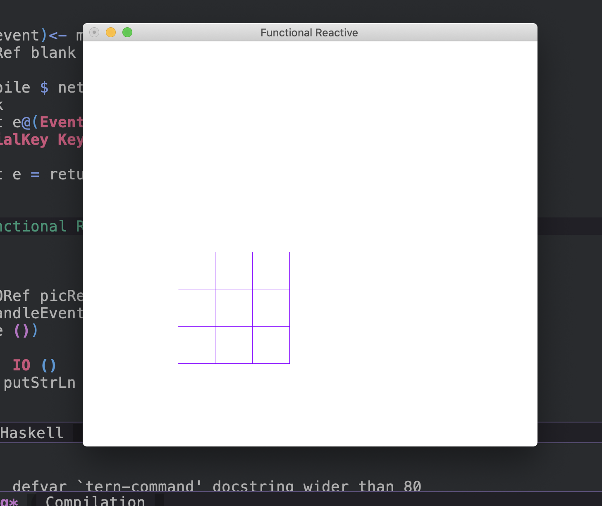

## Spacemacs

THe following are the keystrokes I needed to use Spacemacs editor for Haskell so that I could focus on the code
without too much distraction. More advanced customizations are possible but for now this suffices.

|KeyStroke     |                |                 |                            
|--------------|----------------|----------------|
|              | Windows        |        <       |
|==============|----------------|----------------|
| C-x b        |   Switch Buffer|        <       |
| SPC b x      |   Kill Buffer  |        <       |
| SPC w x      |   Kill Window  |        <       |
| C-x 2        |   Split Window |        <       |
| C-x k        |   Kill Buffer  |        <       |


| KeyStroke    |                |                |                
|--------------|----------------|----------------|
|              | Files          |        <       |
|==============|----------------|----------------|
| C-x f        |   Open File    |        <       |
| C-x C-s      |   Save File    |        <       |
| SPC w x      |   Kill Window  |        <       |


## Introduction

There are details that are yet to be added to this post but this code works. Since I am a Haskell novice
I can explain only part of the code. The program itself will be refactored as I understand it better.

The code uses [reactive-banana](https://hackage.haskell.org/package/reactive-banana)

### What is functional reactive programming ?


### Pattern 1

My initial attempt samples an image and renders it in the window when an event is fired in
the following function.



eventLoop :: EventSource ()  -> IO ()
eventLoop ( displayvalueevent)  = do
  putStrLn "Fired Event"
  fire displayvalueevent ()



But it does not sample images based on different UI events generated by the KeyBoard or Mouse.

This function is only for testing if the UI events are trapped or not.



let handleEvent e@(EventKey k Down _ _) = case k of
            (SpecialKey KeySpace) -> putStrLn "Space" 
            _                   -> putStrLn "Case"
       handleEvent e = event e



This is the code in its entirety.




------------------------------------------------------------------------------}
{-# LANGUAGE ScopedTypeVariables #-}
{-# LANGUAGE BlockArguments #-}

module Main where
import Data.IORef
import Data.Bool (bool)
import Data.IORef (newIORef, readIORef, writeIORef)
import Graphics.Gloss hiding (pictures)
import Reactive.Banana
import Reactive.Banana.Frameworks
import Graphics.Gloss.Interface.IO.Game( Event(..) )
import Graphics.Gloss.Interface.IO.Game( MouseButton(..) )
import Graphics.Gloss.Interface.IO.Game( KeyState( Down ) )
import Graphics.Gloss.Interface.IO.Game
import qualified Graphics.Gloss.Interface.IO.Game as Gloss (Event, playIO)


main = do

   picRef ← newIORef blank
   (eventHandler, event) ← newAddHandler

   sources <- makeSources
   network <- compile $ networkDescriptor picRef sources
   actuate network
   eventLoop sources
   let handleEvent e@(EventKey k Down _ _) = case k of
            (SpecialKey KeySpace) -> putStrLn "Space" 
            _                   -> putStrLn "Case"
       handleEvent e = event e

   Gloss.playIO
    (InWindow "Functional Reactive" (320, 240) (800, 200))
    white
    30
    ()
    (\() -> readIORef picRef)
    -- (\ ev   _ → quit ev >> () <$ handleEvent ev)
    (\ ev () -> handleEvent ev)
    (\_ () -> pure ())
  where
    quit (EventKey (Char 's' )
                          _ _ _) = reactToKeyPress
    quit  _ = return ()

reactToKeyPress :: IO ()
reactToKeyPress = putStrLn "Key Pressed"

drawBoard :: Picture
drawBoard =
   Pictures $ [ color violet $ translate x y $ rectangleWire 90 90| x<-[0,90..180], y<-[0,90..180] ] 

makeSources =  newAddHandler

type EventSource a = (AddHandler a, a -> IO ())

addHandler :: EventSource a -> AddHandler a
addHandler = fst

eventLoop :: EventSource ()  -> IO ()
eventLoop ( displayvalueevent)  = do
  putStrLn "Fired Event"
  fire displayvalueevent ()

fire :: EventSource a -> a -> IO ()
fire = snd

networkDescriptor :: IORef Picture -> EventSource() -> MomentIO ()
networkDescriptor lastFrame  displayGlossEvent = do
  glossEvent <- fromAddHandler (addHandler displayGlossEvent )
  reactimate $ putStrLn . showValue <$> glossEvent

  picture <- liftMoment (handleKeys displayGlossEvent )
  changes picture >>= reactimate' . fmap (fmap (writeIORef lastFrame))
  valueBLater picture >>= liftIO . writeIORef lastFrame

showValue value = "Value is " ++ show value

handleKeys :: EventSource ()  -> Moment (Behavior Picture)
handleKeys glossEvent = do


  let picture = drawBoard
  return $ pure picture



{:class="img-responsive"}

After debugging this code I came up with an improvement. This code can trap a specific `Gloss` KeyBoard event
and fire a `reactive-banana` event.


------------------------------------------------------------------------------}
{-# LANGUAGE ScopedTypeVariables #-}
{-# LANGUAGE BlockArguments #-}

module Main where
import Data.IORef
import Data.Bool (bool)
import Data.IORef (newIORef, readIORef, writeIORef)
import Graphics.Gloss hiding (pictures)
import Reactive.Banana
import Reactive.Banana.Frameworks
import Graphics.Gloss.Interface.IO.Game( Event(..) )
import Graphics.Gloss.Interface.IO.Game( MouseButton(..) )
import Graphics.Gloss.Interface.IO.Game( KeyState( Down ) )
import Graphics.Gloss.Interface.IO.Game
import qualified Graphics.Gloss.Interface.IO.Game as Gloss (Event, playIO)


main = do

   (eventHandler,event)<- makeSources
   picRef ← newIORef blank
  
   network <- compile $ networkDescriptor picRef eventHandler
   actuate network
   let handleEvent e@(EventKey k Down _ _) = case k of
            (SpecialKey KeySpace) -> event e
            _                   -> return ()
       handleEvent e = return ()

   Gloss.playIO
    (InWindow "Functional Reactive" (550, 490) (800, 200))
    white
    30
    ()
    (\() -> readIORef picRef)
    (\ ev () -> handleEvent ev)
    (\_ () -> pure ())

reactToKeyPress :: IO ()
reactToKeyPress = putStrLn "Key Pressed"

drawBoard :: Picture
drawBoard =
   Pictures $ [ color violet $ translate x y $ rectangleWire 90 90| x<-[0,90..180], y<-[0,90..180] ] 

makeSources =  newAddHandler

type EventSource a = (AddHandler a, a -> IO ())

addHandler :: EventSource a -> AddHandler a
addHandler = fst

fire :: EventSource a -> a -> IO ()
fire = snd

networkDescriptor :: IORef Picture -> AddHandler Gloss.Event -> MomentIO ()
networkDescriptor lastFrame  displayGlossEvent = do
  glossEvent <- fromAddHandler displayGlossEvent
  reactimate $ putStrLn . showValue <$> glossEvent

  picture <- liftMoment (handleKeys glossEvent )
  changes picture >>= reactimate' . fmap (fmap (writeIORef lastFrame))
  valueBLater picture >>= liftIO . writeIORef lastFrame

showValue value = "Value is " ++ show value

handleKeys :: Reactive.Banana.Event e  -> Moment (Behavior Picture)
handleKeys glossEvent = do

  let picture = drawBoard
  return $ pure picture



### Pattern 2

This is my second attempt. Some functions are unused. As we see this time the actual Gloss UI events 
generated by the KeyBoard or Mouse are printed inside 
`networkDescriptor :: IORef Picture -> AddHandler Gloss.Event -> MomentIO ()`



------------------------------------------------------------------------------}
{-# LANGUAGE ScopedTypeVariables #-}
{-# LANGUAGE BlockArguments #-}

module Main where
import Data.IORef
import Data.Bool (bool)
import Data.IORef (newIORef, readIORef, writeIORef)
import Graphics.Gloss hiding (pictures)
import Reactive.Banana
import Reactive.Banana.Frameworks
import Graphics.Gloss.Interface.IO.Game( Event(..) )
import Graphics.Gloss.Interface.IO.Game( MouseButton(..) )
import Graphics.Gloss.Interface.IO.Game( KeyState( Down ) )
import Graphics.Gloss.Interface.IO.Game
import qualified Graphics.Gloss.Interface.IO.Game as Gloss (Event, playIO)

main = do

   picRef ← newIORef blank
   (eventHandler, event) ← newAddHandler
  
   network <- compile $ networkDescriptor picRef eventHandler
   actuate network

   Gloss.playIO
    (InWindow "Functional Reactive" (550, 490) (800, 200))
    white
    30
    ()
    (\() -> readIORef picRef)
    (\ ev () -> event ev)
    (\_ () -> pure ())

drawBoard :: Picture
drawBoard =
   Pictures $ [ color violet $ translate x y $ rectangleWire 90 90| x<-[0,90..180], y<-[0,90..180] ] 


makeSources =  newAddHandler

type EventSource a = (AddHandler a, a -> IO ())

addHandler :: EventSource a -> AddHandler a
addHandler = fst

fire :: EventSource a -> a -> IO ()
fire = snd

networkDescriptor :: IORef Picture -> AddHandler Gloss.Event -> MomentIO ()
networkDescriptor lastFrame  displayGlossEvent = do
  glossEvent <- fromAddHandler displayGlossEvent
  reactimate $ putStrLn . showValue <$> glossEvent

  picture <- liftMoment (handleKeys glossEvent )
  changes picture >>= reactimate' . fmap (fmap (writeIORef lastFrame))
  valueBLater picture >>= liftIO . writeIORef lastFrame

showValue value = "Value is " ++ show value

handleKeys :: Reactive.Banana.Event  e -> Moment (Behavior Picture)
handleKeys glossEvent = do

  let picture = drawBoard
  return $ pure picture



```shell
Value is EventMotion (-798.0,56.0)
Value is EventMotion (-798.0,56.0)
Value is EventMotion (-798.0,57.0)
Value is EventKey (SpecialKey KeyEsc) Down (Modifiers {shift = Up, ctrl = Up, alt = Up}) (-798.0,57.0)
Value is EventKey (SpecialKey KeyEsc) Up (Modifiers {shift = Up, ctrl = Up, alt = Up}) (-798.0,57.0)
Value is EventKey (Char 'h') Down (Modifiers {shift = Up, ctrl = Up, alt = Up}) (-798.0,57.0)
Value is EventKey (Char 'h') Up (Modifiers {shift = Up, ctrl = Up, alt = Up}) (-798.0,57.0)
Value is EventKey (Char 'j') Down (Modifiers {shift = Up, ctrl = Up, alt = Up}) (-798.0,57.0)
Value is EventKey (Char 'j') Up (Modifiers {shift = Up, ctrl = Up, alt = Up}) (-798.0,57.0)
Value is EventKey (Char 'k') Down (Modifiers {shift = Up, ctrl = Up, alt = Up}) (-798.0,57.0)
Value is EventKey (Char 'k') Up (Modifiers {shift = Up, ctrl = Up, alt = Up}) (-798.0,57.0)
Value is EventMotion (-798.0,57.0)
Value is EventMotion (-798.0,59.0)
Value is EventMotion (-798.0,61.0)
```

