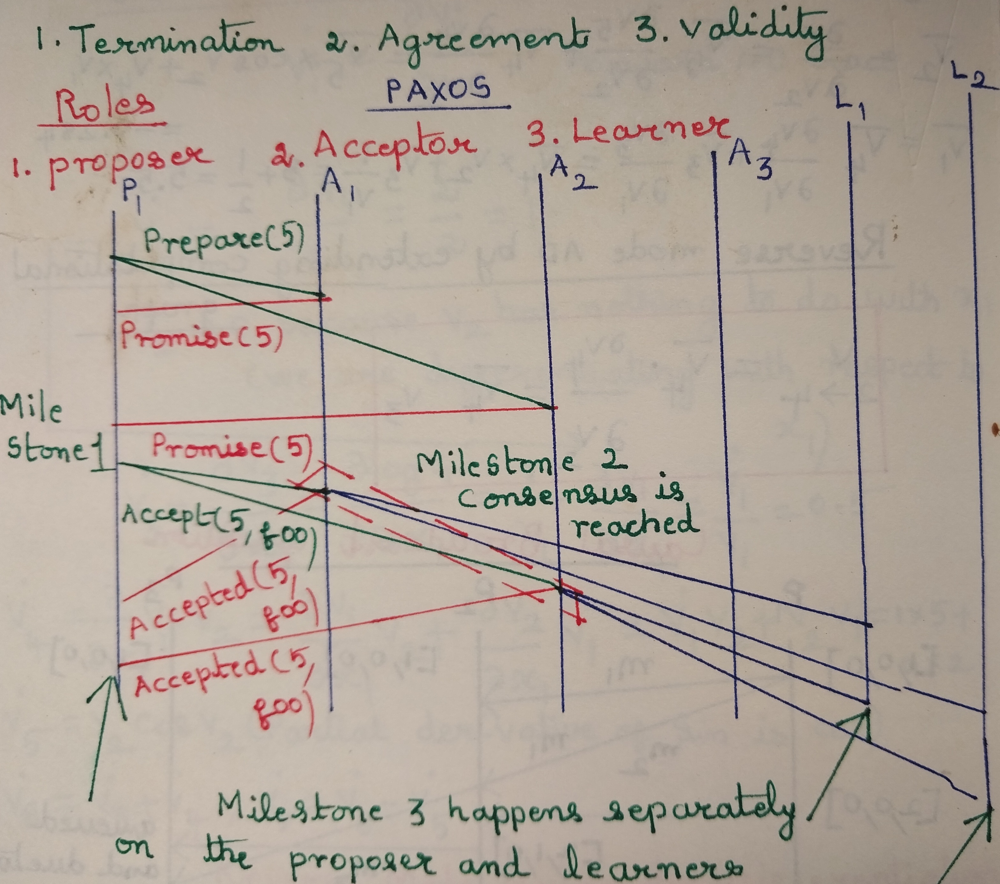
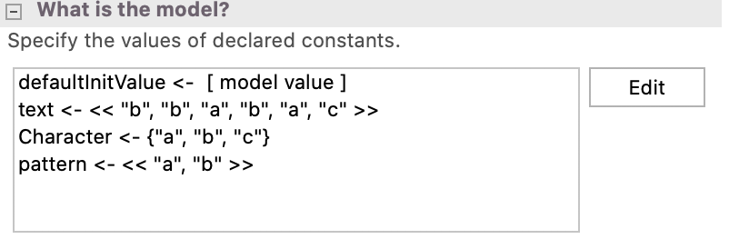

{:class="img-responsive"} 

When I was reading papers on Distributed Systems it was apparent that the algoeithms involved
were hard to understand just by drawing Lamport diagrams. Morever these research papers have Math
notation.

I have rendered a lamport diagram like this.

{:class="img-responsive"}

Even at this abstract level it was hard to understand how this protocol works. So as usual I looked
at ways to render it in code. Writing code for these complex protocols and testing it using Unit tests
was impossible. Further research led me to believe that specifications for verification of these protocols
can be coded. 
I had already come across <i>Hillel Wayne's</i> Practical TLA+ book a few years
back. So I started reading that and naturally I was drawn to TLA+ and the Pluscal
algorithm language.

### Development environment

I didn't find any IDE except the TLA+ Toolkit which was hard
to use. One could configure it and improve the font size in several places
but still it is a difficult development environment.

At the basic level one can debug by printing short pieces of code. My main
reference book is Hillel Wayne's. Practical TLA+.

So, for example, this code can be used to print values.



EXTENDS  Sequences,TLC

(*--algorithm test1

variables

    z = (2 :> 3)[2],
    w = ("a" :> "b").a;
begin    
    print ( ToString(z) \o "  " \o ToString(w));

end algorithm; *)



### Pluscal algorithm language
I have still not cleanly delineated the difference between Pluscal and TLA+syntax.

Moreover I have used a small subset of the language features in the code.

## CONSTANTS


CONSTANTS Character, text, pattern


These are constants than can be declared in the code and setup using the Toolkit's
UI as shown [Model Values setup](#model-title) 

## Operators

"An operator is the TLA+ equivalent of a procedure in programming."
Wayne, Hillel. Practical TLA+ (p. 69). Apress. 

The code I used in the BayerMoore algorithm matches that definition.

Max(x,y) == IF x < y THEN y ELSE x

## Loops

## Pluscal Algorithm Language

### BayerMoore Algorithm implementation.

The Java example of this implementation used an array to represent the ASCII value of
the letters of the alphabet. So I was looking for a similar Pluscal/TLA+ function.

_16.1.1 in Specifying Systems_ has an example. 


Ascii(char) =∆ 96 + choose i ∈ 1 .. 26 :
          “abcdefghijklmnopqrstuvwxyz”[i] = char


So I translated it to the following code but this doesn't compile.


Ascii(char) == 96 + CHOOSE z \in 1 .. 26 :"abcdefghijklmnopqrstuvwxyz"[z] = char


## Translaated TLA code

## Model Values setup

{:class="img-responsive"}

