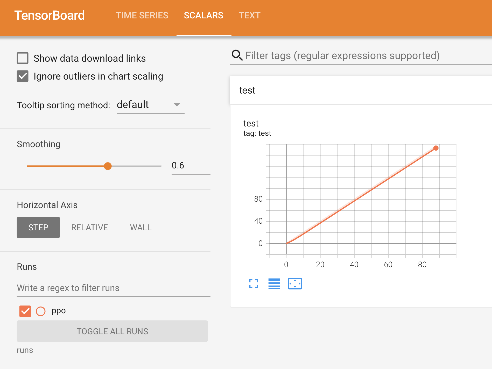

These are the notes I collected while I was taking the [Hugging Face](https://huggingface.co/docs/hub/index)
Reinforcement Learning course. I have mentioned the Video lectures, Arxiv papers and books that I referred.
I have to point out though that this is not an expert's view at all. There is math that I don't fully
understand but I have tried to read and search.

#Stochasticity

#Proximal Policy Optimization


import argparse
import os
from torch.utils.tensorboard import SummaryWriter

def parse_args():
    parser = argparse.ArgumentParser()
    parser.add_argument('--exp-name',type=str,default=os.path.basename(__file__).rstrip(".py"),
                        help='The name of this experiment')
    args = parser.parse_args()
    return args

if __name__ == "__main__":
    args = parse_args()
    print(args)

    writer = SummaryWriter(f"runs/{args.exp_name}")
    writer.add_text(
        "hyperparameters",
        "|param|value|\n|-|-|\n%s" % ("\n".join([f"|{key}|{value}|" for key, value in vars(args).items()])),
    )
    for i in range(100):
        writer.add_scalar("test",i * 2, global_step=i)


{:class="img-responsive"} 
