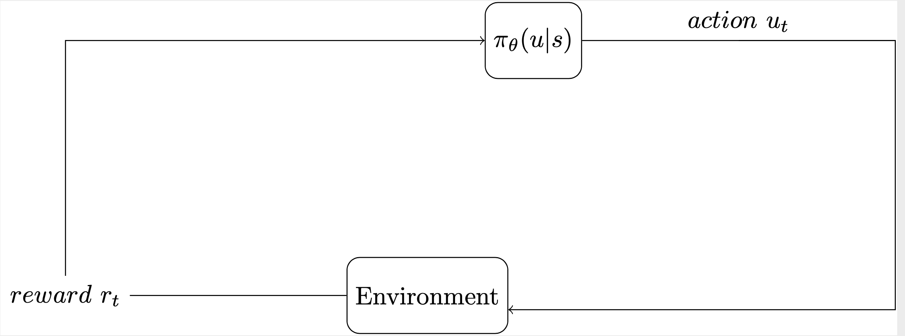

{:class="img-responsive"} 

Latex code that I use to draw various types of diagrams.



[auto, node distance=5cm]
\tikzstyle{block} = [draw, rectangle, minimum height=3em, minimum width=3em]
\tikzstyle{virtual} = [coordinate]

    % Place nodes
    \node [virtual]                 (input)     {};
    \node [virtual]                 (input1)     {};
    \node [rounded corners=5pt][name=t,block, right of=input]   (model)     {\(
        \pi_\theta (u | s )
		 \)};
    \node [virtual, right of=model] (output)    {};
    \node [virtual, right of=model] (feedback)  {};
    \node [rounded corners=5pt][name=e,block, below right of=input1]   (model1)     {Environment};
    \node [virtual, above left of=model1] (reward)    {};
    \node [name=i,virtual, below left] (input1)    {};
    \node [name=r, left of=model1] {\( reward \ r_t \)} (reward);
    % Connect nodes
    \draw [-] (model) -- node [name=y] 
	{\(action \
	   u_t \)}
	(output);
    \draw [->] (y) |- (feedback) |- (model1.-10);
    \draw [->] (model1.180) |- (r) |- (model.-180);
 



{:class="img-responsive"} 



\Large
   \tikzstyle{block} = [draw=none,,rounded corners=2.9mm,minimum width=4.2mm,minimum height=3.7mm, draw=violet!80,thick, text width=.9cm,,font=\bfseries, align=center, fill=cyan!14]  

        %nodes  
        \node[block, anchor=north] (q) {\color{black}{\boldmath$Q_{1}$}};
        \node[block, above=40mm of q] (k) {\color{black}{\boldmath$K_{1}$}};
        \node at ($(q.north)-(2,-2)$) [block] (x1) {\color{black}{\boldmath$x_{1}$}};
         \node[block, right=2cm of x1.center, anchor=center] (v) {\color{black}{\boldmath$V_{1}$}};

		 
        %lines
        \draw[{Stealth[scale=1.3,angle'=45,open]}-,semithick][rounded corners=2] (q) -- node[midway, label=above:{{\boldmath$W^{q}$}}] {}($(q)-(1,0)$) |- ($(x1.east)+(0,.1)$);
        \draw [{Stealth[scale=1.3,angle'=45,open]}-,semithick][rounded corners=2] (k) -- node[midway, label=above:{{\boldmath$W^{k}$}}] {}($(k)-(1,0)$) |- ($(x1.east)+(0,.1)$);
        \draw [{Stealth[scale=1.3,angle'=45,open]}-,semithick][rounded corners=2] (v) -- node[midway, label=above:{{\boldmath$W^{v}$}}] {}($(v)-(1,0)$) |- ($(x1.east)+(0,.1)$);

        %nodes  
        \node[-{Latex[black,length=5mm,width=2mm]},semithick][block, below=54mm of k] (k1) {{\boldmath$K_{2}$}};
        \node[block, anchor=north, below=43mm of k1] (q1) {\color{black}{\boldmath$Q_{2}$}};
		       \node at ($(q1.north)-(2,-2)$) [block , below=57mm of x1] (x2) {\color{black}{\boldmath$x_{2}$}};
                \node[block, right=2cm of x2.center, anchor=center] (v1) {\color{black}{\boldmath$V_{2}$}};
 
        %lines
        \draw[{Stealth[scale=1.3,angle'=45,open]}-,semithick][rounded corners=2pt] (q1) -- node[midway, label=:{{\boldmath$W^{q}$}}] {}($(q1)-(1,0)$) |- ($(x2.east)+(0,.1)$);
        \draw [{Stealth[scale=1.3,angle'=45,open]}-,semithick][rounded corners=2] (k1) -- node[midway, label=left:{{\boldmath$W^{k}$}}] {}($(k1)-(1,0)$) |- ($(x2.east)+(0,.1)$);
        \draw [{Stealth[scale=1.3,angle'=45,open]}-,semithick][rounded corners=2] (v1) -- node[midway, label=above:{{\boldmath$W^{v}$}}] {}($(v1)-(1,0)$) |- ($(x2.east)+(0,.1)$);

		        %nodes  
        \node[block, below=57mm of k1] (k2) {\color{black}{\boldmath$K_{T}$}};
        \node[block, anchor=north, below=40mm of k2] (q2) {\color{black}{\boldmath$Q_{T}$}};
		       \node at ($(q2.north)-(2,-2)$) [block , below=57mm of x2] (x3) {\color{black}{\boldmath$x_{T}$}};
                \node[block, right=2cm of x3.center, anchor=center] (v2) {\color{black}{\boldmath$V_{T}$}};
 
        %lines
        \draw [{Stealth[scale=1.3,angle'=45,open]}-,semithick][ rounded corners=2] (q2) -- node[midway, label=above:{{\boldmath$W^{q}$}}] {}($(q2)-(1,0)$) |- ($(x3.east)+(0,.1)$);
        \draw [{Stealth[scale=1.3,angle'=45,open]}-,semithick][rounded corners=2] (k2) -- node[midway, label=left:{{\boldmath$W^{k}$}}] {}($(k2)-(1,0)$) |- ($(x3.east)+(0,.1)$);
        \draw [{Stealth[scale=1.3,angle'=45,open]}-,semithick][rounded corners=2] (v2) -- node[midway, label=above:{{\boldmath$W^{v}$}}] {}($(v2)-(1,0)$) |- ($(x3.east)+(0,.1)$);

        \node (r1) [draw=none,rounded corners=.5cm,line width=.6mm, below=1mm of q, draw=violet!80, minimum width=5.2cm,minimum height=6.7cm]{};
        
        \node (r2) [draw=none,rounded corners=.5cm,line width=.6mm, right=33mm of v, draw=blue!80, minimum width=3.5cm,minimum height=1.6cm]{};
        \node (r3) [draw=none,rounded corners=.5cm,line width=.5mm, below=37mm of r2, draw=blue!80, minimum width=3.5cm,minimum height=1.6cm]{};
        \node (r4) [draw=none,rounded corners=.5cm,line width=.5mm, below=56mm of r3, draw=blue!80, minimum width=3.5cm,minimum height=1.4cm]{};
		
		
        \node [block , right=37mm of v] (q21) {\color{black}{\boldmath$Q_{2}$}};;
        \node [block , right=3mm of q21] (k11) {\color{black}{\boldmath$K_{1}$}};;
		        \node [below=of r2.north] {\color{black}{\boldmath$T$}};;
		        \node [below= of r3.north] {\color{black}{\boldmath$T$}};;
		        \node [below= of r4.north] {\color{black}{\boldmath$T$}};;

        \node [block , fill=YellowGreen!40,above=37mm of q21] (a21) at ([yshift=-2cm]$(q21)!0.5!(k11)$) {\color{black}{\boldmath$a_{2,1}$}};;

        \node [block , below=45mm of q21] (q22) {\color{black}{\boldmath$Q_{2}$}};;
        \node [block , right=3mm of q22] (k12) {\color{black}{\boldmath$K_{2}$}};;
        \node [block , fill=YellowGreen!40, above=30mm of q22] (a22) at ([yshift=-2cm]$(q22)!0.5!(k12)$) {\color{black}{\boldmath$a_{2,2}$}};;

        \node [block , below=64mm of q22] (q23) {\color{black}{\boldmath$Q_{T}$}};;
        \node [block , right=3mm of q23] (k13) {\color{black}{\boldmath$K_{T}$}};;
        \node [block , fill=YellowGreen!40,above=34mm of q23] (a23) at ([yshift=-2cm]$(q23)!0.5!(k13)$) {\color{black}{\boldmath$a_{2,3}$}};;

        \draw [color=Orange,line width=1.95pt,dotted][rounded corners=2] (v) -- (5.2,0);
\node [block , fill=Violet!20,right=83mm of v1] (A2) {\color{black}{\boldmath$A_{2}$}};;
        \draw [-{Stealth[scale=1.3,angle'=45,open]},color=Orange,line width=1.95pt,dotted][rounded corners=2](5.2,0) -- ($(A2)-(0.7,0)$);
        \draw [-{Stealth[scale=1.3,angle'=45,open]},line width=1.95pt,color=Orange,dotted][rounded corners=2](5.2,-8) -- ($(A2)-(0.7,0)$);
        \draw [line width=1.95pt,color=Orange,dotted][rounded corners=2] (v2) -- (5.2,-8);

		\draw [-{Stealth[scale=1.3,angle'=45,open]},line width=1.95pt,color=Orange,dotted][rounded corners=2] (v1) -- ($(A2)-(0.8,0)$);

	    \draw [line width=1.95pt,color=Orange,dotted][rounded corners=2] ($(r2.south)-(1,0)$) -- (5.2,0);
	    \draw [line width=1.95pt,color=Orange,dotted][rounded corners=2] ($(r4.north)-(1.3,.1)$) -- (5.2,-8);

		\node[text=blue,align=left] at (13,6) {As in the simplified version\\ this is a form of \\ similarity or compatibility measure \\ "Multiplicative Attention" \\};

		\node [text=blue,align=left,right=of A2] (text1) {For each query\\ model learns\\ which key-value input \\ it should attend to};

		        \node [ below=34mm of text1] (formula1) {\color{black}{\boldmath$A(q2,K,V)=\Sigma_{i=1}^T[\frac{\mathrm{exp(q_2 . k_i^T)}}{\Sigma_iexp(q_2 . k_i^T)} v^i]
$}};;
		\node[text=RoyalPurple,below=3mm of formula1,align=left,font=\fontsize{12pt}{15pt}\selectfont] (sm) {Softmax\\};

		\node[text=RoyalPurple,align=left,font=\fontsize{12pt}{15pt}\selectfont] at (1,-3.5) {Current input\\ "query"\\};

		\node at ($(k2)!.5!(q2)$) [text=blue,left=25mm of k2,font=\fontsize{52pt}{35pt}\selectfont]{\ldots};
		
		\node[above,font=\huge\bfseries] at (current bounding box.north) {Self-Attention Mechanism};



{:class="img-responsive"} 

