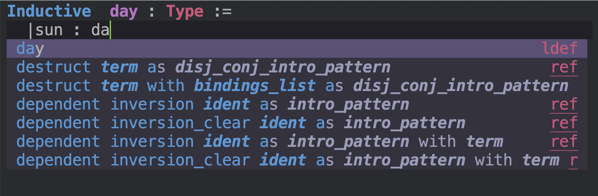
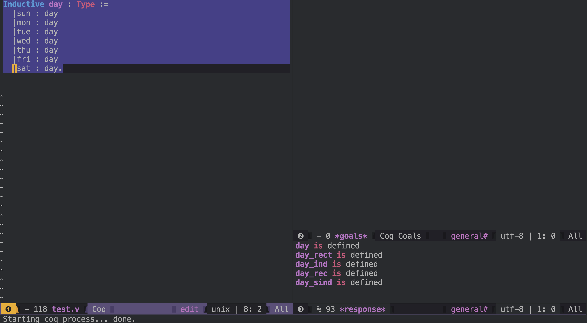

I started dabbling in Programs and proofs recently by using Spacemacs and its
Coq layer. Since I didn't study this subject before I start by setting up and
using the tools.

My primary learning material is [CS6225 Programs and Proofs @ IITM (Coq + F*)](https://www.youtube.com/playlist?list=PLt0HgEXFOHdkfd7phdKKmTIuwHEvPX0qb)
but I will add more once I am past the preliminary stage.

# IDE setup

The colour scheme of Spacemacs is very pleasing. I think. So Spacemacs is what I
like to use whenever possible. The other option is VSCode.

## .spacemacs configuration

Enable the _coq_ layer like this.



 ;; List of configuration layers to load.
   dotspacemacs-configuration-layers
   '(racket
     javascript
     ;; ----------------------------------------------------------------
     ;; Example of useful layers you may want to use right away.
     ;; Uncomment some layer names and press `SPC f e R' (Vim style) or
     ;; `M-m f e R' (Emacs style) to install them.
     ;; ----------------------------------------------------------------
     auto-completion
     ;; better-defaults
     emacs-lisp
     ;; git
     helm
     (haskell :variables
              haskell-enable-hindent-style "johan-tibell")
     coq
     ;; lsp
     ;; markdown
     multiple-cursors
     ;; org
     (shell :variables
            shell-default-height 30
            shell-default-position 'bottom
            shell-default-shell 'eshell)
     ;; spell-checking
     ;; syntax-checking
     ;; version-control
     treemacs)


I added _add-hook_ to activate _Company-coq_ to enable auto-completion features.



(defun dotspacemacs/user-config ()
  "Configuration for user code:
This function is called at the very end of Spacemacs startup, after layer
configuration.
Put your configuration code here, except for variables that should be set
before packages are loaded."
( global-company-mode t)
(setq-default
   dotspacemacs-configuration-layers
   '((auto-completion :variables
                      spacemacs-default-company-backends '(company-files company-capf))))
(add-hook 'coq-mode-hook #'company-coq-mode)
)

The _auto-completion_ feature is powerful enough.

{:class="img-responsive"}



During the installation of _coq_ using _homebrew_ an issue was identified which
I reported [here](https://stackoverflow.com/questions/75843422/coqc-does-not-find-findlib-conf/75857649#75857649)
and it seems to have been fixed promptly.

_coqc_ the compiler works like when it is invoked by C-c C-RET

There is something pleasing about this IDE.

{:class="img-responsive"}
