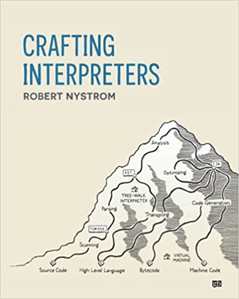

# Crafting Interpreters

{:class="img-responsive"}

This is the book I am reading and I started to code the interpreter using JDK19's preview features.
The book though uses an older version of the JDK.

The preview features introduce _record_ pattern matching but soon I realized languages like Haskell and OCaml
were built with such pattern matching in mind.

So I decided to code part of it using Haskell. And then I started to code the same parts using Racket
which is a far more lofty goal. I think.

# Explanation(TODO)

 As I mention every time I am still learning Functional Programming principles. So I put together
 this code based on data structures generally used for such purposes. The intention is to drive
 this test based on structures like these.

# Haskell Code

I will refactor this code and probably create a Git repo.


{-# LANGUAGE OverloadedStrings #-}
{-# LANGUAGE TypeOperators #-}
{-# LANGUAGE OverloadedStrings #-}
import Data.Char ( isSpace, isDigit, isAlpha, isAlphaNum )
import Data.Either
import Data.Maybe

data Operator i = Literal i| Plus | Minus | Div
  | InvalidChar i
    deriving (Show, Eq) 

data Error i e = Error
  { errorOffset :: Offset
  , error :: ErrorType i e
  } deriving (Eq, Show)

data ErrorType i e
  = EndOfInput
  | Unexpected i
  | Expected i e
  | ExpectedEndOfFile i
  | BeginningOfInput i
  | Empty
  deriving (Eq, Show)

type Offset = Int

operator :: Char -> Operator Char
operator c | c == '+' = Plus
           | c == '-' = Minus
           | c == '/' = Div
           
scanner :: Offset -> ErrorType Offset Char-> String -> Either [Error Offset (ErrorType Offset Char)]  [Operator Char]
scanner offset error (x:xs) 
  | isDigit x = tokenize offset error (Literal x) 
  | x == '+' = tokenize offset error (operator x)
  | otherwise = tokenize offset error (InvalidChar x) 
  where
      tokenize offset error t = 
          case scanner offset error xs of
              Left err -> Left err
              Right tokens -> Right (t : tokens)
scanner offset error "" = Right []

main :: IO ()
main = do
    let result = scanner 0 (BeginningOfInput 0) "1+x2"
    case result of
        Left err -> putStrLn $ "Error: " ++ show err
        Right tokens -> putStrLn $ "Tokens: " ++ show tokens



The result is this. The error condition is not tested.


λ> :main
Tokens: [Literal '1',Plus,InvalidChar 'x',Literal '2']


# Racket code

I have to note that this is my first ever Racket code and the intention is to port my haskell to Typed Racket.
So I have explained what I learn using pieces of code. Neither the Racket code or Haskell code implementes
the entire interpreter or even the lexer. The git repo. will have the entire code if I manage to learn
Racket sufficiently to code the whole interpreter in the book.

## Step 1

This compiles without errors. But the code is not tested. I will add more test code while I refactor.
In this case I have a feeling the the code is more verbose than the equivalent Haskell code.


#lang typed/racket
(require racket/list)

(define (operator c )
  (match c
     ['+' Plus]
     ['-' Minus]
     ['/' Div]))

(struct (i) Literal ([v : i]))
(struct Plus ())
(struct Minus ())
(struct Div ())
(struct (i) InvalidChar ([v : i]))

(struct EndOfInput())
(struct Empty() )
(struct (i) Unexpected([val : i]))
(define-type (Expected i e) (U Integer Char))
(struct (i)  ExpectedEndOfFile([val : i]))
(struct  (i) BeginningOfInput ([val : i]))

(define-type (ErrorType i e)
      (U Empty EndOfInput
      ( Unexpected i)
      ( Expected i e)
      ( ExpectedEndOfFile i)
      ( BeginningOfInput i)))

(define-type (Error i e) (U Integer
                            (ErrorType i e)))


### Simple test


(define (parse-exp e)
  (match e
    [(? number?) (Literal e)]
    ))

(define input 2)

(parse-exp input)



But this prints #<Literal> without the value. So I have to learn how to print a _struct_.

 

(struct (i) Literal ([v : i])
    #:transparent
  )
 
 
 
This is th Racket way of printing the _struct_ with the value.
