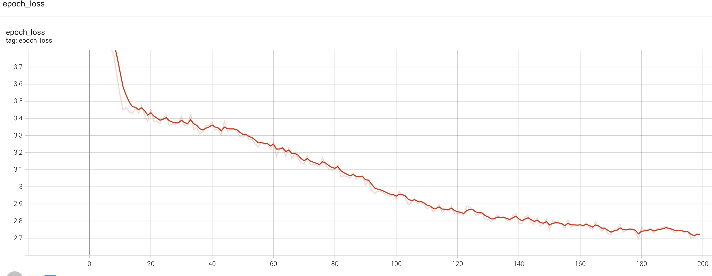
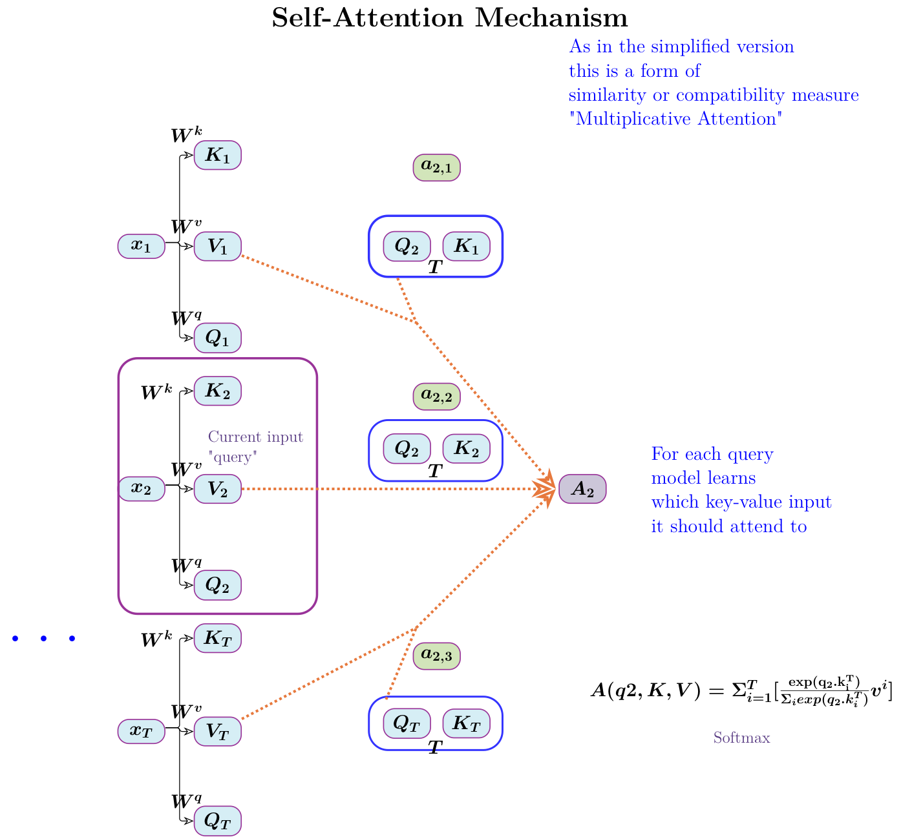

I set about learning the Transformet Architecture from first principles. Before long I realized
I need to read many Arxiv research papers starting with ['Attention is All you need'](https://arxiv.org/abs/1706.03762).
But there are other older foundational papers dealing with this.

The key confounding aspect for me in the field of Machine Learning is the math. One could watch several videos
like I did and take notes. There is one other way to develop intuition. If one is familiar with a framework
then a few algorithms can be coded and executed either on CPU or GPU as the case may be.

I believe both these efforts should be parallel to understand the algorithm and the math.

But before understanding the _Transformer_ architecture we need some intuition of the architectures
that it improves like _Recurrent Neural Nets_. So here I start with an RNN, a simple LSTM to generate
characters. There are several steps before reaching the target Transformer Architecture.

# Tensorflow Code

## tf.lookup.StaticHashTable

There are simpler ways to store data in _lookup_ datastructures but there is also a _HashTable_
which I use to store the individual character in the text and the associated indexes.

There is one for looking up the index of a character and one for looking up the character with
an index.



indextoelem = tf.lookup.StaticHashTable(
    initializer=tf.lookup.KeyValueTensorInitializer(
        keys=tf.strings.as_string([idx  for idx, inp in enumerate(elem)]),
        values=elem,
    ),
    default_value=tf.constant('-1'),
    name="indextoelem"
)


## Part I

The first part can be coded using our Tensorflow knowledge as this is about data preparation. My code
is not based on any established pattern like Part 2. It may not be even idiomatic. This is a learning exercise and
the code is constructed by referring to the TensorFlow API.


import datetime

import tensorflow as tf
from keras import Sequential
from keras.layers import Embedding
from tensorflow import keras

input = tf.io.read_file("/PycharmProjects/TensorFlow2/shakespeare.txt")
input = tf.strings.strip(input)
input = tf.strings.regex_replace(input,' +', '')
input = tf.strings.regex_replace(input,'\n', '')
length = int(tf.strings.length(input))

vocab = tf.strings.unicode_split_with_offsets(input, 'UTF-8')
elem,idx = tf.unique(vocab[0])

table = tf.lookup.StaticHashTable(
    initializer=tf.lookup.KeyValueTensorInitializer(
        keys=elem,
        values=tf.constant([idx  for idx, inp in enumerate(elem)]),
    ),
    default_value=tf.constant(-1),
    name="elemtoindex"
)

indextoelem = tf.lookup.StaticHashTable(
    initializer=tf.lookup.KeyValueTensorInitializer(
        keys=tf.strings.as_string([idx  for idx, inp in enumerate(elem)]),
        values=elem,
    ),
    default_value=tf.constant('-1'),
    name="indextoelem"
)

def random_sample(text):
    rand = tf.random.uniform(shape=[], minval=1, maxval=length - 201)
    start = int(rand)
    # print(f'Start={int(rand)} Length={length} End={start + 200 + 1}')
    return tf.strings.substr(text,start, 201, unit='BYTE')

global samplelist,reversesamplelist
samplelist = []
reversesamplelist = []

def reverse_map_fn(bytes):
    reversesamplelist.append(indextoelem.lookup(tf.strings.as_string(bytes)))
    # print(f'Reverse map{reversesamplelist}')
    return bytes

def map_fn(bytes):
    samplelist.append(table.lookup(bytes))
    return bytes

def draw_random_sample():
    for i in range(50):
        sample = random_sample(input)
        split_sample = tf.strings.bytes_split(sample)
        # print(f'Sample {split_sample}')
        tf.map_fn(map_fn, tf.strings.bytes_split(split_sample))
        global samplelist
        reverse_map(samplelist[:-1])
        X,y = (tf.stack(samplelist[:-1]),tf.stack(samplelist[1:]))
        samplelist = []
        yield X,y

def reverse_map(X):
    tf.map_fn(reverse_map_fn, X)

logdir = "/Users/anu/PycharmProjects/TensorFlow2/logs/scalars/" + datetime.datetime.now().strftime("%Y%m%d-%H%M%S")
tensorboard_callback = keras.callbacks.TensorBoard(log_dir=logdir)

EMBEDDING_DIM = 128
HIDDEN_DIM = 1024
INPUT_DIM=len(elem)
OUTPUT_DIM=len(elem)
EPOCHS = 200


## Part 2

This is the part that can be copied if one understands most of the meaning of the network
architecture.



def build_model(input_dim,embedding_dim,hidden_dim,output_dim):
    # define model
    model = Sequential()
    model.add(Embedding(input_dim, embedding_dim,batch_input_shape=[50,None]))
    model.add(keras.layers.LSTM(hidden_dim,return_sequences= True,stateful=True,
      recurrent_initializer=tf.keras.initializers.GlorotNormal()
    ))
    model.add(keras.layers.Dense(output_dim))
    print(model.summary())
    return model

loss = tf.losses.SparseCategoricalCrossentropy(from_logits=True)

model = build_model(INPUT_DIM, EMBEDDING_DIM,HIDDEN_DIM,OUTPUT_DIM)
model.compile(tf.keras.optimizers.Adam(learning_rate=1e-3),
              loss=loss)
print(model.summary())

train_dataset = tf.data.Dataset.from_generator(
    draw_random_sample,
    output_types=(tf.int32, tf.int32),
    output_shapes=((200,1), (200,1))).batch(50)

history = model.fit(train_dataset,epochs=EPOCHS,callbacks=[tensorboard_callback],)


#Graph of epoch loss

I expected the epoch loss to be driven down lower than what the graph shows. This can be investigated.

{:class="img-responsive"}

# Self-Attention
Explanation follows. This diagram is drawn based on [Sebastian Raschka's](https://sebastianraschka.com/blog/2021/dl-course.html#l19-self-attention-and-transformer-networks)
explanatory diagram. I use Tikz and code is [here](https://mohanr.github.io/TikzNotes/)

{:class="img-responsive"}

