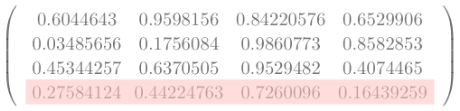

Yet another attempt to closely replicate the popular PyTorch code of [https://karpathy.ai/zero-to-hero.html](Karpathy)
close on the heels of the exploration of basic [https://mohanr.github.io/Exploring-Transformer-Architecture/](Transformers).

I have ported the code to TensorFlow and may have caused a bug or two which are not evident. But the code works as I 
expected. But this just the beginning stage. At this point there is no GPT.

### Stage 1

The dataset used here is not cleaned. There are characters and numbers in it.



import tensorflow as tf
import tensorflow_probability as tfp
from keras.layers import Embedding

input = tf.io.read_file("/Users/anu/PycharmProjects/TensorFlow2/shakespeare.txt")
input = tf.strings.strip(input)
input = tf.strings.regex_replace(input,' +', '')
input = tf.strings.regex_replace(input,'\n', '')
length = int(tf.strings.length(input))

vocab = tf.strings.unicode_split_with_offsets(input, 'UTF-8')
elem,idx = tf.unique(vocab[0])
vocab_size = len(elem)
print(f'Size of vocabulary={vocab_size}')

table = tf.lookup.StaticHashTable(
    initializer=tf.lookup.KeyValueTensorInitializer(
        keys=elem,
        values=tf.constant([idx  for idx, inp in enumerate(elem)]),
    ),
    default_value=tf.constant(-1),
    name="elemtoindex"
)

indextoelem = tf.lookup.StaticHashTable(
    initializer=tf.lookup.KeyValueTensorInitializer(
        keys=tf.strings.as_string([idx  for idx, inp in enumerate(elem)]),
        values=elem,
    ),
    default_value=tf.constant('-1'),
    name="indextoelem"
)

def random_sample(text):
    rand = tf.random.uniform(shape=[], minval=1, maxval=length - 201)
    start = int(rand)
    # print(f'Start={int(rand)} Length={length} End={start + 200 + 1}')
    return tf.strings.substr(text,start, 201, unit='BYTE')

global samplelist,reversesamplelist
samplelist = []
reversesamplelist = []

def reverse_map_fn(bytes):
    reversesamplelist.append(indextoelem.lookup(tf.strings.as_string(bytes)))
    return bytes

def map_fn(bytes):
    samplelist.append(table.lookup(bytes))
    return bytes

def draw_random_sample(block_size):
        sample = tf.strings.substr(input,0, block_size, unit='BYTE')
        split_sample = tf.strings.bytes_split(sample)
        tf.map_fn(map_fn, tf.strings.bytes_split(split_sample))
        global samplelist
        reverse_map(samplelist[:-1])
        X,y = (tf.stack(samplelist[:-1]),tf.stack(samplelist[1:]))
        samplelist = []
        return X,y

def reverse_map(X):
    tf.map_fn(reverse_map_fn, X)

X,y = draw_random_sample(9)
print(reversesamplelist)
vocab_size = len(elem)

def decode(idx):
    return idx,indextoelem.lookup(
                    tf.strings.as_string([inp  for inp, inp in enumerate(idx)]))

class BigramModel(tf.keras.Model):
    def __init__(self,vocab_size):
        super().__init__()
        self.token_embedding_table = Embedding(vocab_size,vocab_size)
    def call(self,idx,targets=None):
        logits=self.token_embedding_table(idx)
        if targets is None:
            loss = None
        else:
            bce = tf.keras.losses.SparseCategoricalCrossentropy(from_logits=True)
            loss = bce(targets,tf.squeeze(logits)).numpy()
        return logits, loss
    def generate(self,idx,max_new_tokens):
        i = tf.constant(0)
        c = lambda i, d: tf.less(i, max_new_tokens)

        def b(i, idx):
            logits,loss = self(idx)
            logits = logits[-1]
            # print(f'Shape of logits is {tf.shape(logits)}')
            probs = tf.nn.softmax(logits)
            # print(f'Shape of probs is {tf.shape(probs)}')
            idx_next = tfp.distributions.Multinomial(total_count=1,probs=probs)
            # print(f'Shape of sample is {tf.shape(idx_next.sample(1))}')
            idx = tf.concat([idx,
                    tf.reshape(tf.squeeze(
                        tf.cast(tf.where(
                            tf.reshape(idx_next.sample(1),(vocab_size))),tf.int64))
                      ,(1,))],0)
            return tf.add(i, 1), idx

        _, idx1 = tf.while_loop(c, b, loop_vars=[i, idx])
        return idx1

m = BigramModel(len(elem))
out,loss = m(tf.reshape(X,(1,8)),tf.reshape(y,(1,8)))
idx, generation = decode(m.generate(tf.zeros((1,),tf.int64),20))
print(["".join(i) for i in generation.numpy()[:].astype(str)])



# Last time step

Only the last dimension in this output is considered for predictng the next _one_ character
at this time.

So in this example the last dimension is highlighted.


x = tf.random.uniform((4,4))
print(x)
print(x[-1])



tf.Tensor(
[[0.6044643  0.9598156  0.84220576 0.6529906 ]
 [0.03485656 0.1756084  0.9860773  0.8582853 ]
 [0.45344257 0.6370505  0.9529482  0.4074465 ]
 [0.27584124 0.44224763 0.7260096  0.16439259]], shape=(4, 4), dtype=float32)
 

{:class="img-responsive"}
