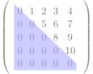
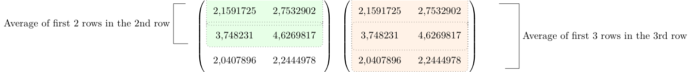

Yet another attempt to closely replicate the popular PyTorch code of [https://karpathy.ai/zero-to-hero.html](Karpathy)
close on the heels of the exploration of basic [https://mohanr.github.io/Exploring-Transformer-Architecture/](Transformers).

I have ported the code to TensorFlow and may have caused a bug or two which are not evident. But the code works as I 
expected. But this is just the beginning stage. At this point there is no GPT.

# Stage 1

The dataset used here is not cleaned. There are characters and numbers in it. So _newlines_ are
removed but data can be properly fed at a later stage.



import tensorflow as tf
import tensorflow_probability as tfp
from keras.layers import Embedding

input = tf.io.read_file("/Users/anu/PycharmProjects/TensorFlow2/shakespeare.txt")
input = tf.strings.strip(input)
input = tf.strings.regex_replace(input,' +', '')
input = tf.strings.regex_replace(input,'\n', '')
length = int(tf.strings.length(input))

vocab = tf.strings.unicode_split_with_offsets(input, 'UTF-8')
elem,idx = tf.unique(vocab[0])
vocab_size = len(elem)
print(f'Size of vocabulary={vocab_size}')

table = tf.lookup.StaticHashTable(
    initializer=tf.lookup.KeyValueTensorInitializer(
        keys=elem,
        values=tf.constant([idx  for idx, inp in enumerate(elem)]),
    ),
    default_value=tf.constant(-1),
    name="elemtoindex"
)

indextoelem = tf.lookup.StaticHashTable(
    initializer=tf.lookup.KeyValueTensorInitializer(
        keys=tf.strings.as_string([idx  for idx, inp in enumerate(elem)]),
        values=elem,
    ),
    default_value=tf.constant('-1'),
    name="indextoelem"
)

def random_sample(text):
    rand = tf.random.uniform(shape=[], minval=1, maxval=length - 201)
    start = int(rand)
    # print(f'Start={int(rand)} Length={length} End={start + 200 + 1}')
    return tf.strings.substr(text,start, 201, unit='BYTE')

global samplelist,reversesamplelist
samplelist = []
reversesamplelist = []

def reverse_map_fn(bytes):
    reversesamplelist.append(indextoelem.lookup(tf.strings.as_string(bytes)))
    return bytes

def map_fn(bytes):
    samplelist.append(table.lookup(bytes))
    return bytes

def draw_random_sample(block_size):
        sample = tf.strings.substr(input,0, block_size, unit='BYTE')
        split_sample = tf.strings.bytes_split(sample)
        tf.map_fn(map_fn, tf.strings.bytes_split(split_sample))
        global samplelist
        reverse_map(samplelist[:-1])
        X,y = (tf.stack(samplelist[:-1]),tf.stack(samplelist[1:]))
        samplelist = []
        return X,y

def reverse_map(X):
    tf.map_fn(reverse_map_fn, X)

X,y = draw_random_sample(9)
print(reversesamplelist)
vocab_size = len(elem)

def decode(idx):
    return idx,indextoelem.lookup(
                    tf.strings.as_string([inp  for inp, inp in enumerate(idx)]))



The model sub-class is simple and accepts the entire sequence of characters everytime.
But we are predicting the next character only based on the previous character. This will
be addressed later.


tf.Tensor([0], shape=(1,), dtype=int64)
tf.Tensor([0 8], shape=(2,), dtype=int64)
tf.Tensor([ 0  8 43], shape=(3,), dtype=int64)
tf.Tensor([ 0  8 43 67], shape=(4,), dtype=int64)
tf.Tensor([ 0  8 43 67  5], shape=(5,), dtype=int64)
tf.Tensor([ 0  8 43 67  5 31], shape=(6,), dtype=int64)
tf.Tensor([ 0  8 43 67  5 31 31], shape=(7,), dtype=int64)
tf.Tensor([ 0  8 43 67  5 31 31 21], shape=(8,), dtype=int64)
tf.Tensor([ 0  8 43 67  5 31 31 21 51], shape=(9,), dtype=int64)
tf.Tensor([ 0  8 43 67  5 31 31 21 51 23], shape=(10,), dtype=int64)
tf.Tensor([ 0  8 43 67  5 31 31 21 51 23  2], shape=(11,), dtype=int64)
tf.Tensor([ 0  8 43 67  5 31 31 21 51 23  2  2], shape=(12,), dtype=int64)
tf.Tensor([ 0  8 43 67  5 31 31 21 51 23  2  2 56], shape=(13,), dtype=int64)
tf.Tensor([ 0  8 43 67  5 31 31 21 51 23  2  2 56  1], shape=(14,), dtype=int64)
tf.Tensor([ 0  8 43 67  5 31 31 21 51 23  2  2 56  1 55], shape=(15,), dtype=int64)
tf.Tensor([ 0  8 43 67  5 31 31 21 51 23  2  2 56  1 55 36], shape=(16,), dtype=int64)
tf.Tensor([ 0  8 43 67  5 31 31 21 51 23  2  2 56  1 55 36 12], shape=(17,), dtype=int64)
tf.Tensor([ 0  8 43 67  5 31 31 21 51 23  2  2 56  1 55 36 12 27], shape=(18,), dtype=int64)
tf.Tensor([ 0  8 43 67  5 31 31 21 51 23  2  2 56  1 55 36 12 27 31], shape=(19,), dtype=int64)
tf.Tensor([ 0  8 43 67  5 31 31 21 51 23  2  2 56  1 55 36 12 27 31 38], shape=(20,), dtype=int64)


The is the TensorFlow code that should produce the same result as the original PyTorch code.
The loop structures are all different though.



class BigramModel(tf.keras.Model):
    def __init__(self,vocab_size):
        super().__init__()
        self.token_embedding_table = Embedding(vocab_size,vocab_size)
    def call(self,idx,targets=None):
        logits=self.token_embedding_table(idx)
        if targets is None:
            loss = None
        else:
            bce = tf.keras.losses.SparseCategoricalCrossentropy(from_logits=True)
            loss = bce(targets,tf.squeeze(logits)).numpy()
        return logits, loss
    def generate(self,idx,max_new_tokens):
        i = tf.constant(0)
        c = lambda i, d: tf.less(i, max_new_tokens)

        def b(i, idx):
            logits,loss = self(idx)
            logits = logits[-1]
            # print(f'Shape of logits is {tf.shape(logits)}')
            probs = tf.nn.softmax(logits)
            # print(f'Shape of probs is {tf.shape(probs)}')
            idx_next = tfp.distributions.Multinomial(total_count=1,probs=probs)
            # print(f'Shape of sample is {tf.shape(idx_next.sample(1))}')
            idx = tf.concat([idx,
                    tf.reshape(tf.squeeze(
                        tf.cast(tf.where(
                            tf.reshape(idx_next.sample(1),(vocab_size))),tf.int64))
                      ,(1,))],0)
            return tf.add(i, 1), idx

        _, idx1 = tf.while_loop(c, b, loop_vars=[i, idx])
        return idx1



## Batches

I haven't coded this to use batches at this time hoping to add it later.

## Last time step

Only the last dimension in this output is considered for predictng the next _one_ character
at this time.

So in this example the last dimension is highlighted.


x = tf.random.uniform((4,4))
print(x)
print(x[-1])



tf.Tensor(
[[0.6044643  0.9598156  0.84220576 0.6529906 ]
 [0.03485656 0.1756084  0.9860773  0.8582853 ]
 [0.45344257 0.6370505  0.9529482  0.4074465 ]
 [0.27584124 0.44224763 0.7260096  0.16439259]], shape=(4, 4), dtype=float32)
 

{:class="img-responsive"}

## Generation

This generates these 20 characters.



m = BigramModel(len(elem))
out,loss = m(tf.reshape(X,(1,8)),tf.reshape(y,(1,8)))
idx, generation = decode(m.generate(tf.zeros((1,),tf.int64),20))
print(["".join(i) for i in generation.numpy()[:].astype(str)])



['1', 'T', '0', 'V', 'S', '.', "'", '.', 'n', 'U', 't', '8', 'l', 'M', "'", 'T', 'g', 'b', 'N', 'i', 'h']

## Training Stage 1

This is the entire code again as small changes have been made to train.



import tensorflow as tf
import tensorflow_probability as tfp
from keras.layers import Embedding

input = tf.io.read_file("/Users/anu/PycharmProjects/TensorFlow2/shakespeare.txt")
input = tf.strings.strip(input)
input = tf.strings.regex_replace(input,' +', '')
input = tf.strings.regex_replace(input,'\n', '')
length = int(tf.strings.length(input))

vocab = tf.strings.unicode_split_with_offsets(input, 'UTF-8')
elem,idx = tf.unique(vocab[0])
vocab_size = len(elem)
print(f'Size of vocabulary={vocab_size}')
block_size = 9
table = tf.lookup.StaticHashTable(
    initializer=tf.lookup.KeyValueTensorInitializer(
        keys=elem,
        values=tf.constant([idx  for idx, inp in enumerate(elem)]),

    ),
    default_value=tf.constant(-1),
    name="elemtoindex"
)

indextoelem = tf.lookup.StaticHashTable(
    initializer=tf.lookup.KeyValueTensorInitializer(
        keys=tf.strings.as_string([idx  for idx, inp in enumerate(elem)]),
        values=elem,

    ),
    default_value=tf.constant('-1'),
    name="indextoelem"
)

def random_sample(text):
    rand = tf.random.uniform(shape=[], minval=1, maxval=length - 201)
    start = int(rand)
    # print(f'Start={int(rand)} Length={length} End={start + 200 + 1}')
    return tf.strings.substr(text,start, 201, unit='BYTE')

global samplelist,reversesamplelist
samplelist = []
reversesamplelist = []

def reverse_map_fn(bytes):
    reversesamplelist.append(indextoelem.lookup(tf.strings.as_string(bytes)))
    return bytes

def map_fn(bytes):
    samplelist.append(table.lookup(bytes))
    return bytes

def random_sample(text,block_size):
    rand = tf.random.uniform(shape=[], minval=1, maxval=length - (block_size + 1))
    start = int(rand)
    # print(f'Start={int(rand)} Length={length} End={start + block_size + 1}')
    return tf.strings.substr(text,start, block_size, unit='BYTE')

def draw_random_sample(block_size):
        sample = random_sample(input,block_size)
        split_sample = tf.strings.bytes_split(sample)
        tf.map_fn(map_fn, tf.strings.bytes_split(split_sample))
        global samplelist
        reverse_map(samplelist[:-1])
        X,y = (tf.stack(samplelist[:-1]),tf.stack(samplelist[1:]))
        samplelist = []
        return X,y

def reverse_map(X):
    tf.map_fn(reverse_map_fn, X)

X,y = draw_random_sample(block_size)
print(reversesamplelist)
vocab_size = len(elem)

def decode(idx):
    return idx,indextoelem.lookup(
                    tf.strings.as_string([inp  for inp, inp in enumerate(idx)]))

class BigramModel(tf.keras.Model):
    def __init__(self,vocab_size):
        super().__init__()
        self.token_embedding_table = Embedding(vocab_size,vocab_size)
    def call(self,idx,targets=None):
        logits=self.token_embedding_table(idx)
        if targets is None:
            loss = None
        else:
            bce = tf.keras.losses.SparseCategoricalCrossentropy(from_logits=True)
            # loss = bce(targets,tf.squeeze(logits)).numpy()
            loss = bce(targets, tf.squeeze(logits))
        return logits, loss
    def generate(self,idx,max_new_tokens):
        i = tf.constant(0)
        c = lambda i, d: tf.less(i, max_new_tokens)

        def b(i, idx):
            logits,loss = self(idx)
            logits = logits[-1]
            # print(f'Shape of logits is {tf.shape(logits)}')
            probs = tf.nn.softmax(logits)
            # print(f'Shape of probs is {tf.shape(probs)}')
            idx_next = tfp.distributions.Multinomial(total_count=1,probs=probs)
            # print(f'Shape of sample is {tf.shape(idx_next.sample(1))}')
            idx = tf.concat([idx,
                    tf.reshape(tf.squeeze(
                        tf.cast(tf.where(
                            tf.reshape(idx_next.sample(1),(vocab_size))),tf.int64))
                      ,(1,))],0)
            return tf.add(i, 1), idx

        _, idx1 = tf.while_loop(c, b, loop_vars=[i, idx])
        return idx1

m = BigramModel(len(elem))
out,loss = m(tf.reshape(X,(1,block_size -1)),tf.reshape(y,(1,block_size-1)))
idx, generation = decode(m.generate(tf.zeros((1,),tf.int64),20))
print(["".join(i) for i in generation.numpy()[:].astype(str)])

optimizer = tf.keras.optimizers.Adam(learning_rate=1e-3)

epochs = 2
for epoch in range(epochs):
    print("\nStart of epoch %d" % (epoch,))

    for step in range(20000):
        with tf.GradientTape() as tape:
            x,y = draw_random_sample(block_size)
            logits,loss = m(tf.reshape(x, (1, block_size - 1)), tf.reshape(y, (1, block_size - 1)))

        grads = tape.gradient(loss, m.trainable_weights)

        # Run one step of gradient descent by updating
        # the value of the variables to minimize the loss.
        optimizer.apply_gradients(zip(grads, m.trainable_weights))

        # Log every 200 batches.
        if step % 200 == 0:
            print(
                "Training loss at step %d: %.4f"
                % (step, float(loss))
            )
            print("Seen so far: %s samples" % ((step + 1)))

_, generation = decode(m.generate(tf.zeros((1,),tf.int64),20))
print(["".join(i) for i in generation.numpy()[:].astype(str)])



# Matrix multiplication trick using triangular matrix

I am reusing this code I contributed to [Stackoverflow](https://stackoverflow.com/questions/56159487/transform-an-array-into-a-matrix-with-its-elements-filling-the-upper-triangle-of/56183515#56183515) years back
with appropriate changes introduced by TensorFlow 2 API. This code can be refactored and improved but at this time it works.

What does the resulting matrix look like ? The logic if the code now creates a lower triangular matrix( or upper triangular matrix, if we want it)
like this.

{:class="img-responsive"}



x = tf.constant(tf.ones(10,))
ones = tf.ones((5,5),dtype=tf.int64) #size of the output matrix
mask_a = tf.linalg.band_part(ones, -1, 0)  # Upper triangular matrix of 0s and 1s
mask_b = tf.linalg.band_part(ones, 0, 0)  # Diagonal matrix of 0s and 1s
mask = tf.subtract(mask_a, mask_b) # Mask of upper triangle above diagonal

zero = tf.constant(0, dtype=tf.int64)
non_zero = tf.not_equal(mask, zero) #Conversion of mask to Boolean matrix
indices = tf.where(non_zero) # Extracting the indices of upper trainagle elements

out = tf.SparseTensor(indices,x,dense_shape=tf.cast((5,5),dtype=tf.int64))
dense = tf.slice(tf.sparse.to_dense(out), [1, 0], [3, 3])
tf.print(dense)

dense = dense / tf.reduce_sum(dense,1,keepdims=True)
print(dense)

random_ints = tf.random.uniform(shape=(3,2), minval=1., maxval=5.)
print(random_ints)

print(tf.matmul(dense,random_ints))


The output is this.



[[1 0 0]
 [1 1 0]
 [1 1 1]]
tf.Tensor(
[[1.         0.         0.        ]
 [0.5        0.5        0.        ]
 [0.33333334 0.33333334 0.33333334]], shape=(3, 3), dtype=float32)
tf.Tensor(
[[2.1591725 2.7532902]
 [3.748231  4.6269817]
 [2.0407896 2.2444978]], shape=(3, 2), dtype=float32)
tf.Tensor(
[[2.1591725 2.7532902]
 [2.9537017 3.690136 ]
 [2.6493979 3.2082565]], shape=(3, 2), dtype=float32)



The trick give us a matrix that has rows based on weighted averages like this.

{:class="img-responsive"}

