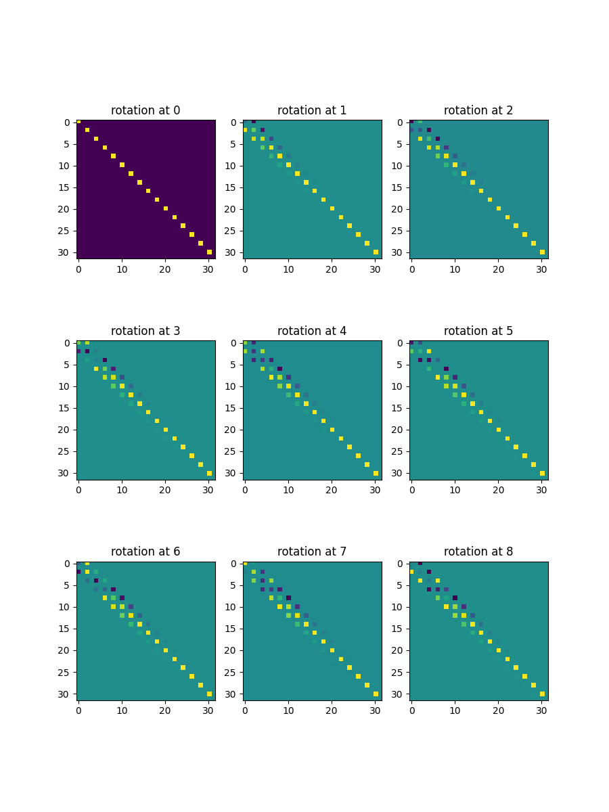
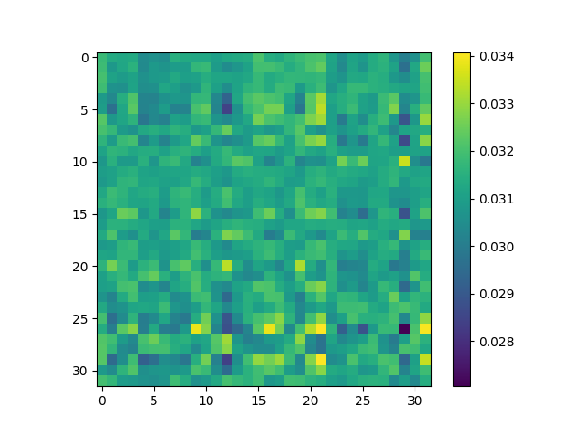

# tl;dr
1. The architecture is described in [Llama: Open and Efficient Foundation Language Models](http://arxiv.org/pdf/2302.13971.pdf)
2. The code is ported from PyTorch to TensorFlow 2.x using various references. (e.g) https://nn.labml.ai/transformers/rope/index.html
   TensorFlow is very verbose and sometimes it poses difficulties as every line of PyTorch has to be ported.
4. In very few cases the code can be directly ported with minimal changes. But this situation isn't common.
5. The math supporting the algorithm is only partially understood. There are several research papers to read.
6. The RoPE embeddings and attention need more insight and explanation.In fact each section will need multiple
   diagrams and descriptions.

# Batches


def random_sample(text,block_size):
    rand = tf.random.uniform(shape=(batch_size,), minval=1, maxval=length - (block_size + 1),dtype=tf.int32)
    return [tf.strings.substr(text,i, block_size, unit='BYTE') for i in rand]

def draw_random_sample_batches(block_size):
        sample = random_sample(input,block_size)
        tf.map_fn(map_fn,tf.strings.bytes_split(sample))
        global samplelist
        X = tf.stack([inp[  : -1] for inp in samplelist])
        y = tf.stack([inp[ 1 :  ] for inp in samplelist])
        samplelist = []
        return X,y



# RMSNorm



import numpy as np
import tensorflow as tf

class RMSNorm(tf.keras.Model):

    def __init__(self, layer_shape):
        super(RMSNorm, self).__init__()
        self.scale = tf.Variable(initial_value=np.ones(layer_shape), trainable=True,dtype=tf.float32)

    def call(self, x):
        normalized_mat, norm = tf.linalg.normalize(x, axis=(1, 2))
        # print(f'Normalize {norm}')
        rms = tf.multiply(norm ,
                             tf.pow(tf.cast(tf.size(x[0]),tf.float32),-0.5))
        r = tf.divide(x , rms )
        return tf.multiply(self.scale[:tf.shape(x)[1], :] , r)



## TensorFlow Tests

Simple tests like these are supported by TensorFlow. I have learnt to use the Python console from within PyCharm
as the tests are sometimes not recognized by the IDE.



/opt/anaconda3/envs/tensorflow2/bin/python3 "/Applications/PyCharm CE.app/Contents/plugins/python-ce/helpers/pydev/pydevconsole.py" --mode=client --port=51221
import sys; print('Python %s on %s' % (sys.version, sys.platform))
sys.path.extend(['/Users/anu/PycharmProjects/illama'])
Python 3.7.10 (default, Feb 26 2021, 10:16:00) 
Type 'copyright', 'credits' or 'license' for more information
IPython 7.24.1 -- An enhanced Interactive Python. Type '?' for help.
PyDev console: using IPython 7.24.1
Python 3.7.10 (default, Feb 26 2021, 10:16:00) 
[Clang 10.0.0 ] on darwin
runfile('/Users/anu/PycharmProjects/illama/testRotaryEmbedding.py', wdir='/Users/anu/PycharmProjects/illama')
Running tests under Python 3.7.10: /opt/anaconda3/envs/tensorflow2/bin/python3
[ RUN      ] testRotaryEmbedding.test_RotaryEmbedding
2023-08-25 12:29:24.820540: I tensorflow/core/platform/cpu_feature_guard.cc:151] This TensorFlow binary is optimized with oneAPI Deep Neural Network Library (oneDNN) to use the following CPU instructions in performance-critical operations:  AVX2 FMA
To enable them in other operations, rebuild TensorFlow with the appropriate compiler flags.
16
tf.Tensor([32 32], shape=(2,), dtype=int32)
tf.Tensor([ 1 32], shape=(2,), dtype=int32)
INFO:tensorflow:time(__main__.testRotaryEmbedding.test_RotaryEmbedding): 1.01s
I0825 12:29:25.825525 4538162624 test_util.py:2309] time(__main__.testRotaryEmbedding.test_RotaryEmbedding): 1.01s
[       OK ] testRotaryEmbedding.test_RotaryEmbedding
[ RUN      ] testRotaryEmbedding.test_session
[  SKIPPED ] testRotaryEmbedding.test_session
----------------------------------------------------------------------
Ran 2 tests in 1.008s
OK (skipped=1)
Process finished with exit code 0




import tensorflow as tf

from Parameters import batch_size, block_size, n_embd

class testRMSNorm(tf.test.TestCase):

    def setUp(self):
        super(testRMSNorm, self).setUp()
        self.batch = tf.random.normal((batch_size, block_size, n_embd))

    def test_RMSNormTest(self):
        normalized_mat, norm = tf.linalg.normalize(self.batch, axis=(1, 2))
        ff_rms = tf.multiply(norm,
                             tf.pow(tf.cast(tf.size(self.batch[0]), tf.float32), -0.5))
        ffx = tf.Variable(tf.zeros_like(self.batch))
        print(tf.shape(ffx))
        for i in range(self.batch.shape[0]):
            ffx[i, :, : ].assign(tf.divide(self.batch[i] , ff_rms[i]))
        normalized_mat, norm = tf.linalg.normalize(self.batch, axis=(1, 2))
        print(tf.pow(norm,2))

        # The values are close to 1024 but not close enough for default
        # tolerance levels to pass the test. So it will fail unless
        # I pass a different tolerance level. I believe this is a temporary
        # fix until I understand the issue.
        self.assertAllClose(tf.pow(norm,2),
                            tf.reshape(
                                tf.repeat([tf.constant(1024,tf.float32)], repeats=[4], axis=0),
                                (4,1,1)),50,50)

tf.test.main()



There is one other issue that I don't understand fully.

The test failed as the values are not close enough as per the tolerance.

My questions are these.

1. Is the RMSNorm algorithm correct ? Should I read any material/code to improve it if it is wrong ?
2. Can I use different tolerance levels to pass the test ? The API _ self.assertAllClose_ takes tolerance levels as
   parameters.And if I pass 50( for example ) for the upper and lower limit the test passes.

I can also ignore the failure as the values seem to be close.



AssertionError: 
Not equal to tolerance rtol=1e-09, atol=0.0001
Mismatched value: a is different from b. 
not close where = (array([0, 1, 2, 3]), array([0, 0, 0, 0]), array([0, 0, 0, 0]))
not close lhs = [1019.3864 1056.9813 1021.6669 1046.128 ]
not close rhs = [1024. 1024. 1024. 1024.]
not close dif = [ 4.6135864 32.981323   2.33313   22.128052 ]
not close tol = [0.00010102 0.00010102 0.00010102 0.00010102]
dtype = float32, shape = (4, 1, 1)
Mismatched elements: 4 / 4 (100%)
Max absolute difference: 32.981323
Max relative difference: 0.03220832



# Rotary Positional Embeddings( RoPE)

Code used to test _RoPE_ embeddings



from matplotlib import pyplot as plt
import tensorflow as tf
from Parameters import n_embd
from RotaryPositionalEmbeddings import RotaryPositionalEmbeddings

def rotaryPositionalEmbeddingsTest():
    K = 3
    rotary_emb = RotaryPositionalEmbeddings()
    R = rotary_emb.rotary_matrix(tf.pow(K,2),n_embd)
    fig, ax = plt.subplots(K, K, figsize=(K * 3, K * 4))

    for i in range(K):
        for j in range(K):
            ax[i, j].imshow(R[i * K + j, :, :])
            ax[i, j].set_title(f'rotation at {i * K + j}')
    # plt.show()
    plt.savefig("rotraryembeddings.png")

if __name__ == "__main__":
    rotaryPositionalEmbeddingsTest()



# RoPE



import tensorflow as tf
import numpy as np

class RotaryPositionalEmbeddings(tf.keras.Model):

    def __init__(self):
        super(RotaryPositionalEmbeddings, self).__init__()

    def rotary_matrix( self,block_size, embedding_dim):
        R = tf.Variable(tf.zeros((block_size, embedding_dim, embedding_dim)))
        i = tf.constant(0)
        p_i = tf.constant(0)
        neg_2 = tf.constant(-2)
        emb = lambda i, d: tf.less(i, int(tf.divide(embedding_dim , 2) - 1))
        p = lambda p_i, d: tf.less(p_i, block_size )
        print(int(tf.divide(embedding_dim , 2)))
        def position(p_i, p_idx):
            def embedding(i, idx):
                theta = tf.pow(10000. , tf.divide(tf.multiply(neg_2 , tf.subtract(i , 1)) , embedding_dim))
                m_theta = tf.multiply(tf.cast(p_i,tf.float32) , tf.cast(theta,tf.float32))
                R[p_i, tf.multiply(2, i),tf.multiply(2, i)].assign(tf.cos(m_theta))
                # print(i, p_i, tf.multiply(2, i), tf.multiply(2, tf.add(i , 1)))
                R[p_i, tf.multiply(2, i), tf.multiply(2, tf.add(i , 1))].assign(- tf.sin(m_theta))
                R[p_i, tf.multiply(2, tf.add(i , 1)), tf.multiply(2, i)].assign(tf.sin(m_theta))
                R[p_i, tf.multiply(2, tf.add(i , 1)), tf.multiply(2, tf.add(i , 1))].assign(tf.cos(m_theta))

                return tf.add(i, 1), idx

            _, idx = tf.while_loop(emb, embedding, loop_vars=[i, embedding_dim])
            return tf.add(p_i, 1), p_idx

        _, idx = tf.while_loop(p, position, loop_vars=[p_i, block_size])
        return R


{:class="img-responsive"}

# RoPEAttention

This is one section that exemplifies the lack of diagrams and descriptions. This can be added as more intuition
is gained. But for now the code is [here](https://github.com/mohanr/Llama)

This visualization of attention weights seems to be different from the PyTorch code I was using as reference.
The difference is in terms of the shape of the attention weights. But by slightly changing the indexing mechanism
we can still visualize it. I need to revise this later.

{:class="img-responsive"}

