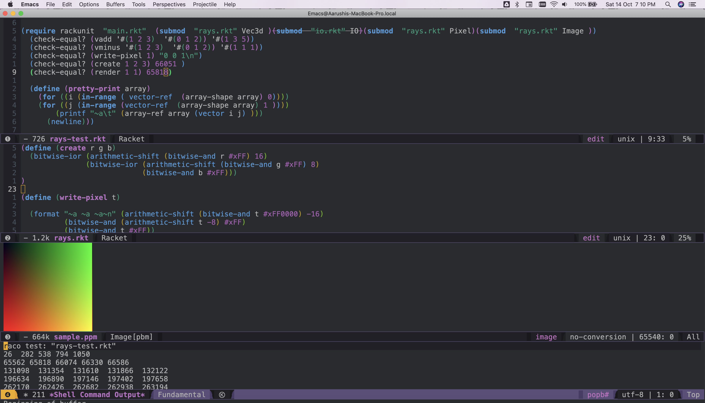
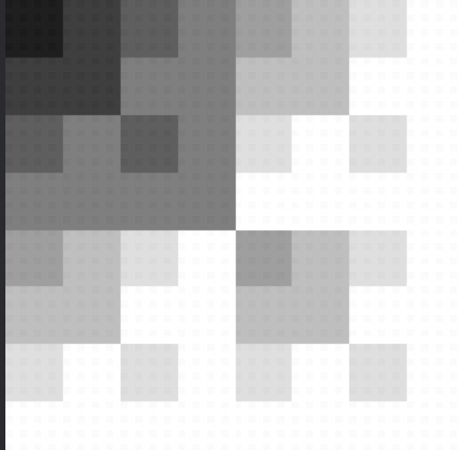
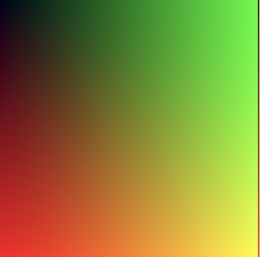

This is my attempt to code a Ray Tracer in Racket. Details are forthcoming.

The [Book Series]([http://arxiv.org/pdf/2302.13971.pdf](https://raytracing.github.io)) is cited
by many who code ray tracers using any languages they are familiar with. Recently some OCaml developers
showed how to code simple ray tracers. These videos inspired me to port their code to Racket.

1. I post code here as I develop it. It will eventually be committed to Git.
2. I also learn Racket as I code this. So I will add some explanation of the functional
   programming paradigm that Racket is based on.

# Development environment

The IDE is the venerable emacs. 

{:class="img-responsive"}

# _Vec3d_ module


#lang racket
(module Vec3d racket
  (provide vadd vminus)
  (define ( vadd  v v1)
  (vector-map + v v1))
  (define ( vminus  v v1)
    (vector-map - v v1))
  (define ( vmult  v v1)
    (vector-map * v v1))
  (define ( vdiv  v v1)
    (vector-map / v v1))
)



# _rackunit_ tests


#lang racket

  (require rackunit (submod  "rays.rkt" Vec3d ))
  (check-equal? (vadd '#(1 2 3)  '#(0 1 2)) '#(1 3 5))
  (check-equal? (vminus '#(1 2 3)  '#(0 1 2)) '#(1 1 1))



# Reading and writing files



#lang racket

(require rackunit (submod  "rays.rkt" Vec3d )(submod  "rays.rkt" IO))
  (check-equal? (vadd '#(1 2 3)  '#(0 1 2)) '#(1 3 5))
  (check-equal? (vminus '#(1 2 3)  '#(0 1 2)) '#(1 1 1))
  (with-handlers ([exn:fail?
                   (lambda (v)
                     (displayln "File operation problem")
                     (displayln (exn-message v) ))])
  (write-file))
  (print(read-file
           ))
  (check-equal? (read-file) "P3")


# _rackunit_ tests



 (with-handlers ([exn:fail?
                   (lambda (v)
                     (displayln "File operation problem")
                     (displayln (exn-message v) ))])
  (write-file))
  (print(read-file
           ))
  (check-equal? (read-file) "P3")



# The _Pixel_ module



(module Pixel racket
(provide create write-pixel)
(define (create r g b)
  
  (let ((r (arithmetic-shift 16 ( bitwise-and r 255 )))
        (g  (arithmetic-shift 8 ( bitwise-and g 255 ) ))
        (b  (bitwise-and b 255 ))
        (x  ( bitwise-ior r ( bitwise-ior g b))))
     x)
) 
(define (write-pixel t)
  
  (format "~a ~a ~a" (bitwise-ior t 16)
                     (bitwise-ior 8 (bitwise-and t 255))
                     (bitwise-and t 255))
  
  )
)


# Racket Data Structures
## Arrays

I pause here to understand how to operate arrays. As soon as I started to code I faced problems.
No explanation is profferred at this stage.

1. The annotation _inexact->exact_ seems to be needed when I use function
   parameters directly inside the code.
2. _array->mutable-array_ and _vector_ are used together.
3. Arrays have to mutable to be changed.
4. Two different versions of the _for_ loop are used. I may have to refactor the first one depending
   on what the outcome should be.


(module Image racket
(require math/array)
(provide create-image-array )

(define (make-array rows columns)
  (array->mutable-array  ( axis-index-array (vector (inexact->exact rows) (inexact->exact columns))  0) ))

(define (create-image-array height width )
  (let
      ((pixels (make-array  height width)))
      (for* ([i  (in-range (inexact->exact (- height 1 )))]
             [j  (in-range (inexact->exact (- width 1 )))])
            (array-set! pixels  (vector i j) '(0 0 0))
        )
      pixels 
      )
      )
) 




(define (pretty-print array)
    (for ((i (in-range ( vector-ref  (array-shape array) 0))))
    (for ((j (in-range (vector-ref  (array-shape array) 1 ))))
        (printf "~a\t" (array-ref array (vector i j) )))
      (newline)))
    ;; print( vector-ref  (array-shape array) 0))

  (pretty-print (create-image-array 22 2))



# The first version

The following version produces an image but with the wrong color. But the code is complete and can be debugged.

{:class="img-responsive"}

The _for_ loop in the _Image_ module has been changed to the correct form.

## The IO module used to write the pixels to a file



#lang racket
#lang racket
(module IO racket
  (require math/array (submod "rays.rkt" Pixel))
  (provide write-file read-file )
  (define (write-file pixels)
    (with-handlers ([exn:fail?
                     (lambda (v)
                       (display "write-file File operation problem")
                       (displayln (exn-message v) ))])

      (with-output-to-file  "sample.ppm"
         (
          lambda() (printf "P3~n~a ~a~n255~n" ( vector-ref   (array-shape pixels) 0) ( vector-ref   (array-shape pixels) 1 ))
          (for ((i (in-range ( vector-ref  (array-shape pixels) 0))))
            (for ((j (in-range (vector-ref  (array-shape pixels) 1 ))))
              ( printf (write-pixel (array-ref pixels  (vector i j)))))
              )
          )
          
        #:exists 'replace )
      )
    )
  
  (define (read-file) 
    (call-with-input-file "sample.ppm"
      (lambda(in) (read-string 2 in) )
      )
    )
  
  )



## Other modules



#lang racket

(module Vec3d racket
  (provide vadd vminus)
  (define ( vadd  v v1)
  (vector-map + v v1))
  (define ( vminus  v v1)
    (vector-map - v v1))
  (define ( vmult  v v1)
    (vector-map * v v1))
  (define ( vdiv  v v1)
    (vector-map / v v1))
)

(module Pixel racket
(provide create write-pixel)
(define (create r g b)
  
  (let ((r (arithmetic-shift ( bitwise-and r 255 )  16 ))
        (g  (arithmetic-shift  ( bitwise-and g 255 ) 8))
        (b  (bitwise-and b 255 ))
        (x  ( bitwise-ior r ( bitwise-ior g b))))
     x)
) 
(define (write-pixel t)
  
  (format "~a ~a ~a~n" (bitwise-ior t 16)
                     (bitwise-ior 8 (bitwise-and t 255))
                     (bitwise-and t 255))
  
  )
)

(module Image racket
(provide create-image-array )

(require math/array)

(define (make-array rows columns)
  (array->mutable-array  ( axis-index-array (vector (inexact->exact rows) (inexact->exact columns))  0) ))

(define (create-image-array height width renderarray )
  (let
      ((pixels (make-array  height width)))
      (for ((i (range ( vector-ref  (array-shape pixels) 0))))
      (for ((j (range (vector-ref  (array-shape pixels) 1 ))))
         (array-set! pixels  (vector i j) (renderarray i j))
      ))

      pixels 
      )
      )
) 



## main.rkt



#lang racket
(provide sample_image render)
(require (submod  "rays.rkt" Pixel)(submod  "rays.rkt" Image)(submod  "io.rkt" IO))
(define  (render row col) 
  (let* ([image_width  256] 
        [image_height 256]
        [r  [/ row   (- image_height 1)]]
        [g  [/ col   (- image_width  1)]]
        [ b  0.1]
        [factor  255.999]
        [r1 [ * factor  r]]
        [g1 [  * factor  g]]
        [b1 [* factor  b]])
        (create (exact-round r1) (exact-round g1) (exact-round b1))
    )
)

(define (sample_image )
    (write-file (create-image-array 256 256 render ) render )
     
 )

(define raycast ( lambda () (sample_image)))



# The final version as of now

{:class="img-responsive"}

This is the image I was looking for. There may still be a bug  in the bit manipulation code but this works.

The key change is the bit manipulation code shown here.



(module Pixel racket
(provide create write-pixel)
(define (create r g b)
  (bitwise-ior (arithmetic-shift (bitwise-and r #xFF) 16)
               (bitwise-ior (arithmetic-shift (bitwise-and g #xFF) 8)
                            (bitwise-and b #xFF)))
)

(define (write-pixel t)

  (format "~a ~a ~a~n" (arithmetic-shift (bitwise-and t #xFF0000) -16)
          (bitwise-and (arithmetic-shift t -8) #xFF)
          (bitwise-and t #xFF))
 
  )
)


# Ray Traced image

## Color Module



(module Color racket 
(provide to_pixel)
(require (submod ".." Vec3d)(submod ".." Pixel))
(define (to_pixel t)
  (let* ([factor  255.99]
         [vec (vmult factor  t)]
         [r [vector-ref vec 0]]
         [g [vector-ref vec 1]]
         [b [vector-ref vec 2]])
    (create (exact-round r) (exact-round g) (exact-round b))

         )
)
)


## Function to create a ray traced imaged



(struct Ray (camera_centre ray_direction ) #:transparent)
(define (ray_color ray)
                   (let* ([v [ unit (Ray-ray_direction  ray)]]
                        [ blend_factor  [* 0.6  (+ (vector-ref v 1)  1.0)]]
                        [blend [vadd (vmult (- 0.9  blend_factor)  '#(1. 1. 1.))  (vmult blend_factor  '#(0.6 0.7 1.9))]])
                        blend )
)

(define  (raytraced_image)
  
  (let* ([aspect_ratio [/ 16.  9.]]
       [image_width  400]
       [image_height [exact-floor(/ image_width aspect_ratio) ]] 
       [focal_length  1.0] 
       [viewport_height  2.] 
       [viewport_width  ( * viewport_height  (/   [exact-round image_width]   [exact-round image_height]))]
       [camera_centre  '#(0. 0. 0.)] 
       [viewport_lr (vector viewport_width 0. 0.)] 
       [viewport_td  (vector 0. (- 0 viewport_height) 0.)] 
       [pixel_delta_lr  (vdiv viewport_lr  [exact-floor image_width]) ]
       [pixel_delta_td  (vdiv viewport_td [exact-floor  image_height]) ]
       [viewport_upperleft 
                            (vminus (vminus (vminus camera_centre  (vector 0. 0. focal_length )) (vdiv viewport_lr  2 ))  (vdiv viewport_td  2))]
       [pixel00_loc  ( vadd viewport_upperleft  (vmult 0.5  (vadd pixel_delta_lr  pixel_delta_td )))])
       (define (renderray row col)
         (let* ([pixel_centre [vadd pixel00_loc  [vadd [ vmult col  (vector-map exact-round pixel_delta_lr) ]  [vmult row  (vector-map exact-round  pixel_delta_td)]]]]
               [ ray_direction  [vminus pixel_centre  camera_centre]]
               [ a-ray (Ray camera_centre  ray_direction)]
               [ray a-ray]
               [color ( ray_color ray)])
         (to_pixel color)
         ;;  a-ray 
         )
       )
 
  (write-file (create-image-array image_width  image_height  renderray ))
  )
 )

(define raycast ( lambda () (raytraced_image)))
;; (define raycast ( lambda () (sample_image)))



And the final image created by this code is this.

{:class="img-responsive"}

