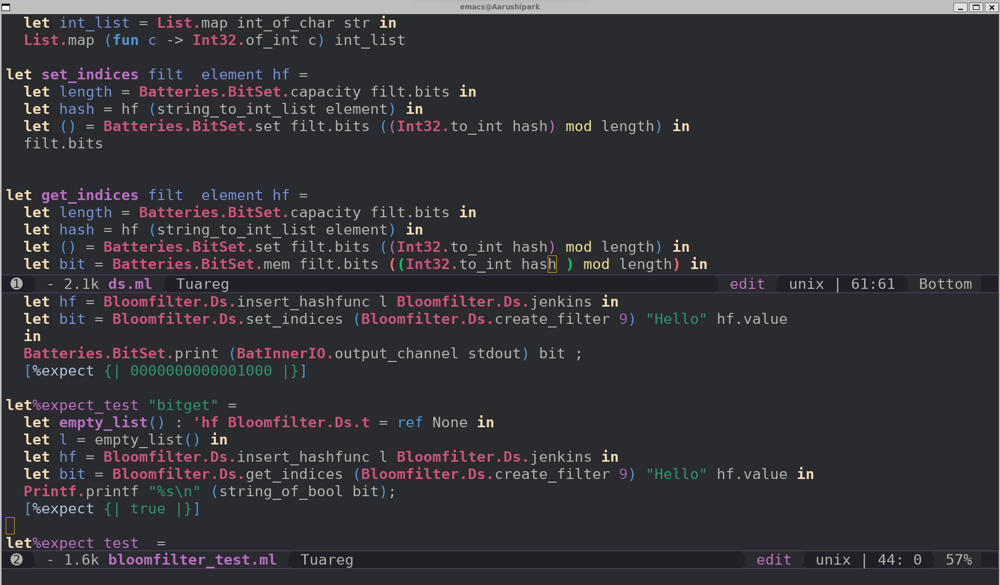
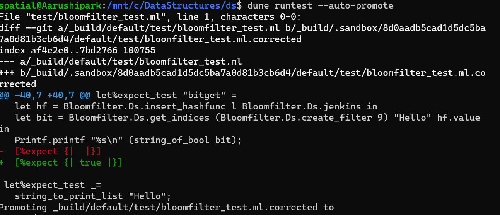
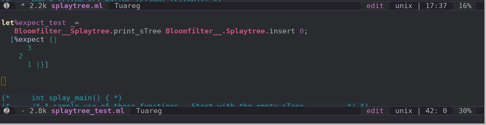

# tl;dr
1. The code will be gradually improved and  be committed to git finally.
2. Performance considerations are not paramount here.
3. The language is OCaml and it is imperative even though I will attempt to use functional Data structures.
4. The repository is [this](https://github.com/mohanr/Algorithms)

# Development Environment

{:class="img-responsive"}

{:class="img-responsive"}

# Probabilistic and other Data Structures

## Bloom Filter

 

 let jenkins ss : int32 =
   let rec hash_accu ( accu, l ):int32  =
    match l with
      | [] ->
        let hs = Int32.add accu (Int32.shift_left accu 3) in
        let hs1 = Int32.logxor hs (Int32.shift_right_logical hs 11) in
        Int32.add (Int32.shift_left hs1 15) hs1
      | hd :: tl ->
        let h = Int32.add accu hd in
        let accu = Int32.add h (Int32.shift_left h 10) in
        hash_accu (Int32.logxor accu (Int32.shift_right_logical accu 6), tl)
     (*  | [] -> *)
    (*           let hs = accu + (accu lsl 3) in *)
    (*           let hs1 = hs lxor (hs lsr 11) in *)
    (*           Int32.of_int (hs1 + (hs1 lsl 15)) *)
    (* | hd :: tl ->let h = accu + hd in *)
    (*              let accu = h + (h lsl 10) in *)
    (*   hash_accu ((accu lxor (accu lsr 6) ), tl) *)
   in
   hash_accu  ((Int32.of_int 0 ),ss)

 

### Initial set of tests

As I mentioned I am not considering space allocation here as the focus is on
working code.

 

let string_to_print_list s =

  let str = s |> String.to_seq |> List.of_seq in
  let int_list = List.map int_of_char str in
  List.iter (fun c -> Printf.printf "%d\n" c) int_list

let string_to_int_list s =

  let str = s |> String.to_seq |> List.of_seq in
  let int_list = List.map int_of_char str in
  List.map (fun c -> Int32.of_int c) int_list

let%expect_test _=
  let hash = Bloomfilter.Ds.jenkins (string_to_int_list "Hello") in
  Printf.printf "%d\n" (Int32.to_int  hash);
  [%expect {| 1901914092 |}]

let%expect_test _=
  string_to_print_list "Hello";
  [%expect {|
    72
    101
    108
    108
    111 |}]
 

### Initial version with a list of hash functions.

 
type 'hf element =
  { value : 'hf
  ; mutable next : 'hf element option
  }
type 'hf  t = 'hf element option ref 

let insert_hashfunc t value =
  let new_hashfunc = { next = !t; value } in
  (match !t with
   | Some old_hashfunc  -> old_hashfunc.next
                             <- Some new_hashfunc
   | None -> ());
  t := Some new_hashfunc;
  new_hashfunc

 

### Test
 
let%expect_test "hash" =
  let empty_list() : 'hf Bloomfilter.Ds.t = ref None in
  let l = empty_list() in
  let hf = Bloomfilter.Ds.insert_hashfunc l Bloomfilter.Ds.jenkins in
  let hash = hf.value (string_to_int_list "Hello") in
  Printf.printf "%d\n" (Int32.to_int  hash);
  [%expect {| 1901914092 |}]

 

### Test for Bit set and get

 
let%expect_test "bitset" =
  let empty_list() : 'hf Bloomfilter.Ds.t = ref None in
  let l = empty_list() in
  let hf = Bloomfilter.Ds.insert_hashfunc l Bloomfilter.Ds.jenkins in
  let bit = Bloomfilter.Ds.set_indices (Bloomfilter.Ds.create_filter 9) "Hello" hf.value
  in
  Batteries.BitSet.print (BatInnerIO.output_channel stdout) bit ;
  [%expect {| 0000000000001000 |}]

let%expect_test "bitget" =
  let empty_list() : 'hf Bloomfilter.Ds.t = ref None in
  let l = empty_list() in
  let hf = Bloomfilter.Ds.insert_hashfunc l Bloomfilter.Ds.jenkins in
  let bit = Bloomfilter.Ds.get_indices (Bloomfilter.Ds.create_filter 9) "Hello" hf.value in
  Printf.printf "%s\n" (string_of_bool bit);
  [%expect {| true |}]

 

### Bit set and get

The code will be further refactored and committed to my repository.

 
let set_indices filt  element hf =
  let length = Batteries.BitSet.capacity filt.bits in
  let hash = hf (string_to_int_list element) in
  let () = Batteries.BitSet.set filt.bits ((Int32.to_int hash) mod length) in
  filt.bits

let get_indices filt  element hf =
  let length = Batteries.BitSet.capacity filt.bits in
  let hash = hf (string_to_int_list element) in
  let () = Batteries.BitSet.set filt.bits ((Int32.to_int hash) mod length) in
  let bit = Batteries.BitSet.mem filt.bits ((Int32.to_int hash ) mod length) in
  bit
 

# Splay Tree

## Initial set of tests

 

type 'a r_tree = Leaf | Node of 'a node1
and 'a node1 = { value : 'a; left : 'a r_tree; right : 'a r_tree; }

let rec check_splay_tree t = 
  match t with
  |Leaf ->  false
  | Node {left; value = v; right}->
    match left, right with
    | Node { left = _; value = v0;  _}, Node {left =  _; value = v1;  _} -> v == v1 + v0 + 1 
    | Node { left ;   _}, Leaf -> check_splay_tree left
    | Leaf, Node { left = _ ;value = _;  right} -> check_splay_tree right
    | _ -> false

let insert=
  Node {
    value = 2;
    left = Node {value = 1; left = Leaf; right = Leaf};
    right = Node {value = 3; left = Leaf; right = Leaf}
  }

let%expect_test _=
  Printf.printf  "%s" (string_of_bool (check_splay_tree insert));
  [%expect {| false |}]

 

We can print a small tree like this for debugging.

 

let rec print_sTree (sTree : int s_tree ) (d : int) : unit =
  match sTree with
  |Leaf -> () 
  | Node { left  ;value ;  right} ->
                                   print_sTree right (d + 1);
                                   for __i=0 to  (d - 1) do
                                       Printf.printf "  "
                                   done;
                                   Printf.printf "%d\n" value;
                                   print_sTree left  (d+1) 

 

_dune runtest --auto-promote_ updates the test output automatically.

{:class="img-responsive"}

## Core Splay algorithm

At this stage the compiler is happy but very less progress is made. There is a steep learning curve here as I have to learn the language
deeply. I am also not very happy with this imperative style but this should do for now.

 
let splay (i : int ) (t : int splay_tree option ref) =
  let n = { key = 0;value=0; left = None; right = None } in
  let l = ref n in
  let r = ref n in
  let get_key node = match node with
    | Some n -> n.key
    | None -> 0 in
  let  loop t =
    match !t with
    | None -> ()
    | Some node ->
      let y = ref None in
      (* while true do *)
       match !node with 
        | { key = k; value=0;left = Some left_node; right = _ } as n when i < k ->
          let left_key = get_key (Some !node )in
          if i < left_key then (
            y := Some left_node;
            !node.left <- !y;
            begin match !y with
            | Some y_node ->
              begin match y_node with
              |Node r -> r.right <- !node.left;
              | Leaf -> ()
              end;
            | None -> ()
            end;
            node := !r
          ) else if i = k then node := !node
              else (
                begin match n.right with
                  | None -> ()
                  |  Some right ->
                    match right with
                    |Node r -> 
                      let right_key = get_key (Some r) in
                      if i > right_key then (
                        y := Some right;
                        !node.right <- !y;
                        begin match !y with
                        | None -> ()
                        | Some y_node ->
                              begin match y_node with
                                |Node _l -> r.left <- !node.left;
                                | Leaf -> ()
                              end;
                        end;
                        node := !l
                      )
                    | _-> ()
                end;
              )
        | _ -> ()
  (*     done *)
  in
  l := { key = 0; value = 0; left = None; right =  !t };
  r := !l;
  match !t with
  | None -> None
  | Some node ->
    match node with
        | Leaf -> None 
        | Node root ->
          loop (ref (Some (ref root)));
          match !t with
          | None -> None
          | Some node ->
            !l.right <- n.right;
            !r.left <-  n.left;
            match node with
            | Leaf -> None
            | Node localnode ->
              localnode.left <-  n.right;
              localnode.right <- n.left;
              Some node

 

## Insert Key into a binary tree

At this stage the mutable imperative style is hard to debug.Moreover _None_ and _Some Leaf_ are
both used redundantly. This led to a bug.

 

let rec insert_key (k : int ) (t : int splay_tree option ref) : int splay_tree option ref=
 match !t with
  | None |Some Leaf ->
    let new_node = Node { key = k; value = 0; left = None; right = None } in
    t := Some new_node;
    t
  | Some tree  ->
    let  insert_node tree =

      match tree with
      |  Node old_key ->
        begin match old_key with
          |  ok  ->
            if k > ok.key then(
              match ok.right with
              | None | Some Leaf ->
              let r = ref (Some (Node { key = k ;value = 0 ; right = Some Leaf; left = Some Leaf} ))in
               ok.right <- !r;
               t
             | Some _r ->
             insert_key k (ref (ok.right ))
             )
            else 
            if k < ok.key then(
              match ok.left with
              | None ->
               let l = ref (Some (Node { key = k ;value = 0 ; right = Some Leaf; left = Some Leaf} ))in 
              ok.left <- !l;
              t 
             | Some _l ->
             insert_key k (ref (ok.left)); 
            )
          else
             t
        end;
     |Leaf ->t
    in
    insert_node tree

 

