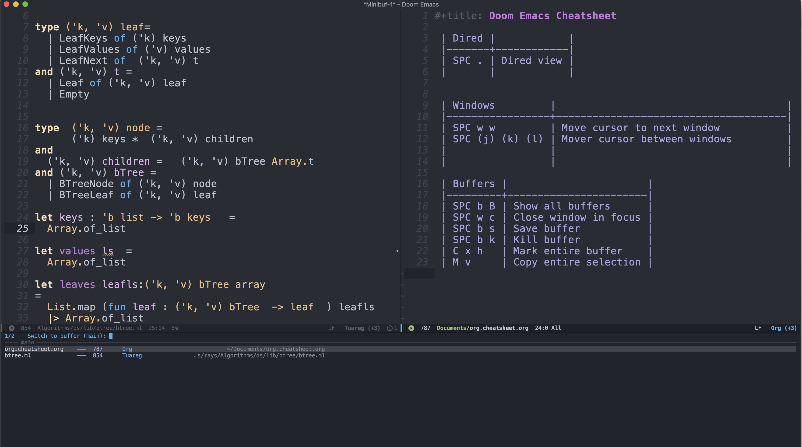

Whenever I code Data structures like BTree,LSM etc. in OCaml I read SML,Rust or C++ code. The code I read is in a repo.
that implements a caching layer or DBs like https://rethinkdb.com. I don't find any direct OCaml references.
So I ported this Haskell two-three tree by [http://matthew.brecknell.net/post/btree-gadt/….](https://matthew.brecknell.net/posts/btree-gadt/)
Moreover since I am learning it is hard to identify succinct functional code as some examples seem to be imperative.

# Two-Three BTree

 
type ('n, 'a) n =
  | Type1 of ('n, 'a) t * 'a * ('n, 'a) t
  | Type2 of ('n, 'a) t * 'a * ('n, 'a) t * 'a * ('n, 'a) t
and ('n, 'a)  t =
  | BR of('n, 'a)  n
  | LF

type ('n, 'a ) tree = Tree of ('n, 'a ) t

type ('n, 'a, 't ) normal_replace = ('n, 'a ) t -> 't
type ('n, 'a, 't ) insert_or_pushup = ('n, 'a ) t -> 'a -> ('n, 'a ) t -> 't

type order = LESS | EQUAL | GREATER

let compare k1 k2 : order =
  if k1 < k2 then LESS
  else if k1 = k2 then EQUAL
else GREATER

let compare_normal v1 v2 v1_lessthan_V2 v1_equalto_v2 v1_greaterthan_v2 =
  match compare v2 v2 with
  | LESS -> v1_lessthan_V2
  | EQUAL -> v1_equalto_v2
  | GREATER -> v1_greaterthan_v2

let compare_pushup v1 v2 v3 v1_lessthan_V2 v1_equalto_v2 v1_between v1_equalto_v3 v1_greaterthan_v3 =
  compare_normal v1 v2 v1_lessthan_V2 v1_equalto_v2 ( compare_normal v1 v3 v1_between v1_equalto_v3 v1_greaterthan_v3 )

let insert (value:int) tree  =
  let rec ins t normal_replace insert_or_pushup =
  match t with
  | LF -> insert_or_pushup LF value LF
  | BR br  ->
    match br with
    | Type1 ( a, b, c ) ->
      let v1_lessthan_v2 =

        ins a (fun k -> normal_replace (BR (Type1 (k,b,c)))) 
              (fun p q r -> normal_replace (BR (Type2 (p, q, r, b, c )))) in

      let v1_greaterthan_v2 =

        ins c (fun k -> normal_replace (BR ((Type1 (a, b, k)))))
              (fun p q r -> normal_replace (BR ((Type2 (a, b, p, q, r ))))) in

      let v1_equalto_v2 = normal_replace (BR ((Type1 (a,  value,  c)))) in
      compare_normal value b v1_lessthan_v2 v1_greaterthan_v2 v1_equalto_v2

    | Type2( a, b, c, d, e ) -> 
      let v1_lessthan_v2 =

       ins a (fun k -> normal_replace (BR (Type2 (k,b,c,d,e)))) 
         (fun p q r -> insert_or_pushup (BR (Type1 (p, q, r))) b  (BR (Type1 (c, d, e)))) in

      let v1_between =
          ins c (fun k -> normal_replace (BR (Type2 (a,b,k,d,e)))) 
                (fun p q r -> insert_or_pushup (BR (Type1 (a, b, p))) q (BR (Type1 (r, d, a) ))) in

      let v1_greaterthan_v3 =
          ins e (fun k -> normal_replace (BR (Type2 (a,b,c,d,k)))) 
                (fun p q r -> insert_or_pushup (BR (Type1 (a, b, c))) d (BR (Type1 (p, q, r)  ))) in

      let v1_equalto_v2  = normal_replace (BR ((Type2 (a,  value,  c, d, e)))) in

      let v1_equalto_v3  = normal_replace (BR ((Type2 (a,  b, c, value,  e)))) in
      compare_pushup value b d v1_lessthan_v2 v1_between v1_greaterthan_v3 v1_equalto_v2 v1_equalto_v3

  in
  ins tree (fun t -> t)(fun a b c -> BR(Type1( a, b, c)))

let rec print_bTree (bTree: ('n, 'a) t) d : unit =
  begin match bTree with
  |LF -> () 
  |BR n-> 
  begin match n with
  | (Type1 ( a,b,c)) ->
    print_bTree a (d + 1);
    for __i=0 to  (d - 1) do
      Printf.printf "  "
    done;
    Printf.printf "%d \n" b;
    print_bTree c (d+1); 

  | (Type2 ( a,b,c,d,e)) ->
    print_bTree a (d + 1);
    for __i=0 to  (d - 1) do
      Printf.printf "  "
    done;
    Printf.printf "%d %d\n" b d;
    print_bTree c (d+1); 
    print_bTree e (d+1); 
  end;
  end;



The _print_bTree_ function prints all the values when I tested even though it may not be in an order that
proves that the two-three BTree is storing values properly.

# Development Environment

Since my Spacemacs IDE broke after I upgraded to a newer version of Emacs I decided to move to a new environment - Doom Emacs.

{:class="img-responsive"}
