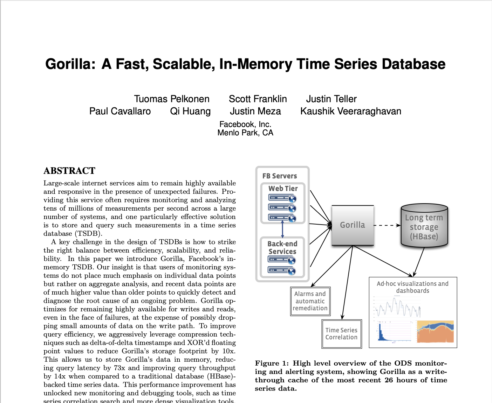

{:class="img-responsive"}

My current implementation is based on this paper and some other implementations that inspired me. Code is not fully tested
and will be updated as and when I write more tests.

At this time I am learning about Time Series Databases and this is just one part of it.

# The ADTs



open Bin_prot.Std
open Bigarray

module  Datapoint_vector = CCVector

type data_point= {
	tstamp  :    float;
	value :   int64;
}
[@@deriving bin_io]

module Compressed_data_vector =  CCVector

type timeseries_block = {

    start_time : float;

    points: data_point Datapoint_vector.vector;

    compressed_data: ((int,int8_unsigned_elt, c_layout) Array1.t) Compressed_data_vector.vector;

    compressed_size: int64;
}

module  Timeseries_block_vector = CCVector

type time_series = {

    key : string;

    mutable active_block: timeseries_block ;

    closed_blocks:timeseries_block Timeseries_block_vector.vector;

}

type compression_stats = {

    original_size: int64;

    compressed_size: int64;

    compression_ratio:  ((float,float64_elt, c_layout) Array1.t) Compressed_data_vector.vector;
}

module  Timeseries_vector = CCVector

module  Timeseriesmap = struct
  type t = string
  let compare s s1 =
     String.compare s s1
end

module  Indice_map = CCMap.Make(Timeseriesmap)

module  Indice_vector = CCVector

type  time_series_map = {

    series_vector: time_series option Timeseries_vector.vector;

	mutable index_map : int64  Indice_map.t;

    free_indices: int64 Indice_vector.vector;
}

module  Buffer_vector = CCVector

type bit_writer = {

    buffer: ((int,int8_unsigned_elt, c_layout) Array1.t) Buffer_vector.vector;

    current_byte:  (int,int8_unsigned_elt, c_layout) Array1.t;

    bit_position: (int,int8_unsigned_elt, c_layout) Array1.t;
}
type bit_reader = {

    buffer: ((int,int8_unsigned_elt, c_layout) Array1.t) Buffer_vector.vector;

    byte_position:  (int,int8_unsigned_elt, c_layout) Array1.t;

    bit_position: (int,int8_unsigned_elt, c_layout) Array1.t;
}
(*  TODO Enhance this inferface*)
module type TSDBOperator = sig
  val time_series : unit -> timeseries_block
end
open Bin_prot.Std
open Bigarray

module  Datapoint_vector = CCVector

type data_point= {
	tstamp  :    float;
	value :   int64;
}
[@@deriving bin_io]

module Compressed_data_vector =  CCVector

type timeseries_block = {

    start_time : float;

    points: data_point Datapoint_vector.vector;

    compressed_data: ((int,int8_unsigned_elt, c_layout) Array1.t) Compressed_data_vector.vector;

    compressed_size: int64;
}

module  Timeseries_block_vector = CCVector

type time_series = {

    key : string;

    mutable active_block: timeseries_block ;

    closed_blocks:timeseries_block Timeseries_block_vector.vector;

}

type compression_stats = {

    original_size: int64;

    compressed_size: int64;

    compression_ratio:  ((float,float64_elt, c_layout) Array1.t) Compressed_data_vector.vector;
}

module  Timeseries_vector = CCVector

module  Timeseriesmap = struct
  type t = string
  let compare s s1 =
     String.compare s s1
end

module  Indice_map = CCMap.Make(Timeseriesmap)

module  Indice_vector = CCVector

type  time_series_map = {

    series_vector: time_series option Timeseries_vector.vector;

	mutable index_map : int64  Indice_map.t;

    free_indices: int64 Indice_vector.vector;
}

module  Buffer_vector = CCVector

type bit_writer = {

    buffer: ((int,int8_unsigned_elt, c_layout) Array1.t) Buffer_vector.vector;

    current_byte:  (int,int8_unsigned_elt, c_layout) Array1.t;

    bit_position: (int,int8_unsigned_elt, c_layout) Array1.t;
}
type bit_reader = {

    buffer: ((int,int8_unsigned_elt, c_layout) Array1.t) Buffer_vector.vector;

    byte_position:  (int,int8_unsigned_elt, c_layout) Array1.t;

    bit_position: (int,int8_unsigned_elt, c_layout) Array1.t;
}
(*  TODO Enhance this inferface*)
module type TSDBOperator = sig
  val time_series : unit -> timeseries_block
end
open Bin_prot.Std
open Bigarray

module  Datapoint_vector = CCVector

type data_point= {
	tstamp  :    float;
	value :   int64;
}
[@@deriving bin_io]

module Compressed_data_vector =  CCVector

type timeseries_block = {

    start_time : float;

    points: data_point Datapoint_vector.vector;

    compressed_data: ((int,int8_unsigned_elt, c_layout) Array1.t) Compressed_data_vector.vector;

    compressed_size: int64;
}

module  Timeseries_block_vector = CCVector

type time_series = {

    key : string;

    mutable active_block: timeseries_block ;

    closed_blocks:timeseries_block Timeseries_block_vector.vector;

}

type compression_stats = {

    original_size: int64;

    compressed_size: int64;

    compression_ratio:  ((float,float64_elt, c_layout) Array1.t) Compressed_data_vector.vector;
}

module  Timeseries_vector = CCVector

module  Timeseriesmap = struct
  type t = string
  let compare s s1 =
     String.compare s s1
end

module  Indice_map = CCMap.Make(Timeseriesmap)

module  Indice_vector = CCVector

type  time_series_map = {

    series_vector: time_series option Timeseries_vector.vector;

	mutable index_map : int64  Indice_map.t;

    free_indices: int64 Indice_vector.vector;
}

module  Buffer_vector = CCVector

type bit_writer = {

    buffer: ((int,int8_unsigned_elt, c_layout) Array1.t) Buffer_vector.vector;

    current_byte:  (int,int8_unsigned_elt, c_layout) Array1.t;

    bit_position: (int,int8_unsigned_elt, c_layout) Array1.t;
}
type bit_reader = {

    buffer: ((int,int8_unsigned_elt, c_layout) Array1.t) Buffer_vector.vector;

    byte_position:  (int,int8_unsigned_elt, c_layout) Array1.t;

    bit_position: (int,int8_unsigned_elt, c_layout) Array1.t;
}
(*  TODO Enhance this inferface*)
module type TSDBOperator = sig
  val time_series : unit -> timeseries_block
end



# Time manipulation



open Timedesc
open Types

module TimeSeries = struct

let time_since (time : float) =

  let time_as_float =
  (match (Timedesc.of_timestamp_float_s time) with
    | Some t ->
      let time_as_float = Timedesc.Span.sub (Timedesc.Timestamp.now())  (Timedesc.to_timestamp_single t) in
      (match (Timedesc.Time.of_span time_as_float) with
      | Some t ->
         (Time.hour  t, Time.ns t)
      | None -> failwith "Duration error" )
    | None -> failwith "Duration error" )
  in time_as_float

let overlaps start (en_d:float)=
  (match (Timedesc.of_timestamp_float_s (Float.add start  7200.)),
         (Timedesc.of_timestamp_float_s start) ,
         (Timedesc.of_timestamp_float_s en_d) with
    | Some t, Some t1,Some  t2 ->
         (Timedesc.Timestamp.lt (Timedesc.to_timestamp_single t2) (Timedesc.to_timestamp_single t))
          || (Timedesc.Timestamp.gt (Timedesc.to_timestamp_single t)
                                    (Timedesc.to_timestamp_single t1))
    | _,_,  _ ->  failwith "Duration error" )

let time_series() =

        let  start = Float.mul 1000.  (Unix.gettimeofday()) in
        {
            start_time = start;

            points = Datapoint_vector.create();

            compressed_data = Compressed_data_vector.create();

            compressed_size  = 0L;
        }

let new_time_series k =

        {
            key = k;
            active_block  = time_series();
            closed_blocks = Timeseries_block_vector.create();
         }

let get_points timeseries start e_nd =

   let overlaps tstamp  =
    (match (Timedesc.of_timestamp_float_s tstamp),
           (Timedesc.of_timestamp_float_s start),
           (Timedesc.of_timestamp_float_s e_nd) with
    | Some t, Some t1,Some  t2 ->
        (Timedesc.Timestamp.ge (Timedesc.to_timestamp_single t) (Timedesc.to_timestamp_single t1))
        &&
        (Timedesc.Timestamp.le (Timedesc.to_timestamp_single t) (Timedesc.to_timestamp_single t2))
    | _,_, _ ->  failwith "Duration error" )
    in
    CCVector.filter ( fun dp -> overlaps dp.tstamp ) timeseries

let  insert_data_point time_s timestamp value =
      let dp = { tstamp = timestamp; value = value } in
      match (time_since timestamp) with
      (* I should use the time API to check this. *)
      | (h, ns) -> if h > 2 || (h = 2 && ns > 0 ) then( (*TODO  I check nanoseconds only!*)
                     let () = CCVector.push time_s.closed_blocks time_s.active_block in time_s.active_block <- time_series();
                         CCVector.push time_s.active_block.points dp
                     )
                     else(
                         CCVector.push time_s.active_block.points dp
                     )

let query start en_d blocks =
        let  results = CCVector.create() in

        CCVector.iter(fun block ->
            if overlaps block.start_time en_d then
                CCVector.push results (get_points block.points start en_d)
            else ()
        )blocks.closed_blocks;
        if overlaps blocks.active_block.start_time  en_d then
            CCVector.push results (get_points blocks.active_block.points
                            start en_d);

        results

let  get ts_map key =
  match( Indice_map.find_opt key ts_map.index_map) with
  | Some index ->
             Indice_vector.get ts_map.series_vector (Int64.to_int index)
  | None -> failwith "Index doesn't exist"

let insert ts ts_map key timestamp value =
  let index =  get ts_map key in
  match ( CCVector.exists (fun ts -> true ) ts_map.series_vector ) with
  | true ->  insert_data_point ts timestamp value
  | false ->
            let  series = new_time_series  key in
            let () = insert_data_point series timestamp value in
            let index = CCVector.pop ts_map.free_indices in
            match index with
            |Some i ->
                CCVector.set ts_map.series_vector (Int64.to_int i) (Some series)
            |None ->
                let() = CCVector.push ts_map.series_vector (Some series) in
                ts_map.index_map <- Indice_map.update key (fun _ -> index) ts_map.index_map

(* Read paper to understand tombstones *)
let delete ts ts_map key =
  match( Indice_map.find_opt key ts_map.index_map ) with
  | Some index ->
            let () = CCVector.set ts_map.series_vector ts None in
            let () = CCVector.push ts_map.free_indices index in
            Indice_map.remove key ts_map.index_map
  | None -> failwith "Key to be delete is not found"

end

module TSDBOp = TimeSeries



# Bit writer



open Types
open Bigarray

module BITWRITER = struct

  let new_write_buffer() =
    {
            buffer =  Buffer_vector.create();

            current_byte = Array1.create int8_unsigned c_layout 1;

            bit_position =  Array1.create int8_unsigned c_layout 1;
    }

  (* This is fro0 OCaml forum *)
let int_size = Sys.word_size - 1
let int2bin =
  let buf = Bytes.create int_size in
  fun n ->
    for i = 0 to int_size - 1 do
      let pos = int_size - 1 - i in
      Bytes.set buf pos (if n land (1 lsl i) != 0 then '1' else '0')
    done;
    (* skip leading zeros *)
    match Bytes.index_opt buf '1' with
    | None -> "0b0"
    (* | Some i -> "0b" ^ Bytes.sub_string buf i (int_size - i) *)

    | Some _i -> "0b" ^ Bytes.to_string buf

let write_bit (buf : bit_writer) bit =
        let bp = Array1.get buf.bit_position 0 in
        if bit then(
            let cb = Array1.get buf.current_byte 0 in
            let () = Array1.set buf.current_byte 0 (Int.logor cb (Int.shift_left 1 (Int.sub 7  bp) )  ) in
            Printf.printf "write_bit %d %s\n"  (Array1.get buf.current_byte 0) (int2bin (Int.logor cb (Int.shift_left 1 (Int.sub 7  bp) )   ));
          );
         Array1.set buf.bit_position 0 (Int.add bp  1);

        if Int.equal( Array1.get buf.bit_position 0)  8 then(
            CCVector.push buf.buffer buf.current_byte;
            Array1.set buf.current_byte 0 0;
            Array1.set buf.bit_position 0 0;
        ) else ()

let  write_bits buf bitfield len =
        let bits = bitfield.{0} in
         (* Printf.printf " bit is  %s\n"  (int2bin (Int32.to_int bits)); *)

        for i = len - 1 downto 0 do
            let bit = (Int32.equal(Int32.logand (Int32.shift_right bits  i)  1l) 1l ) in
            write_bit buf bit
        done

let push_to_buffer (buf : bit_writer) =
        let bp = Array1.get buf.bit_position 0 in
        if bp > 0 then
            CCVector.push buf.buffer buf.current_byte;
        buf.buffer

let bit_count buf =
        let bp = Array1.get buf.bit_position 0 in
        CCVector.length buf.buffer * 8 + bp

end
open Types
open Bigarray

module BITWRITER = struct

  let new_write_buffer() =
    {
            buffer =  Buffer_vector.create();

            current_byte = Array1.create int8_unsigned c_layout 1;

            bit_position =  Array1.create int8_unsigned c_layout 1;
    }

  (* This is fro0 OCaml forum *)
let int_size = Sys.word_size - 1
let int2bin =
  let buf = Bytes.create int_size in
  fun n ->
    for i = 0 to int_size - 1 do
      let pos = int_size - 1 - i in
      Bytes.set buf pos (if n land (1 lsl i) != 0 then '1' else '0')
    done;
    (* skip leading zeros *)
    match Bytes.index_opt buf '1' with
    | None -> "0b0"
    (* | Some i -> "0b" ^ Bytes.sub_string buf i (int_size - i) *)

    | Some _i -> "0b" ^ Bytes.to_string buf

let write_bit (buf : bit_writer) bit =
        let bp = Array1.get buf.bit_position 0 in
        if bit then(
            let cb = Array1.get buf.current_byte 0 in
            let () = Array1.set buf.current_byte 0 (Int.logor cb (Int.shift_left 1 (Int.sub 7  bp) )  ) in
            Printf.printf "write_bit %d %s\n"  (Array1.get buf.current_byte 0) (int2bin (Int.logor cb (Int.shift_left 1 (Int.sub 7  bp) )   ));
          );
         Array1.set buf.bit_position 0 (Int.add bp  1);

        if Int.equal( Array1.get buf.bit_position 0)  8 then(
            CCVector.push buf.buffer buf.current_byte;
            Array1.set buf.current_byte 0 0;
            Array1.set buf.bit_position 0 0;
        ) else ()

let  write_bits buf bitfield len =
        let bits = bitfield.{0} in
         (* Printf.printf " bit is  %s\n"  (int2bin (Int32.to_int bits)); *)

        for i = len - 1 downto 0 do
            let bit = (Int32.equal(Int32.logand (Int32.shift_right bits  i)  1l) 1l ) in
            write_bit buf bit
        done

let push_to_buffer (buf : bit_writer) =
        let bp = Array1.get buf.bit_position 0 in
        if bp > 0 then
            CCVector.push buf.buffer buf.current_byte;
        buf.buffer

let bit_count buf =
        let bp = Array1.get buf.bit_position 0 in
        CCVector.length buf.buffer * 8 + bp

end


# Bit Reader



open Types
open Bigarray

module BITREADER = struct

  let new_read_buffer buffer =
    {
            buffer =  buffer;

            byte_position = Array1.create int8_unsigned c_layout 1;

            bit_position =  Array1.create int8_unsigned c_layout 1;
    }
let int_size = Sys.word_size - 1
let int2bin =
  let buf = Bytes.create int_size in
  fun n ->
    for i = 0 to int_size - 1 do
      let pos = int_size - 1 - i in
      Bytes.set buf pos (if n land (1 lsl i) != 0 then '1' else '0')
    done;
    (* skip leading zeros *)
    match Bytes.index_opt buf '1' with
    | None -> "0b0"
    | Some i -> "0b" ^ Bytes.sub_string buf i (int_size - i)

let read_bit buf =

        let b = (Array1.get (CCVector.get buf.buffer 0)) 0 in
        Printf.printf "read_bit %s\n"  (int2bin b);

        let bp = Array1.get buf.byte_position 0 in
        if bp >= CCVector.length buf.buffer then
            None
        else

        let bip = Array1.get buf.bit_position 0 in

        let bit = Int.equal (Int.logand (Int.shift_right b (Int.sub 7  bip) )  1) 1 in

        Array1.set buf.bit_position 0 (Int.add bip  1);
        if Int.equal( Array1.get buf.bit_position 0)  8 then(
            Array1.set buf.byte_position 0 (bp+1);
            Array1.set buf.bit_position 0 0;
        );

        Some bit

let read_bits buf len=
        let value = 0L in
        let rec loop_while idx acc =
        if idx <  len - 1 then
            (match read_bit buf with
            |Some b ->
            let value = Int64.logor (Int64.shift_left acc  1) (Int64.of_int (Bool.to_int b)) in
            loop_while (idx+1) value
            | None ->
            loop_while (idx+1) value
            )
        else acc
        in
        loop_while 0 0L
eend



# A simple test

The _read_bits_ returns only the first 3 bits now. That has to be fixed.


open Bigarray
open Tsdb__Bit_writer.BITWRITER
open Tsdb__Bit_reader.BITREADER

let%expect_test "Test Set and Get keys"=

        let buf = new_write_buffer() in
        let bitfield = Array1.create Int32 c_layout 1 in
        bitfield.{0} <- Int32.of_int 0b1010;
        write_bit buf true;
        write_bit buf false;
        write_bit buf true;
        write_bits buf bitfield 4;

        let buffer = push_to_buffer buf in
        let read_buffer = new_read_buffer buffer in
        let () =
        (match (read_bit read_buffer) with
        | Some b -> Printf.printf "%b " b
        | None -> Printf.printf "None " ;
        ) in
        let () =
        match (read_bit read_buffer) with
        | Some b -> Printf.printf "%b " b
        | None -> Printf.printf "None " ;
        in
        let () =
        match (read_bit read_buffer) with
        | Some b -> Printf.printf "%b " b
        | None -> Printf.printf "None " ;
        in
        Printf.printf "Bits %s\n" (int2bin (Int64.to_int (read_bits read_buffer 6)));
  [%expect {|
    write_bit 128 0b000000000000000000000000000000000000000000000000000000010000000
    write_bit 160 0b000000000000000000000000000000000000000000000000000000010100000
    write_bit 176 0b000000000000000000000000000000000000000000000000000000010110000
    write_bit 180 0b000000000000000000000000000000000000000000000000000000010110100
    read_bit 0b10110100
    true read_bit 0b10110100
    false read_bit 0b10110100
    true read_bit 0b10110100
    read_bit 0b10110100
    read_bit 0b10110100
    read_bit 0b10110100
    read_bit 0b10110100
    Bits 0b10100
    |}];


