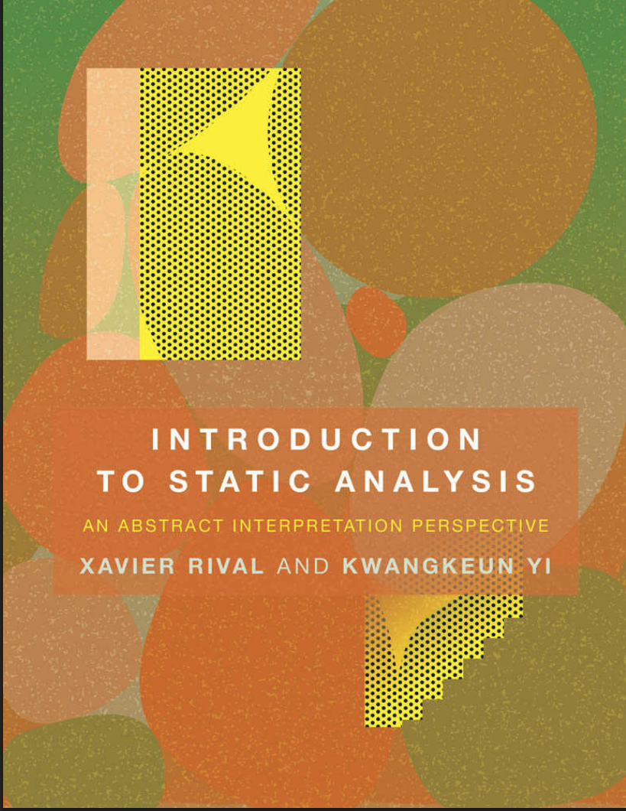

This is a typical post in this blog in the sense that code is shown first and the narrative is built later if at all.
This has its disadvantages as the article is incomplete without the explanation.

But in many cases like this one the theory is somewhat inscrutable as it may involve Math. It has to be learnt in
a series of steps and working code seems to be a good motivating factor. Narrative and diagrams should be required
to complete this and other blog posts.

I will start anyway by showing OCaml code that I ported from Python. This Python code is [part](https://github.com/sree314/simple-abstract-interpreter)
of the Spring 2020 edition of CSC255/455 Software Analysis and Improvement taught at the University of Rochester.
{:width="30%"}{:class="img-responsive"}
# The ADT

This is the first cut and has to improve gradually.



type binaryOps =
    | Plus of char
    | Minus of char
    | Div of char
    | Neg of char
    | Mul of char
  [@@deriving show]

type comparisonOps =
    | Less of char
    | Great of char
    | StructEqu of string
    | Less_Eq of string
    | Great_Eq of string
    | Not_Eq of string
  [@@deriving show]

let operator c =
  match c with
     |'+' -> Plus c
     |'-' -> Minus c
     |'/' -> Div c
     | _ -> failwith "Wrong operator"

(* Some types can be merged into 'expr*)
type expr =
  | BinOp of binaryOps * var * scalar
  | BinaryOps of binaryOps * expr * expr
  | ComparisonOps of comparisonOps * comparisonOps
  | Seq of expr * expr
  | Assign of var * expr
  | If of expr * expr * expr
  | Input of var
  | BoolExpr of comparisonOps * var *  scalar
  | BoolExprs of comparisonOps * expr*  expr
  | While of expr * expr
  | Vars  of char               (* Refactor*)
  | Const of scalar (* Refactor*)
  | Skip
and scalar =
  | Scalar of int
and var = Var of char
[@@deriving show]

 (* convenience function to turn a list into a sequence *)
let rec sequence l =
    match List.length l with
      | 0 -> failwith "Can't convert an empty list into a Seq"
      | 1 -> Seq ((List.nth l 0), Skip)
      | 2 ->  Seq ((List.nth l 0), (List.nth l 1))
      | _ -> Seq ((List.nth l 0),
                 sequence ( List.filteri
                              (fun i _ -> i >= 1 && i <=
                                                    (List.length l)) l ))





open Bloomfilter__Intervals
open Containers
open Types

module NonRelationalAbstraction( Dom : ORDERED_FUNCTIONAL_SET) = struct

    let union m0 m1 =
      let acc =
       let rec loop_while_m0 acc1 m0  =
       (match m0 with
          |[] -> acc1
          |(x,hd) :: tl ->
           let acc =
             let rec loop_while_m1 acc m1 =
             (match m1 with
              |[] -> acc
              |(x1,hd1) :: tl1 ->
                if  Char.(=) x x1 then
                 loop_while_m1 (acc @ [(x,Dom.lub hd hd1)]) tl1
                else
                 loop_while_m1 acc tl1
             )
             in loop_while_m1 [] m1
           in
           loop_while_m0 (acc1 @ acc) tl
       )
     in loop_while_m0 [] m0   in
     acc

     (* construct an abstraction for a set of memories *)
    let phi m =
     let m_acc =
       let rec loop_while_accum m i m_accum =
        if i < List.length m  then (
        let m_abs =
         let mabs = CCArray.make (List.length (List.nth m i))  (' ',(Dom.Tup(Dom.Int 0,Dom.Int 0))) in
         let rec loop_while_abs m i  mabs =
           if Array.length m > i then
             match Array.get m i with
             | x, y ->
            let a,b =  Dom.phi y in
            let _ = Array.set mabs i (x,Dom.Tup (a, b)) in
            (* let _ = List.iter (fun (c,k) -> *)
            (*   print_char  c; *)
            (*   print_endline (Dom.show_interval k); *)
            (* ) (Array.to_list mabs) in *)
            loop_while_abs m (i + 1) mabs
           else
             mabs
          in loop_while_abs (Array.of_list (List.nth m i)) 0 mabs
          in
            let accum =
               if List.length m_accum = 0 then
                  Array.to_list m_abs
               else
                  union m_accum (Array.to_list m_abs)
               in
                   loop_while_accum  m (i + 1) accum
         ) else
            m_accum
         in loop_while_accum  m 0 []
        in
        (* also construct BOT TODO Investigate how this is used.*)
       m_acc

    let rec lte m0_abs m1_abs =
        match m0_abs, m1_abs with
          |[],[] -> true
          |hd :: tl,hd1 :: tl1 ->
            if not (Dom.lte hd hd1) then false else (lte tl tl1)
          |_,_ -> failwith "lte error"

    let widen m0 m1 =
      let acc =
       let rec loop_while acc m0 m1=
       match m0,m1 with
          |[],[] -> acc
          |hd :: tl,hd1 :: tl1 ->
            loop_while (acc @ [Dom.widen hd hd1]) tl tl1
          |_,_ -> failwith "widen error"

     in loop_while [] m0 m1 in
     acc

    (* convenience function *)
    (* let included m_conc m_abs = *)
    (*     let m_c_abs = phi m_conc in *)
        (* lte m_c_abs m_abs *)

end

module I_Params = struct
  type inter= | Int of int | Pinf | Ninf
  [@@deriving show]
  type interval  = |Bot |Tup of inter * inter
  [@@deriving show]
end

module IST = IntervalDomain( I_Params)
module NRA = NonRelationalAbstraction(IST)


