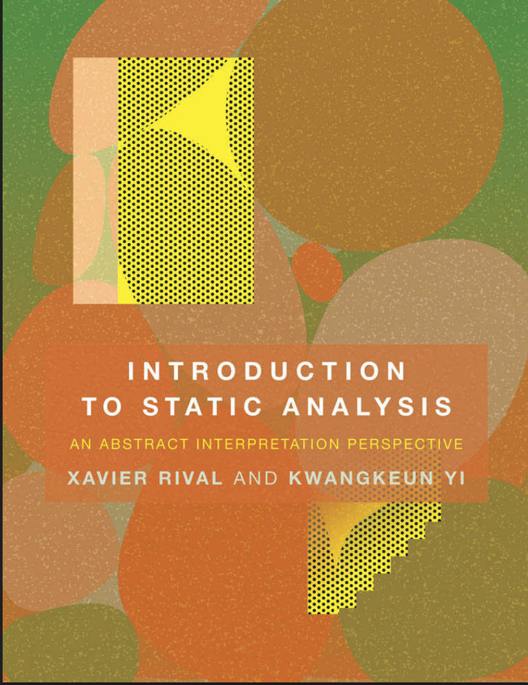
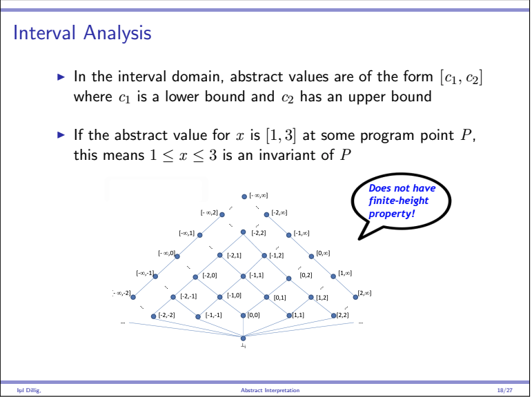
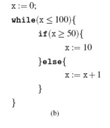

This is a typical post in this blog in the sense that code is shown first and the narrative is built later if at all.
This has its disadvantages as the article is incomplete without the explanation.

But in many cases like this one the theory is somewhat inscrutable as it may involve Math. It has to be learnt in
a series of steps and working code seems to be a good motivating factor. Narrative and diagrams should be required
to complete this and other blog posts.

I will start anyway by showing OCaml code that I ported from Python. This Python code is [part](https://github.com/sree314/simple-abstract-interpreter)
of the Spring 2020 edition of CSC255/455 Software Analysis and Improvement taught at the University of Rochester.

The book recommended for that course is {:width="10%"}{:class="img-responsive"}
# The ADT

This is the first cut and has to improve gradually. _expr_ should be refactored as there is repetition.
This is but one point that shows the disadvantage of ignoring the theory because the focus is more on the
quality of OCaml code and my Functional Programming skills than on the underlying topic.

Almost all the code is here but for a more complete version look at this [repo](https://github.com/mohanr/Algorithms/tree/master/ds/lib/abstract-interpreter)

As I alluded to above the theory is not fully explained or understood and a deeper analysis with source code
is essential to check the Static Analyzer itself.



open Ppx_compare_lib.Builtin
open Ppx_sexp_conv_lib.Conv

type binaryOps =
    | Plus of char
    | Minus of char
    | Div of char
    | Neg of char
    | Mul of char
[@@deriving show ,compare, sexp]

type comparisonOps =
    | Less of char
    | Great of char
    | StructEqu of string
    | Less_Eq of string
    | Great_Eq of string
    | Not_Eq of string
[@@deriving show ,compare, sexp]

let operator c =
  match c with
     |'+' -> Plus c
     |'-' -> Minus c
     |'/' -> Div c
     | _ -> failwith "Wrong operator"
[@@deriving show ,compare, sexp]

(* Some types can be merged into 'expr*)
type expr =
  | Program of expr
  | BinOp of binaryOps * var * scalar
  | BinaryOps of binaryOps * expr * expr
  | ComparisonOps of comparisonOps * comparisonOps
  | Seq of expr * expr
  | Assign of var * expr(* Refactor*)
  | Assigns of expr * expr
  | If of expr * expr * expr
  | Input of var(* Refactor*)
  | Inputs of expr
  | BoolExpr of comparisonOps * var *  scalar
  | BoolExprs of comparisonOps * expr*  expr
  | While of expr * expr
  | Vars  of char               (* Refactor*)
  | Const of scalar (* Refactor*)
  | Skip
and scalar =
  | Scalar of int
and var = Var of char
[@@deriving show ,compare, sexp]

 (* convenience function to turn a list into a sequence *)
let rec sequence l =
    match List.length l with
      | 0 -> failwith "Can't convert an empty list into a Seq"
      | 1 -> Seq ((List.nth l 0), Skip)
      | 2 ->  Seq ((List.nth l 0), (List.nth l 1))
      | _ -> Seq ((List.nth l 0),
                 sequence ( List.filteri
                              (fun i _ -> i >= 1 && i <=
                                                    (List.length l)) l ))



I have to remind myself that the code shows how source code is statically analyzed.
The theory behind it is still somewhat hard to understand at this point.

# Interval

open Types
open Containers

module type ORDERED = sig
  type inter= Types.inter
  type value
  val compare : value -> value  -> int
end

module type IntervalPt = sig
  type elt
  type inter= Types.inter
  val eq : inter -> inter -> bool
  val lt : inter -> inter -> bool
end
module IntervalPoint = struct

module Make (Ord : ORDERED ) : (IntervalPt with type elt := Ord.value) =
      struct
        type value = int
        type inter= Types.inter
        type elt = Ord.value
   (* Repeated definition. Should belong in types.ml *)
   (* But interals.ml uses a certain pattern which may *)
   (* not reuse thie type from types.ml. Should be investigated *)

  let eq pt pt1 =
        (* this equates infinity, which should be okay *)
        match pt,pt1 with
        |inter1,inter2 ->
            Stdlib.compare inter1  inter2 = 0

  let lt pt pt1 =
        match pt,pt1 with
        |Pinf,_ -> false
             (* +inf, -inf/F; +inf, n/F; +inf, +inf/F *)
        |Ninf,_ ->
             (* -inf, -inf/F; -inf, n/T; -inf, +inf/T *)
        if Stdlib.compare pt  pt1 <> 0 then true else false

        |_,Ninf -> false
             (* n, -inf/F *)

        |_,Pinf -> true
             (* n, +inf/F *)

        |_,_->if Stdlib.compare pt  pt1 < 0 then true else false

    let le pt pt1 =
        match pt,pt1 with
        |Pinf,_ -> if Stdlib.compare pt1 pt = 0 then true else false  (* +inf == +inf *)
        |Ninf,_ ->
            true   (* -inf <= -inf, n, +inf *)
        |_,Ninf -> false
        |_,Pinf -> true
             (* _, +inf *)
        |_,_->if Stdlib.compare pt  pt1 < 0 then true else false

    let gt pt pt1 =
        match pt,pt1 with
        |Pinf,_ ->
            Stdlib.compare pt1 Pinf = 0
        |Ninf,_ -> false
        |_,Ninf -> true
        |_,Pinf -> false
        |_,_-> if Stdlib.compare pt pt1 > 0 then true else false

    let add pt o =

    let m =
        IntervalpointMap.empty
        |> IntervalpointMap.add
         (Ninf, Ninf) (Some Ninf)
        |> IntervalpointMap.add
         (Ninf, Pinf) None  (* undefined -inf + +inf *)
        |> IntervalpointMap.add
         ( Pinf,Ninf) None  (* undefined: +inf + -inf*)
        |> IntervalpointMap.add
         ( Pinf,Pinf) (Some Pinf)
         in
         let res =
         (match( IntervalpointMap.find_opt (pt,o) m) with
         | Some index ->
           let result =  IntervalpointMap.get (pt,o) m in
           (match result with
           | Some v -> v
           | None -> failwith "Addition not defined "
           )
         | None ->
          (match pt,o with
            |Types.Int i,Types.Int i1-> Some (Types.Int (i + i1))
            |p,o when Stdlib.compare p Ninf <> 0 && Stdlib.compare p Pinf <> 0 -> Some o
                        (* n + -inf = -inf, n + +inf = +inf *)
            |_,_ -> Some pt
                        (* -inf - n = -inf, +inf - n = +inf *)
           ))
          in res

end
end



# Interval Domain

open Stdlib.Float
open Types
open Tinyest

module type ORDERED_FUNCTIONAL_SET = sig

  type inter = Types.inter
  type interval = Types.interval
  (* type set  *)                     (* I though we are dealing with sets *)
  val phi : int -> inter * inter
  val lte : interval -> interval -> bool
  val lub : interval -> interval -> interval
  val refine : interval -> interval -> interval
  val f_binop : binaryOps -> interval -> interval -> interval
  val f_cmpop : comparisonOps -> interval -> interval -> (inter * inter)*(inter * inter)
  val widen : interval -> interval ->  inter * inter
  val get_bot : unit -> (interval * interval)
  val get_finite_height : unit -> bool

end

module type ORDERED_SET_PARAMS = sig
  type inter = Types.inter
  type interval = Types.interval
  val top : (inter * inter)
  val bot : (interval * interval)
  val finite_height: bool

end

module  IntervalDomain(Params : ORDERED_SET_PARAMS)
  : ORDERED_FUNCTIONAL_SET with  type inter=Types.inter and type interval=Types.interval
                                   = struct

  type inter = Types.inter
  type interval = Types.interval

    let compare_inter a b =
      match a, b with
      | Ninf, Ninf | Pinf, Pinf -> 0
      | Ninf, _ -> -1
      | _, Ninf -> 1
      | Pinf, _ -> 1
      | _, Pinf -> -1
      | Int x, Int y -> Int.compare x y

    let min_inter a b =
      if compare_inter a b <= 0 then a else b

    let max_inter a b =
      if compare_inter a b >= 0 then a else b

    let add_inter a b =
      match a, b with
      | Ninf, Pinf | Pinf, Ninf -> failwith "add_inter error"
      | Ninf, _ | _, Ninf -> Ninf
      | Pinf, _ | _, Pinf -> Pinf
      | Int x, Int y -> Int (x + y)

    let sub_inter a b =
      match a, b with
      | Ninf, Ninf | Pinf, Pinf -> failwith "sub_inter error"
      | Ninf, _ | _, Pinf -> Ninf
      | Pinf, _ | _, Ninf -> Pinf
      | Int x, Int y -> Int (x - y)

    let get_top() = Params.top

    let get_bot() = Params.bot

    let get_finite_height() = false

    let phi v =
        (* Returns an abstract element for a concrete element *)
        Int v, Int v  (* this is the math interval [v, v] *)

    let norm av =
        match av with
          |  Types.Tup (l0,l1)  ->
           if l1 = Types.Ninf then  Types.Bot(* ..., -inf) *)
           else if l0 = Types.Pinf then Types.Bot(* (+inf, ... *)
           else if compare_inter l0 l1 > 0 then Types.Bot
           else av              (*  Should thid return ?*)
          | _ -> av

    let refine l r =
        let l = norm l in
        let r = norm r in

        match l,r with
          | Types.Bot,_->  Types.Bot(* r *)
          | _,Types.Bot->  Types.Bot(* l *)
          |  Types.Tup(l0,l1) , Types.Tup(r0,r1) ->
                   let new_start = max_inter l0 r0 in
                   let new_end = min_inter l1 r1 in
                   norm  (Types.Tup (new_start, new_end))

    (* it helps to think of abstract elements as sets, with lte *)
    (* denoting set inclusion. So we're asking, is x included in y? *)
    let lte x y =
         (* bot is always less than everything else *)
         (* empty set {} is always included *)
        let x = norm x in
        let y = norm y in

        (* top is only lte *)
        (* top is all possible values, so it is only included in itself *)
         (* check if x is included in y *)
        match x,y with
          | Types.Bot,_->  true
          | _,Types.Bot-> false
          | Tup (Types.Ninf,Types.Pinf),_ -> y = Tup ( Types.Ninf,Types.Pinf)
          |  Types.Tup(x0,x1) , Types.Tup(y0,y1) ->
              compare_inter x0 y0 >= 0 && compare_inter x1 y1 <= 0

    let lub x y =
        (* Least upper bound, the smallest set that includes both x and y *)
        let x = norm x in
        let y = norm y in

        if lte x y then y  (* y includes x *)
        else
        if lte y x then x  (* x includes y *)
        else
         (* note neither x nor y can be BOT at this point *)

        match x,y with
          |  Types.Tup(x0,x1) , Types.Tup(y0,y1) ->
                   let new_left = min_inter x0 y0 in
                   let new_right = max_inter x1 y1 in
                   Types.Tup (new_left, new_right)
          | (Tup (x0, x1), Bot) -> failwith "lub error"
          |  (Bot,_) -> failwith "lub error"

   let widen x y =
         (* assume x is previous and y is current *)

         (* compute union *)
        let u = lub x y in

        match u,x with
          | Types.Tup(u0, u1),Types.Tup(x0, x1)  ->
            let new_l = if compare_inter u0 x0 < 0 then Types.Ninf else u0 in
            let new_r = if compare_inter u1 x1 > 0 then Types.Pinf else u1 in
            (new_l, new_r)
          | (Tup (u0, u1), Bot) -> failwith "widen error"
          |  (Bot, _) -> failwith "widen error"

    let f_binop op left right =
        let add_op x y =
          match x,y with
          |  Types.Tup(x0,x1) , Types.Tup(y0,y1) ->
              Types.Tup(add_inter x0 y0, add_inter x1 y1)
          | (Tup (x0, x1), Bot) ->
                    failwith "add_op error"
          |  (Bot, _) ->
                    failwith "add_op error"
          in
        let sub_op x y =
          match x,y with
          |  Types.Tup(x0,x1) , Types.Tup(y0,y1) ->
              let a = sub_inter x0 y1  in  (* smallest of first interval - largest of second interval *)
              let b = sub_inter x1 y0 in   (* largest of first interval - smallest of second interval *)
              Types.Tup(a, b)
          | (Tup (x0, x1), Bot) ->
                    failwith "sub_op error"
          |  (Bot, _) ->
                    failwith "sub_op error"
          in
        let carry_out_op (op : Types.interval -> Types.interval -> Types.interval) left right =
          match left,right with
          |Types.Bot,_ |_,Types.Bot-> Types.Bot
          | _ ->
              op left right
        in
        let l = norm left in
        let r = norm right in

        let open Tinyest in
        match op with
          |Plus '+' ->
            carry_out_op add_op  l r
          |Minus '-' ->
            carry_out_op  sub_op l r
          | _ ->
            failwith "f_binop"

    let f_cmpop op left c =
        let l = norm left in
        let c = norm c in

         (* assume integers *)
        let open Tinyest in
        match op with
          |Less '<' ->
            (match c with
              |  Types.Tup(x0,x1)  ->
                 (match x0 with
                   | Int i ->
                   (Ninf, Int (i - 1)), (Int i, Pinf)
                   | _ -> failwith "Wrong type in f_cmpop"
                 )
              | _ -> failwith "Wrong type in f_cmpop"
            )
          |Less_Eq "<=" ->
            (match c with
              |  Types.Tup(x0,x1)  ->
                 (match x0 with
                   | Int i ->
                   (Ninf, Int i), (Int (i + 1), Pinf)
                   | _ -> failwith "Wrong type in f_cmpop"
                 )
              | _ -> failwith "Wrong type in f_cmpop"
            )
          |Great '>' ->
            (match c with
              |  Types.Tup(x0,x1)  ->
                 (match x0 with
                   | Int i ->
                      (Int (i + 1), Pinf), (Ninf, Int i)
                   | _ -> failwith "Wrong type in f_cmpop"
                 )
              | _ -> failwith "Wrong type in f_cmpop"
            )
          |Great_Eq ">=" ->
            (match c with
              |  Types.Tup(x0,x1)  ->
                 (match x0 with
                   | Int i ->
                     (Int i, Pinf), (Ninf, Int (i - 1))
                   | _ -> failwith "Wrong type in f_cmpop"
                 )
              | _ -> failwith "Wrong type in f_cmpop"
            )
          |_ -> failwith "NotImplementedError "

end

module I_Params= struct
  type inter = Types.inter
  type interval = Types.interval
  let top = (Ninf,Pinf)
  let bot = (Types.Bot,Types.Bot)
  let finite_height = false
end

module IST = IntervalDomain( I_Params)


{:class="img-responsive"}

The example in the diagrams shows the various intervals in the Interval Domain. The code
for intervals and the Interval Domain are shown above. As I understand the number of intervals
is very high when we don't impose any limitation. The limilation is returned by _V_abs.get_finite_height()_
from the Interval Domain set in the _Functor_ in module _NonRelationalAbstractions. The section titled
_Abstractions_ has the code for this module.

The last test which analyzes an infinite loop is relatable to this explanation as the widening
results in a _over_approximation_. I understand from Xaviel Rival's book that this _over_approximation_
is sufficient to analyze the program. Look at the last test for some details.

# sems.ml

open Sems_abs
open Types
open Tinyest
open Intervals
open Abstractions

(* TODO Move to types.ml *)
let get_scalar s m =
  match s with
    |  c -> (match (MemoryMap.get (Char.escaped c) m) with
                | Some (v,v1) ->
                    (match v,v1 with
                    | Const _, Const _ ->
                      (Utils.expr_to_inter v, Utils.expr_to_inter v1)
                    | _ -> failwith "Expecting a scalar"
                    )
                |None -> failwith "AbstractMemoryMap failure"
                )

let rec evaluate_Expr_abs expr m  (vabs : (module ORDERED_FUNCTIONAL_SET))=

  Printf.printf "evaluate_Expr_abs \n%!";
  let  module V  =(val vabs  : ORDERED_FUNCTIONAL_SET ) in
  match expr with
    | Const s  -> (match s with | Scalar s -> let s, s1 = V.phi s in Tup (s, s1))
    | Vars c ->  let s, s1 = get_scalar c m in  Tup (s, s1)
    | BinaryOps (op, left, right) ->
                 let interval =
                  V.f_binop op (evaluate_Expr_abs left m vabs)
                             (evaluate_Expr_abs right m vabs) in
                      interval
    |_ -> failwith "evaluate_Expr_abs"

let evaluate_BoolExpr_abs expr m  (vabs : (module ORDERED_FUNCTIONAL_SET))=
  let  module V  =(val vabs  : ORDERED_FUNCTIONAL_SET) in
  match expr with
  | BoolExprs (op , left, right )->
     let s, s1 =
      ( get_scalar (match left with | Vars l -> l | _ ->failwith "get_scalar") m) in
    V.f_cmpop op ( Tup (s, s1))
       (match right with | Const (Scalar  i) ->
          let s, s1 = V.phi i in (Tup (s, s1)) | _ ->failwith "f_cmpop")
       | _ ->failwith "f_cmpop"

let get_bot  (vabs : (module ORDERED_FUNCTIONAL_SET))=

        let  module V  =(val vabs  : ORDERED_FUNCTIONAL_SET) in
        V.get_bot()

let filter_memory_abs b m_abs (vabs : (module ORDERED_FUNCTIONAL_SET)) =

  Printf.printf "filter_memory_abs\n%!";
  let open Utils in
  let  module V  =(val vabs  : ORDERED_FUNCTIONAL_SET) in
  let true_abs, false_abs = evaluate_BoolExpr_abs b m_abs vabs in
  let bot = (match get_bot vabs with (* It is a tuple *)
                     | b, _-> b ) in
  match b with
  | BoolExprs (op , left, right )->
    let var_abs =  get_scalar (match left with | Vars l -> l | _ ->failwith "get_scalar") m_abs in
    let true_abs = V.refine  (let s, s1 = var_abs in Tup (s, s1)) (let s, s1 = true_abs in Tup (s, s1)) in
    let m_abs_true =
    if (true_abs <> bot) then(
         (* may enter true part *)
      (match true_abs with
      | Tup (x,x1)->
        MemoryMap.update
             (match left with | Vars l -> (Char.escaped l) | _ ->failwith "get_scalar" )
             (Option.map (fun _ ->((inter_to_expr x),(inter_to_expr x1)))) m_abs
      | _ -> failwith "Expected interval"
      )
    )
    else(
        let bot,bot1 =match get_bot vabs with (* It is a tuple *)
                     | b, b1-> interval_to_expr b,interval_to_expr b1 in
        MemoryMap.map (fun m ->  (bot,bot1)) m_abs
    ) in
      let false_abs =
      (match var_abs, false_abs  with
      | (x,x1),(y,y1)->
           V.refine ( Tup (x,x1)) (Tup (y,y1))
      ) in

    let m_abs_false =
    if false_abs <> bot then(
         (* may enter false part *)
      (match false_abs with
      | Tup (x,x1)->
        MemoryMap.update
             (match left with | Vars l -> (Char.escaped l) | _ ->failwith "get_scalar" )
             (Option.map (fun _ ->((inter_to_expr x),(inter_to_expr x1)))) m_abs
      | _ -> failwith "Expected interval"
      )
    )
    else(
        let bot,bot1 =match get_bot vabs with (* It is a tuple *)
                     | b, b1-> interval_to_expr b,interval_to_expr b1 in
        MemoryMap.map (fun m ->  (bot,bot1)) m_abs
    ) in

    (m_abs_true, m_abs_false)
  | _ -> failwith "filter_memory_abs"

let abs_iter f_abs m_abs (abstraction  : (module ORDERED_SET_ABSTRACTIONS)) =
    let  module V  =(val abstraction  : ORDERED_SET_ABSTRACTIONS) in
    let module V_abs = (val  V.get_interval_domain()
     : ORDERED_FUNCTIONAL_SET
    ) in
    let result =
    let rec loop_while r k =
        Printf.printf "k=%d\n" k;
        if k > 5  then
          r
        else
        let t = r in
        Printf.printf "equal=%b\n" (r = t);
          let r =
            if V_abs.get_finite_height() then(
                 V.union r (f_abs r)
            )
            else (
                 V.widen r (f_abs r )
            ) in
          if r = t then
            t
          else
            loop_while r (k + 1)
    in loop_while m_abs 1
    in result

let get_specific_hack_bot() =
  [('x', Types.Bot)]
 (* M_abs is the abstract set of memory states *)
let evaluate_Cmd_abs c m_abs ( abstraction : (module ORDERED_SET_ABSTRACTIONS))=
  Printf.printf "evaluate_Cmd_abs called\n%!";
    let  module A  =(val abstraction : ORDERED_SET_ABSTRACTIONS) in
    let vabs = A.get_interval_domain() in
    let expr_pair_of_interval interval =
      match interval with
      | Tup (x, x1) -> (Utils.inter_to_expr x, Utils.inter_to_expr x1)
      | Bot ->
        let bot_expr = Utils.interval_to_expr Bot in
        (bot_expr, bot_expr)
    in
    let interval_of_expr_pair (left, right) =
      let bot_expr = Utils.interval_to_expr Bot in
      match left, right with
      | l, r when l = bot_expr && r = bot_expr -> Bot
      | Const _, Const _ -> Tup (Utils.expr_to_inter left, Utils.expr_to_inter right)
      | _ -> failwith "interval_of_expr_pair"
    in
    let to_memory_map abs_state =
      List.fold_left
        (fun acc (var, interval) ->
          MemoryMap.add (Char.escaped var) (expr_pair_of_interval interval) acc)
        MemoryMap.empty abs_state
    in
    let of_memory_map mem =
      MemoryMap.to_list mem
      |> List.map (fun (var, value) -> (String.get var 0, interval_of_expr_pair value))
    in
    let rec eval_list cmd abs_state =
      Printf.printf "eval_list: %s\n%!" (show_expr cmd);
      let update_abs_memories mem var value_lambda =
        MemoryMap.update var (Option.map (fun _ -> value_lambda mem)) mem
      in
     (* C[BOT] -> BOT *)
      if List.exists (fun (_, interval) -> interval = Bot) abs_state then
        abs_state
      else
        match cmd with
          | Skip  -> abs_state
          | Program p -> eval_list p abs_state

          | Assigns (left ,right) ->
              let mem = to_memory_map abs_state in
              let mem =
                update_abs_memories mem
                                       (match left with
                                         | Vars c -> Char.escaped c
                                         | _ -> failwith "update_abs_memories")
                                       (fun m -> expr_pair_of_interval (evaluate_Expr_abs right m vabs))
              in
              of_memory_map mem
          | Inputs i ->
              let mem = to_memory_map abs_state in
              let mem =
                update_abs_memories mem
                          (match i with
                           | Vars c -> Char.escaped c
                           | _ -> failwith "update_abs_memories")
                          (fun m -> expr_pair_of_interval (evaluate_Expr_abs i m vabs))
              in
              of_memory_map mem
          | Seq (a,b) -> eval_list b (eval_list a abs_state)
          | If (a,b,c)->
                  let then_memory, else_memory = filter_memory_abs a (to_memory_map abs_state) vabs in
                  let then_memory = eval_list b (of_memory_map then_memory) in
                  let else_memory = eval_list c (of_memory_map else_memory) in
                  let ite_memory = A.union then_memory else_memory in
                  ite_memory

          | While (a,b) ->
              let f_abs mm_abs =
                Printf.printf "f_abs\n%!";
                let pre_memory, _ = filter_memory_abs a (to_memory_map mm_abs) vabs in
                eval_list b (of_memory_map pre_memory)
              in
              let _, out = filter_memory_abs a (to_memory_map (abs_iter f_abs abs_state abstraction)) vabs in
              of_memory_map out
          | _ ->
              failwith "Don't know how to interpret "
    in
    eval_list c m_abs



# sems_abs.ml

open Tinyest
open Types
 (*An implementation of the concrete semantics, including an*)
(* interpreter*)

  (* map of variables (here str, instead of Var) -> values*)
  (*TODO: we could use var if we defined hash to be on the name of Var?*)

let f_binop op left right =
  match op,left,right with
     |Plus '+',Scalar left,Scalar right-> Scalar (left + right)
     |Minus '-',Scalar left,Scalar right -> Scalar (left - right)
     |Div '/',Scalar left,Scalar right -> Scalar (left / right)
     |Mul '*',Scalar left,Scalar right -> Scalar (left * right)
     |_ ->
        failwith "Unknown operator"

let f_cmpop op left right : bool =
  match op with
    | Less '<'-> left < right
    | Great '>'-> left > right
    | StructEqu "=="-> left == right
    | Less_Eq "<="-> left <= right
    | Great_Eq ">="-> left >= right
    | Not_Eq "!="-> left != right
     |_ ->
        failwith "Unknown comparison operator"

let get_scalar s m =
  match s with
    | Vars c -> (match MemoryMap.get (Char.escaped c) m with
                | Some v ->
                    (match v with
                    | Const s -> s
                    | _ -> failwith "Expecting a scalar"
                    )
                |None -> failwith "Memory Map failure"
                )
    |_ -> failwith "evaluate_Expr"

let get_scalar_var v m =
  match v with
  | Var c -> (match MemoryMap.get (Char.escaped c) m with
              | Some value ->
                  (match value with
                  | Const s -> s
                  | _ -> failwith "Expecting a scalar")
              | None -> failwith "Memory Map failure")

let rec evaluate_Expr expr m =
  match expr with
    | Const s -> s
    | Vars c -> get_scalar expr m
    | BinaryOps (op, left, right) ->
                  f_binop op (evaluate_Expr left m)
                             (evaluate_Expr right m)
    | BinOp (op, left, right) ->
                  f_binop op (get_scalar_var left m) right
    |_ -> failwith "evaluate_Expr"

let evaluate_BoolExpr expr  m : bool =
  match expr with
  | BoolExprs (op , left, right )->
    f_cmpop op ( evaluate_Expr left m)
                         (evaluate_Expr right m)
  | BoolExpr (op, left, right) ->
    f_cmpop op (get_scalar_var left m) right
  |_ -> failwith "evaluate_BoolExpr "

let filter_memory ?(res=true) b m  =
    (* TODO: why materialize this generator? *)
   let l =
    let rec loop_while_m m acc   =
      match m with
      |[] -> acc
      |hd :: tl ->
        let b = (evaluate_BoolExpr b hd = res) in
        let acc = if b then  hd::acc  else acc in
        loop_while_m tl acc
    in
    loop_while_m m []
   in l

let union_memories m0 m1 =
     (* this is, of course, ridiculous *)
  let open Stringinttuple in
  let open Core in              (* Janestreet Core *)

    (* convert everything to sets *)
  let loop_while_m m =
       MemoryMap.fold (fun k v acc -> Set.add acc (k,v)) m StringIntTupleSet.empty
  in
let set =
  let rec loop_while_m0 m acc =
    match m with          (* was m0 *)
    | [] -> acc
    | hd :: tl ->
        loop_while_m0 tl (acc @ [loop_while_m hd])
  in
  loop_while_m0 m0 []
in
let set1 =
  let rec loop_while_m1 m acc =
    match m with          (* was m1 *)
    | [] -> acc
    | hd :: tl ->
        loop_while_m1 tl (acc @ [loop_while_m hd])
  in
  loop_while_m1 m1 []
 in
 let s = StringIntTupleSetofSet.of_list  (set @set1) (* Assuming this is a 'union' *)
 in let l = List.map (Set.to_list s)  ~f:(fun m ->
           Set.fold m ~init:MemoryMap.empty ~f:( fun acc (k,v) ->
            MemoryMap.add k v acc ) )
 in l

let rec evaluate_Cmd c m =
    let open Containers in
    let open BatRandom in
    let update_memories var value_lambda =
      List.map (fun m ->
             MemoryMap.update var (Option.map (fun _ -> value_lambda m)) m
           ) m
    in  match c with
          | Skip  -> m
          | Program p -> evaluate_Cmd p m
          | Assign (left ,right) -> update_memories (match left with
                                                     | Var c -> Char.escaped c)
                                     (fun m -> Const (evaluate_Expr right m))
          | Input i -> let n = Random.full_int 101  in (* could be anything, actually *)
                       update_memories (match i with
                                       | Var c -> Char.escaped c)
                                      (fun  m -> (Const (Scalar n)))
          | Seq (a,b) -> evaluate_Cmd b (evaluate_Cmd a m)
          | If (a,b,c)->
                  let then_memory = evaluate_Cmd b (filter_memory a m) in
                  let else_memory = evaluate_Cmd c (filter_memory ~res:false a m) in
                    union_memories then_memory else_memory
          | While (a,b) ->
              let rec loop current accumulated =
                match filter_memory a current with
                | [] -> filter_memory ~res:false a accumulated
                | pre_iter ->
                  let after_iter = evaluate_Cmd b pre_iter in
                  loop after_iter (union_memories accumulated after_iter)
              in
              loop m m
        | _ -> failwith "Don't know how to interpret "



# Abstractions

open Intervals
open Containers
open Types

module type ORDERED_SET_ABSTRACTIONS  = sig
    val get_interval_domain : unit -> (module ORDERED_FUNCTIONAL_SET)
    val union : (char * interval) list ->(char * interval) list ->(char * interval) list
    val widen : (char * interval)list ->  (char * interval)list ->(char * interval) list
    val phi : (char * int)list list ->  (char * interval) list
    val phi_map : (char * int)list list ->  interval MemoryMap.t
    val included : (char * int)list list ->  (char * interval) list -> bool
end

module NonRelationalAbstraction( Dom : ORDERED_FUNCTIONAL_SET)
  : ORDERED_SET_ABSTRACTIONS = struct
  (* The 'set' is to be explored further as we aren't using it explicitly. *)
  (* Only the 'union' function seems to be applicable here. *)

    module IntervalDomain = Dom

let get_interval_domain () =
  (module IntervalDomain :
    ORDERED_FUNCTIONAL_SET)

    let union m0 m1 =
      List.map
        (fun (x, hd) ->
          match Stdlib.List.assoc_opt x m1 with
          | Some hd1 -> (x, Dom.lub hd hd1)
          | None -> failwith "union error")
        m0
    (* construct an abstraction for a set of memories *)
    (* This return (char * Dom.interval list ) *)
    let phi m =
     let m_acc =
       let rec loop_while_accum m i m_accum =
        if i < List.length m  then (
        let m_abs =
         let mabs = CCArray.make (List.length (List.nth m i))  (' ',(Types.Tup(Types.Int 0,Types.Int 0))) in
         let rec loop_while_abs m i  mabs =
           if Array.length m > i then
             match Array.get m i with
             | x, y ->
            let a,b =  Dom.phi y in
            let _ = Array.set mabs i (x,Types.Tup (a, b)) in
            (* let _ = List.iter (fun (c,k) -> *)
            (*   print_char  c; *)
            (*   print_endline (Dom.show_interval k); *)
            (* ) (Array.to_list mabs) in *)
            loop_while_abs m (i + 1) mabs
           else
             mabs
          in loop_while_abs (Array.of_list (List.nth m i)) 0 mabs
          in
            let accum =
               if List.length m_accum = 0 then
                  Array.to_list m_abs
               else
                  union m_accum (Array.to_list m_abs)
               in
                   loop_while_accum  m (i + 1) accum
         ) else
            m_accum
         in loop_while_accum  m 0 []
        in
        (* also construct BOT TODO Investigate how this is used.*)
       m_acc

    let rec lte m0_abs m1_abs =
        match m0_abs, m1_abs with
          |[],[] -> true
          |hd :: tl,hd1 :: tl1 ->
            if not (Dom.lte hd hd1) then false else (lte tl tl1)
          |_,_ -> failwith "lte error"

    let widen m0 m1 =
      let acc =
       let rec loop_while acc m0 m1=
       match m0,m1 with
          |[],[] -> acc
          |(c, v) :: tl,(c1,v1) :: tl1 ->
            if  Char.(=) c c1 then
            let l, r = Dom.widen v v1 in
            loop_while (acc @ [(c,Types.Tup (l, r))]) tl tl1
            else failwith "widen error"
          |_,_ -> failwith "widen error"

     in loop_while [] m0 m1 in
     acc

    (* construct an abstraction for a set of memories *)
    (* This return (char * Dom.interval list ) *)
    let phi_map m =
      let m_map = MemoryMap.empty in
      List.fold_left (fun acc (c,k) ->
          MemoryMap.add  (Char.escaped c) k acc) m_map
       (phi m)

    (* convenience function *)
    let included m_conc m_abs =
        let interval_list = [] in
        let m_c_abs = phi m_conc in
        let i_list =
        List.fold_left (fun acc (c,k) -> k :: acc ) interval_list
        m_c_abs
        in
        lte i_list (List.map snd m_abs)

end


# Test


open Bloomfilter__.Tinyest
open Bloomfilter__.Abstractions
open Bloomfilter__.Types
open Bloomfilter__.Interval_point.IntervalPoint
open Bloomfilter__Intervals
open Bloomfilter__Sems_abs
open Bloomfilter__Sems

let%expect_test _=
    let x = Var 'x' in
    let y = Var 'y' in
    let t = Program(If ( BoolExpr((Less '<'), x, (Scalar 7)),
                           Assign (x, BinOp (( Neg  '-'), x, (Scalar 7))),
                           Assign (y, BinOp ((Minus '-'), x, (Scalar 7)))
               ))
              in
 print_endline (show_expr t);
  [%expect {|
    (Tinyest.Program
       (Tinyest.If (
          (Tinyest.BoolExpr ((Tinyest.Less '<'), (Tinyest.Var 'x'),
             (Tinyest.Scalar 7))),
          (Tinyest.Assign ((Tinyest.Var 'x'),
             (Tinyest.BinOp ((Tinyest.Neg '-'), (Tinyest.Var 'x'),
                (Tinyest.Scalar 7)))
             )),
          (Tinyest.Assign ((Tinyest.Var 'y'),
             (Tinyest.BinOp ((Tinyest.Minus '-'), (Tinyest.Var 'x'),
                (Tinyest.Scalar 7)))
             ))
          )))
    |}]

module I_Params = struct
  type inter= Bloomfilter__.Types.inter
  type value = int
  let compare i i1 = Int.compare i i1
end

module IST = Make( I_Params)

let%expect_test _=
    let open IST in
    let _x = Int 5 in
    let y = Int 6 in
    let pinf = Pinf in
    let _ninf = Ninf in
    Printf.printf "%s" (Bool.to_string (lt pinf y));
    [%expect {| false |}]

module I_Params1 = struct
  include Bloomfilter__Types
  let top = (Ninf,Pinf)
  let bot = (Bot,Bot)
  let finite_height = false
end
module IST1 = IntervalDomain( I_Params1)
module NRA = NonRelationalAbstraction(IST1)

let abs_state_of_phi_map phi_map =
  MemoryMap.to_list phi_map
  |> List.map (fun (name, interval) -> (String.get name 0, interval))

let phi_abs_state memories =
  abs_state_of_phi_map (NRA.phi_map memories)

let%expect_test _=

    let m = [[('x', 25); ('y', 7); ('z', -12)];
         [('x', 28); ('y', -7); ('z', -11)];
         [('x', 20); ('y', 0); ('z', -10)];
         [('x', 35); ('y', 8); ('z', -9)]]
    in
  let _ = List.iter (fun (c,k) ->
    print_char  c;
    print_endline (show_interval k);
  ) (phi_abs_state m) in
    [%expect {|
      z(Types.Tup ((Types.Int -12), (Types.Int -9)))
      y(Types.Tup ((Types.Int -7), (Types.Int 8)))
      x(Types.Tup ((Types.Int 20), (Types.Int 35)))
      |}]

let%expect_test _=
let open Bloomfilter__.Stringinttuple in
let module S = Stdlib.Set.Make(StringIntTuple ) in
let s = S.(union (singleton ("s",Const (Scalar 1))) (singleton ("s",Const (Scalar 1)))) in
    List.iter ( fun (v, v1) -> Fmt.pr "%s %s" v (show_expr v1))
       (S.to_list s);
    [%expect {| s (Tinyest.Const (Tinyest.Scalar 1)) |}]

let%expect_test _=
    let open Bloomfilter__.Sems_abs in
    let x = Vars 'x' in
    let y = Vars 'y' in

    let binOp = BinaryOps ((Plus '+'), x, y) in
    let m = MemoryMap.empty |> MemoryMap.add (Char.escaped 'x') (Const (Scalar 5))
    |> MemoryMap.add (Char.escaped 'y') (Const (Scalar 6)) in
    let ex1 = evaluate_Expr binOp  m in
    match ex1 with
    | Scalar ex1 -> Printf.printf "%d" ex1;
    [%expect {| 11 |}]

let%expect_test _=
    flush stdout;
    (* TODO: actually put in asserts for testing. Right now, rely on visual inspection... *)
    let x = Vars 'x' in
    let y = Vars 'y' in
    let x_var = Var 'x' in
    let y_var = Var 'y' in

    let m1 = [('x', 5); ('y', 6)] in
    let m2 = [('x', 8); ('y', 7)] in

    let concrete_memories memory=
      let acc =
       let rec loop_while acc l =
         (match l with
         |[] -> acc
         | hd :: tl ->
           let acc1 =
            MemoryMap.fold (fun k v acc ->
            match k, v with
              | k, Const (Scalar s) -> acc @ [(String.get  k 0, s)]
              |_,_ -> failwith "concrete_memories"
             ) hd []
             in loop_while (acc @ [acc1]) tl
         )
         in loop_while [] memory
         in acc
    in
    let concrete_memory memory=
      List.fold_left
        (fun mem (name, value) ->
          MemoryMap.add (Char.escaped name) (Const (Scalar value)) mem)
        MemoryMap.empty memory
    in
    let m_in = [concrete_memory m1; concrete_memory m2] in

    let m_in_abs = phi_abs_state [m1; m2] in

    let s = Skip in
    let m_out = evaluate_Cmd s m_in in
    let m_out_abs = evaluate_Cmd_abs (Program Skip) m_in_abs (module NRA) in
    let _ =
    (match m_out with
    |[] -> Fmt.pr ""
    | hd :: _tl ->  MemoryMap.iter ( fun k v -> Fmt.pr "key [%s ]\n Value [ %s]\n"  k (show_expr v)) hd
    ) in
    Printf.printf "[%s Check ]" (Bool.to_string (NRA.included (concrete_memories m_out) m_out_abs));
    let pasgn = Assign (x_var, Const (Scalar 9)) in
    let pasgn_abs = Program(Assigns(x, Const (Scalar 9))) in
    let _m_out = evaluate_Cmd pasgn m_in in
    let _m_out_abs = evaluate_Cmd_abs pasgn_abs m_in_abs (module NRA) in

    let pinput = Input y_var in
    let pinput_abs = Program(Inputs(y)) in
    let _m_out = evaluate_Cmd pinput m_in in
    let _m_out_abs = evaluate_Cmd_abs pinput_abs m_in_abs (module NRA) in

    let pite = If(BoolExpr(Great '>', x_var, Scalar 7),
                  Assign (y_var, BinOp(Minus '-', x_var, Scalar 7)),
                  Assign (y_var, Const (Scalar 0))) in
    let pite_abs = Program(If(BoolExprs(Great '>', x, Const (Scalar 7)),
                              Assigns(y, BinaryOps(Minus '-', x, Const (Scalar 7))),
                              Assigns(y, BinaryOps(Minus '-', Const (Scalar 7), x))
                              )
                         ) in
    let _m_out = evaluate_Cmd pite m_in in
    let _m_out_abs = evaluate_Cmd_abs pite_abs m_in_abs (module NRA) in

    let ploop_abs = Program(While(BoolExprs(Less '<', x, Const (Scalar 7)),
                                  Seq(Assigns(y, BinaryOps(Minus '-', y, Const (Scalar 1))),
                                      Assigns(x, BinaryOps(Plus '+', x, Const (Scalar 1))))))
                    in
    let m_out_abs = evaluate_Cmd_abs ploop_abs m_in_abs (module NRA) in
    match m_out_abs with
    |[] -> Fmt.pr ""
    | (c, i) :: _tl -> Fmt.pr "%s %s" (Char.escaped c) (show_interval i);
    [%expect {|
      evaluate_Cmd_abs called
      eval_list: (Tinyest.Program Tinyest.Skip)
      eval_list: Tinyest.Skip
      key [x ]
       Value [ (Tinyest.Const (Tinyest.Scalar 5))]
      key [y ]
       Value [ (Tinyest.Const (Tinyest.Scalar 6))]
      [true Check ]evaluate_Cmd_abs called
      eval_list: (Tinyest.Program
         (Tinyest.Assigns ((Tinyest.Vars 'x'), (Tinyest.Const (Tinyest.Scalar 9)))))
      eval_list: (Tinyest.Assigns ((Tinyest.Vars 'x'), (Tinyest.Const (Tinyest.Scalar 9))))
      evaluate_Expr_abs
      evaluate_Cmd_abs called
      eval_list: (Tinyest.Program (Tinyest.Inputs (Tinyest.Vars 'y')))
      eval_list: (Tinyest.Inputs (Tinyest.Vars 'y'))
      evaluate_Expr_abs
      evaluate_Cmd_abs called
      eval_list: (Tinyest.Program
         (Tinyest.If (
            (Tinyest.BoolExprs ((Tinyest.Great '>'), (Tinyest.Vars 'x'),
               (Tinyest.Const (Tinyest.Scalar 7)))),
            (Tinyest.Assigns ((Tinyest.Vars 'y'),
               (Tinyest.BinaryOps ((Tinyest.Minus '-'), (Tinyest.Vars 'x'),
                  (Tinyest.Const (Tinyest.Scalar 7))))
               )),
            (Tinyest.Assigns ((Tinyest.Vars 'y'),
               (Tinyest.BinaryOps ((Tinyest.Minus '-'),
                  (Tinyest.Const (Tinyest.Scalar 7)), (Tinyest.Vars 'x')))
               ))
            )))
      eval_list: (Tinyest.If (
         (Tinyest.BoolExprs ((Tinyest.Great '>'), (Tinyest.Vars 'x'),
            (Tinyest.Const (Tinyest.Scalar 7)))),
         (Tinyest.Assigns ((Tinyest.Vars 'y'),
            (Tinyest.BinaryOps ((Tinyest.Minus '-'), (Tinyest.Vars 'x'),
               (Tinyest.Const (Tinyest.Scalar 7))))
            )),
         (Tinyest.Assigns ((Tinyest.Vars 'y'),
            (Tinyest.BinaryOps ((Tinyest.Minus '-'),
               (Tinyest.Const (Tinyest.Scalar 7)), (Tinyest.Vars 'x')))
            ))
         ))
      filter_memory_abs
      eval_list: (Tinyest.Assigns ((Tinyest.Vars 'y'),
         (Tinyest.BinaryOps ((Tinyest.Minus '-'), (Tinyest.Vars 'x'),
            (Tinyest.Const (Tinyest.Scalar 7))))
         ))
      evaluate_Expr_abs
      evaluate_Expr_abs
      evaluate_Expr_abs
      eval_list: (Tinyest.Assigns ((Tinyest.Vars 'y'),
         (Tinyest.BinaryOps ((Tinyest.Minus '-'),
            (Tinyest.Const (Tinyest.Scalar 7)), (Tinyest.Vars 'x')))
         ))
      evaluate_Expr_abs
      evaluate_Expr_abs
      evaluate_Expr_abs
      evaluate_Cmd_abs called
      eval_list: (Tinyest.Program
         (Tinyest.While (
            (Tinyest.BoolExprs ((Tinyest.Less '<'), (Tinyest.Vars 'x'),
               (Tinyest.Const (Tinyest.Scalar 7)))),
            (Tinyest.Seq (
               (Tinyest.Assigns ((Tinyest.Vars 'y'),
                  (Tinyest.BinaryOps ((Tinyest.Minus '-'), (Tinyest.Vars 'y'),
                     (Tinyest.Const (Tinyest.Scalar 1))))
                  )),
               (Tinyest.Assigns ((Tinyest.Vars 'x'),
                  (Tinyest.BinaryOps ((Tinyest.Plus '+'), (Tinyest.Vars 'x'),
                     (Tinyest.Const (Tinyest.Scalar 1))))
                  ))
               ))
            )))
      eval_list: (Tinyest.While (
         (Tinyest.BoolExprs ((Tinyest.Less '<'), (Tinyest.Vars 'x'),
            (Tinyest.Const (Tinyest.Scalar 7)))),
         (Tinyest.Seq (
            (Tinyest.Assigns ((Tinyest.Vars 'y'),
               (Tinyest.BinaryOps ((Tinyest.Minus '-'), (Tinyest.Vars 'y'),
                  (Tinyest.Const (Tinyest.Scalar 1))))
               )),
            (Tinyest.Assigns ((Tinyest.Vars 'x'),
               (Tinyest.BinaryOps ((Tinyest.Plus '+'), (Tinyest.Vars 'x'),
                  (Tinyest.Const (Tinyest.Scalar 1))))
               ))
            ))
         ))
      k=1
      equal=true
      f_abs
      filter_memory_abs
      eval_list: (Tinyest.Seq (
         (Tinyest.Assigns ((Tinyest.Vars 'y'),
            (Tinyest.BinaryOps ((Tinyest.Minus '-'), (Tinyest.Vars 'y'),
               (Tinyest.Const (Tinyest.Scalar 1))))
            )),
         (Tinyest.Assigns ((Tinyest.Vars 'x'),
            (Tinyest.BinaryOps ((Tinyest.Plus '+'), (Tinyest.Vars 'x'),
               (Tinyest.Const (Tinyest.Scalar 1))))
            ))
         ))
      eval_list: (Tinyest.Assigns ((Tinyest.Vars 'y'),
         (Tinyest.BinaryOps ((Tinyest.Minus '-'), (Tinyest.Vars 'y'),
            (Tinyest.Const (Tinyest.Scalar 1))))
         ))
      evaluate_Expr_abs
      evaluate_Expr_abs
      evaluate_Expr_abs
      eval_list: (Tinyest.Assigns ((Tinyest.Vars 'x'),
         (Tinyest.BinaryOps ((Tinyest.Plus '+'), (Tinyest.Vars 'x'),
            (Tinyest.Const (Tinyest.Scalar 1))))
         ))
      evaluate_Expr_abs
      evaluate_Expr_abs
      evaluate_Expr_abs
      k=2
      equal=true
      f_abs
      filter_memory_abs
      eval_list: (Tinyest.Seq (
         (Tinyest.Assigns ((Tinyest.Vars 'y'),
            (Tinyest.BinaryOps ((Tinyest.Minus '-'), (Tinyest.Vars 'y'),
               (Tinyest.Const (Tinyest.Scalar 1))))
            )),
         (Tinyest.Assigns ((Tinyest.Vars 'x'),
            (Tinyest.BinaryOps ((Tinyest.Plus '+'), (Tinyest.Vars 'x'),
               (Tinyest.Const (Tinyest.Scalar 1))))
            ))
         ))
      eval_list: (Tinyest.Assigns ((Tinyest.Vars 'y'),
         (Tinyest.BinaryOps ((Tinyest.Minus '-'), (Tinyest.Vars 'y'),
            (Tinyest.Const (Tinyest.Scalar 1))))
         ))
      evaluate_Expr_abs
      evaluate_Expr_abs
      evaluate_Expr_abs
      eval_list: (Tinyest.Assigns ((Tinyest.Vars 'x'),
         (Tinyest.BinaryOps ((Tinyest.Plus '+'), (Tinyest.Vars 'x'),
            (Tinyest.Const (Tinyest.Scalar 1))))
         ))
      evaluate_Expr_abs
      evaluate_Expr_abs
      evaluate_Expr_abs
      filter_memory_abs
      y (Types.Tup (Types.Ninf, (Types.Int 7)))
      |}]

let%expect_test  "infinite_loop_abs"=
    let x = Vars 'x' in
    let top = Tup (Ninf,Pinf) in
    let m_in_abs =  [('x',top)] in
    let
    ploop3 = Program(Seq(Assigns(x, Const (Scalar 0)),
                         While(BoolExprs(Less_Eq "<=", x, Const (Scalar 100)),
                               If(BoolExprs(Great_Eq ">=", x, Const (Scalar 50)),
                                  Assigns(x, Const (Scalar 10)),
                                  Assigns(x, BinaryOps(Plus '+', x, Const (Scalar 1)))
                               ))
    )) in
    print_endline (show_expr ploop3 );
    let m_out_abs = evaluate_Cmd_abs ploop3 m_in_abs (module NRA)in
    match m_out_abs with
    |[] -> Fmt.pr ""
    | (c, i) :: _tl -> Fmt.pr "%s %s" (Char.escaped c) (show_interval i);
    [%expect {|
      (Tinyest.Program
         (Tinyest.Seq (
            (Tinyest.Assigns ((Tinyest.Vars 'x'),
               (Tinyest.Const (Tinyest.Scalar 0)))),
            (Tinyest.While (
               (Tinyest.BoolExprs ((Tinyest.Less_Eq "<="), (Tinyest.Vars 'x'),
                  (Tinyest.Const (Tinyest.Scalar 100)))),
               (Tinyest.If (
                  (Tinyest.BoolExprs ((Tinyest.Great_Eq ">="), (Tinyest.Vars 'x'),
                     (Tinyest.Const (Tinyest.Scalar 50)))),
                  (Tinyest.Assigns ((Tinyest.Vars 'x'),
                     (Tinyest.Const (Tinyest.Scalar 10)))),
                  (Tinyest.Assigns ((Tinyest.Vars 'x'),
                     (Tinyest.BinaryOps ((Tinyest.Plus '+'), (Tinyest.Vars 'x'),
                        (Tinyest.Const (Tinyest.Scalar 1))))
                     ))
                  ))
               ))
            )))
      evaluate_Cmd_abs called
      eval_list: (Tinyest.Program
         (Tinyest.Seq (
            (Tinyest.Assigns ((Tinyest.Vars 'x'),
               (Tinyest.Const (Tinyest.Scalar 0)))),
            (Tinyest.While (
               (Tinyest.BoolExprs ((Tinyest.Less_Eq "<="), (Tinyest.Vars 'x'),
                  (Tinyest.Const (Tinyest.Scalar 100)))),
               (Tinyest.If (
                  (Tinyest.BoolExprs ((Tinyest.Great_Eq ">="), (Tinyest.Vars 'x'),
                     (Tinyest.Const (Tinyest.Scalar 50)))),
                  (Tinyest.Assigns ((Tinyest.Vars 'x'),
                     (Tinyest.Const (Tinyest.Scalar 10)))),
                  (Tinyest.Assigns ((Tinyest.Vars 'x'),
                     (Tinyest.BinaryOps ((Tinyest.Plus '+'), (Tinyest.Vars 'x'),
                        (Tinyest.Const (Tinyest.Scalar 1))))
                     ))
                  ))
               ))
            )))
      eval_list: (Tinyest.Seq (
         (Tinyest.Assigns ((Tinyest.Vars 'x'), (Tinyest.Const (Tinyest.Scalar 0)))),
         (Tinyest.While (
            (Tinyest.BoolExprs ((Tinyest.Less_Eq "<="), (Tinyest.Vars 'x'),
               (Tinyest.Const (Tinyest.Scalar 100)))),
            (Tinyest.If (
               (Tinyest.BoolExprs ((Tinyest.Great_Eq ">="), (Tinyest.Vars 'x'),
                  (Tinyest.Const (Tinyest.Scalar 50)))),
               (Tinyest.Assigns ((Tinyest.Vars 'x'),
                  (Tinyest.Const (Tinyest.Scalar 10)))),
               (Tinyest.Assigns ((Tinyest.Vars 'x'),
                  (Tinyest.BinaryOps ((Tinyest.Plus '+'), (Tinyest.Vars 'x'),
                     (Tinyest.Const (Tinyest.Scalar 1))))
                  ))
               ))
            ))
         ))
      eval_list: (Tinyest.Assigns ((Tinyest.Vars 'x'), (Tinyest.Const (Tinyest.Scalar 0))))
      evaluate_Expr_abs
      eval_list: (Tinyest.While (
         (Tinyest.BoolExprs ((Tinyest.Less_Eq "<="), (Tinyest.Vars 'x'),
            (Tinyest.Const (Tinyest.Scalar 100)))),
         (Tinyest.If (
            (Tinyest.BoolExprs ((Tinyest.Great_Eq ">="), (Tinyest.Vars 'x'),
               (Tinyest.Const (Tinyest.Scalar 50)))),
            (Tinyest.Assigns ((Tinyest.Vars 'x'),
               (Tinyest.Const (Tinyest.Scalar 10)))),
            (Tinyest.Assigns ((Tinyest.Vars 'x'),
               (Tinyest.BinaryOps ((Tinyest.Plus '+'), (Tinyest.Vars 'x'),
                  (Tinyest.Const (Tinyest.Scalar 1))))
               ))
            ))
         ))
      k=1
      equal=true
      f_abs
      filter_memory_abs
      eval_list: (Tinyest.If (
         (Tinyest.BoolExprs ((Tinyest.Great_Eq ">="), (Tinyest.Vars 'x'),
            (Tinyest.Const (Tinyest.Scalar 50)))),
         (Tinyest.Assigns ((Tinyest.Vars 'x'), (Tinyest.Const (Tinyest.Scalar 10))
            )),
         (Tinyest.Assigns ((Tinyest.Vars 'x'),
            (Tinyest.BinaryOps ((Tinyest.Plus '+'), (Tinyest.Vars 'x'),
               (Tinyest.Const (Tinyest.Scalar 1))))
            ))
         ))
      filter_memory_abs
      eval_list: (Tinyest.Assigns ((Tinyest.Vars 'x'), (Tinyest.Const (Tinyest.Scalar 10))))
      eval_list: (Tinyest.Assigns ((Tinyest.Vars 'x'),
         (Tinyest.BinaryOps ((Tinyest.Plus '+'), (Tinyest.Vars 'x'),
            (Tinyest.Const (Tinyest.Scalar 1))))
         ))
      evaluate_Expr_abs
      evaluate_Expr_abs
      evaluate_Expr_abs
      k=2
      equal=true
      f_abs
      filter_memory_abs
      eval_list: (Tinyest.If (
         (Tinyest.BoolExprs ((Tinyest.Great_Eq ">="), (Tinyest.Vars 'x'),
            (Tinyest.Const (Tinyest.Scalar 50)))),
         (Tinyest.Assigns ((Tinyest.Vars 'x'), (Tinyest.Const (Tinyest.Scalar 10))
            )),
         (Tinyest.Assigns ((Tinyest.Vars 'x'),
            (Tinyest.BinaryOps ((Tinyest.Plus '+'), (Tinyest.Vars 'x'),
               (Tinyest.Const (Tinyest.Scalar 1))))
            ))
         ))
      filter_memory_abs
      eval_list: (Tinyest.Assigns ((Tinyest.Vars 'x'), (Tinyest.Const (Tinyest.Scalar 10))))
      evaluate_Expr_abs
      eval_list: (Tinyest.Assigns ((Tinyest.Vars 'x'),
         (Tinyest.BinaryOps ((Tinyest.Plus '+'), (Tinyest.Vars 'x'),
            (Tinyest.Const (Tinyest.Scalar 1))))
         ))
      evaluate_Expr_abs
      evaluate_Expr_abs
      evaluate_Expr_abs
      filter_memory_abs
      x (Types.Tup ((Types.Int 101), Types.Pinf))
      |}]


{:class="img-responsive"}
I understand that static analyzer stops and return _x (Types.Tup ((Types.Int 101), Types.Pinf))
_. The principle of widening is explained the book shown above.

Thee tests are sparse but more will be added.
